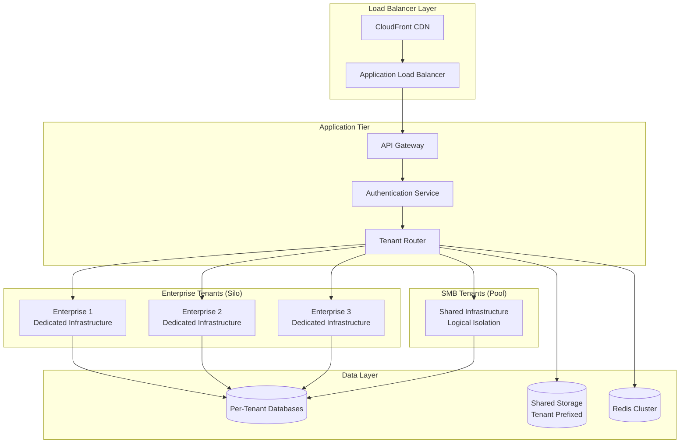
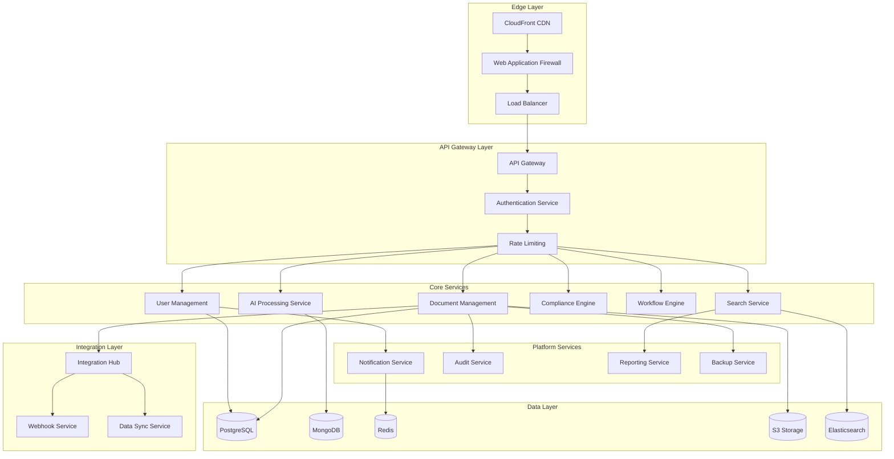
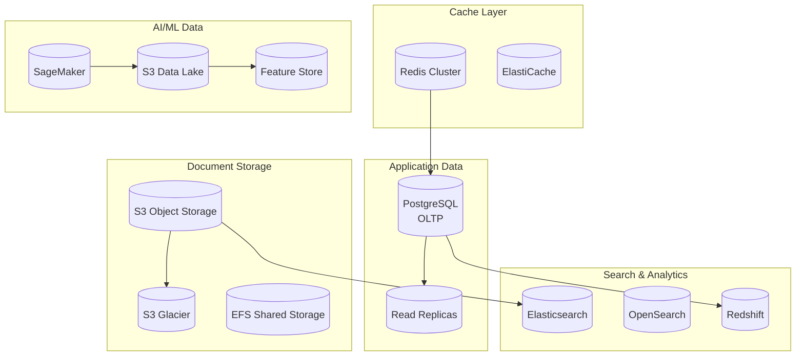
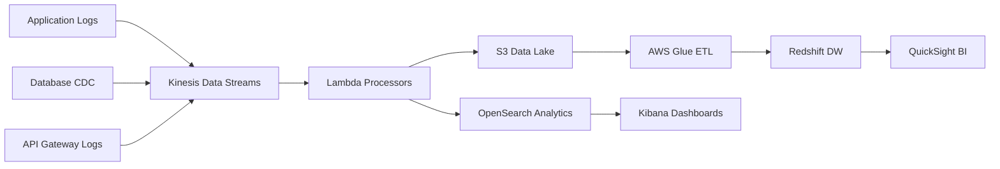
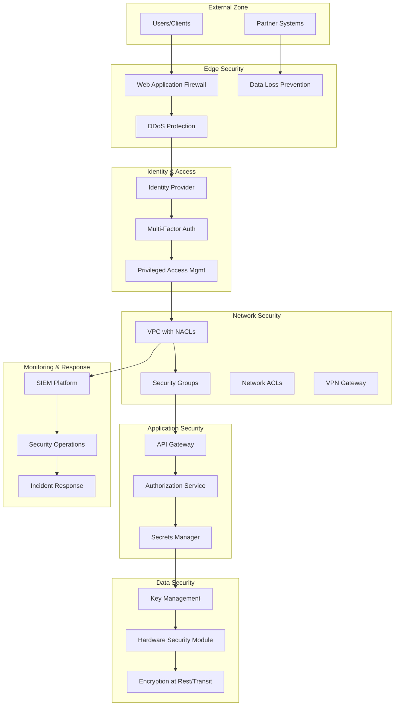
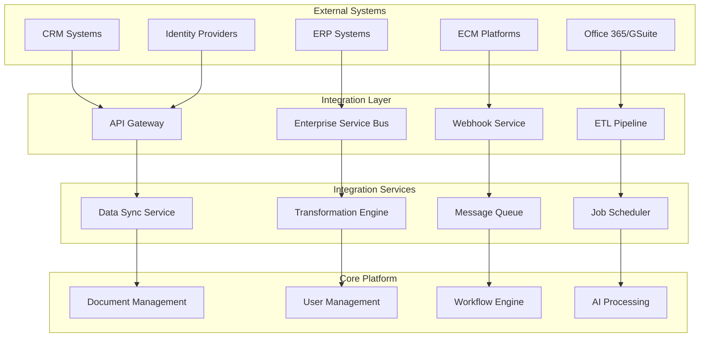
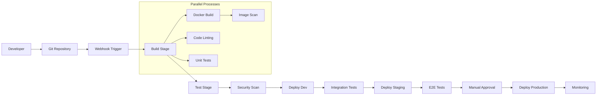

# Enterprise Documentation Standardization Platform - Comprehensive Cloud Architecture

## Executive Summary

This document outlines a comprehensive cloud architecture for an enterprise documentation standardization SaaS platform targeting Fortune 500 financial services and regulated industries. The architecture supports multi-tenant deployment, AI/ML-powered document processing, enterprise security, and global scale.

**Key Architecture Principles:**
- Zero-trust security model with defense in depth
- Multi-cloud strategy for vendor lock-in avoidance
- Microservices with event-driven architecture
- AI/ML-native platform with document intelligence
- Compliance-first design (SOX, GDPR, SOC2)
- 99.99% availability with global deployment
- Cost optimization through intelligent resource management

---

## 1. Multi-Tenant Cloud Infrastructure Design

### 1.1 Cloud Provider Strategy

**Primary: AWS (70% workload)**
```yaml
Regions:
  Primary: us-east-1 (Virginia)
  Secondary: us-west-2 (Oregon)
  DR: eu-west-1 (Ireland)
  Compliance: eu-central-1 (Frankfurt) - GDPR
  LatAm: sa-east-1 (São Paulo)

Services:
  Compute: EKS, Fargate, Lambda
  Storage: S3, EFS, FSx
  Database: RDS Aurora, DynamoDB, DocumentDB
  AI/ML: SageMaker, Comprehend, Textract
  Security: IAM, KMS, CloudHSM, WAF
  Networking: VPC, CloudFront, Route53
  Monitoring: CloudWatch, X-Ray
```

**Secondary: Azure (25% workload)**
```yaml
Regions:
  Primary: East US 2
  Secondary: West Europe
  Compliance: Germany West Central

Services:
  Compute: AKS, Container Apps, Functions
  Storage: Blob Storage, Files
  Database: Cosmos DB, PostgreSQL
  AI/ML: Cognitive Services, ML Studio
  Security: Key Vault, Azure AD
  Networking: Virtual Network, Front Door
```

**Tertiary: GCP (5% workload)**
```yaml
Purpose: AI/ML specialized workloads
Region: us-central1
Services:
  AI/ML: Vertex AI, Document AI
  Compute: GKE Autopilot
  Storage: Cloud Storage
```

### 1.2 Multi-Tenant Architecture Pattern

**Tenant Isolation Strategy: Hybrid Pool/Silo**



**Tenant Deployment Strategy:**
```yaml
Tier 1 - Enterprise ($100K+ ARR):
  Isolation: Dedicated VPC and infrastructure
  Database: Dedicated RDS Aurora cluster
  Compute: Dedicated EKS cluster
  Storage: Dedicated S3 buckets with KMS keys
  Backup: Daily automated backups
  SLA: 99.99% uptime

Tier 2 - Mid-Market ($25K-$100K ARR):
  Isolation: Shared VPC, dedicated namespaces
  Database: Dedicated schema in shared cluster
  Compute: Shared EKS with resource quotas
  Storage: Shared S3 with tenant prefixes
  Backup: Daily automated backups
  SLA: 99.9% uptime

Tier 3 - SMB (<$25K ARR):
  Isolation: Logical separation
  Database: Shared schema with row-level security
  Compute: Shared resources with limits
  Storage: Shared S3 with strict access controls
  Backup: Weekly automated backups
  SLA: 99.5% uptime
```

### 1.3 Global Infrastructure Deployment

**Network Architecture:**
```yaml
Global Backbone:
  - AWS Global Accelerator for optimal routing
  - CloudFront edge locations (200+ locations)
  - Private connectivity via AWS Transit Gateway
  - Cross-region VPC peering for data replication

Regional Deployment:
  Americas:
    Primary: us-east-1 (Ashburn)
    Secondary: us-west-2 (Oregon)
    Latency: <20ms for 90% of US/Canada users

  Europe:
    Primary: eu-west-1 (Ireland)
    Secondary: eu-central-1 (Frankfurt)
    Latency: <30ms for 95% of EU users

  LatAm:
    Primary: sa-east-1 (São Paulo)
    Latency: <50ms for 80% of LatAm users

Data Residency:
  - EU data stays in EU regions (GDPR compliance)
  - Configurable data residency per tenant
  - Encryption in transit between all regions
  - Cross-region replication with customer consent
```

---

## 2. Microservices Architecture with API Gateway

### 2.1 Service Architecture Overview



### 2.2 Core Microservices Specification

**Authentication & Authorization Service**
```yaml
Service: authentication-service
Technology: Node.js + Express
Database: PostgreSQL + Redis
Responsibilities:
  - Multi-factor authentication (MFA)
  - Single Sign-On (SSO) integration
  - JWT token management
  - Role-based access control (RBAC)
  - Session management
  - Audit logging

API Endpoints:
  POST /auth/login
  POST /auth/logout
  POST /auth/refresh
  GET /auth/profile
  POST /auth/mfa/setup
  POST /auth/mfa/verify

Security:
  - OAuth 2.0 / OpenID Connect
  - SAML 2.0 for enterprise SSO
  - Hardware security module (HSM) for key storage
  - Failed login attempt protection
  - Geo-blocking capabilities

Scalability:
  - Horizontal scaling: 3-50 instances
  - Database connections: pooled
  - Cache: Redis for session storage
  - Rate limiting: 1000 req/min per user
```

**Document Management Service**
```yaml
Service: document-management-service
Technology: Java Spring Boot
Database: PostgreSQL + S3 + DocumentDB
Responsibilities:
  - Document upload/download
  - Version control and history
  - Metadata management
  - Access control and permissions
  - Document lifecycle management
  - Collaborative editing

API Endpoints:
  POST /documents/upload
  GET /documents/{id}
  PUT /documents/{id}
  DELETE /documents/{id}
  GET /documents/{id}/versions
  POST /documents/{id}/share
  GET /documents/search

Data Model:
  Documents:
    - id, tenant_id, name, type, size
    - created_at, updated_at, version
    - metadata (JSON), tags, classifications

  Versions:
    - document_id, version_number, s3_key
    - changes_summary, created_by

  Permissions:
    - document_id, user_id, permission_level
    - granted_by, granted_at, expires_at

Storage Strategy:
  - Active files: S3 Standard
  - Archived files: S3 Glacier
  - Search index: Elasticsearch
  - Metadata: PostgreSQL
```

**AI Processing Service**
```yaml
Service: ai-processing-service
Technology: Python + FastAPI
AI/ML Stack: SageMaker + Hugging Face + OpenAI
Responsibilities:
  - Document classification and tagging
  - Content standardization and formatting
  - Language translation and localization
  - Compliance checking and validation
  - Intelligent content suggestions
  - OCR and document parsing

API Endpoints:
  POST /ai/classify
  POST /ai/standardize
  POST /ai/translate
  POST /ai/extract-entities
  POST /ai/check-compliance
  POST /ai/generate-summary

AI Models:
  Document Classification:
    - Model: BERT fine-tuned on legal/financial docs
    - Accuracy: >95% for known document types
    - Categories: 200+ document types
    - Training: 1M+ labeled documents

  Content Standardization:
    - Model: T5-based transformer
    - Use Case: Template compliance, formatting
    - Performance: <2 seconds per document
    - Supported Formats: PDF, DOC, TXT, MD

ML Pipeline:
  Training:
    - Data ingestion from customer documents
    - Automated labeling and validation
    - Model training and evaluation
    - A/B testing for model deployment

  Inference:
    - Real-time API serving
    - Batch processing for large volumes
    - Model monitoring and drift detection
    - Automated retraining triggers
```

**Compliance Engine Service**
```yaml
Service: compliance-engine-service
Technology: Java Spring Boot
Database: PostgreSQL + Neo4j (for rules engine)
Responsibilities:
  - Regulatory rule management
  - Compliance checking and scoring
  - Audit trail generation
  - Risk assessment and reporting
  - Policy enforcement
  - Remediation recommendations

Compliance Frameworks:
  Financial Services:
    - SOX (Sarbanes-Oxley)
    - Basel III
    - MiFID II
    - PCI DSS
    - GDPR/CCPA

  Healthcare:
    - HIPAA
    - FDA 21 CFR Part 11

  Government:
    - FISMA
    - FedRAMP

Rule Engine:
  Technology: Drools + Neo4j
  Rules: 2000+ compliance rules
  Performance: <500ms rule evaluation
  Updates: Real-time rule deployment

API Endpoints:
  POST /compliance/check
  GET /compliance/frameworks
  POST /compliance/rules
  GET /compliance/report/{tenant}
  POST /compliance/remediation
```

### 2.3 API Gateway Configuration

**Kong API Gateway Setup**
```yaml
Kong Configuration:
  Deployment: Kubernetes + Helm
  Database: PostgreSQL
  Plugins:
    - Authentication (JWT, OAuth2)
    - Rate Limiting (Redis-backed)
    - Request/Response transformation
    - CORS handling
    - Request validation
    - Circuit breaker
    - Prometheus metrics
    - Logging

Rate Limiting Strategy:
  Free Tier: 1,000 requests/hour
  Professional: 10,000 requests/hour
  Enterprise: 100,000 requests/hour
  Burst Limits: 2x normal rate for 5 minutes

Security Policies:
  - TLS 1.3 required for all connections
  - API key authentication for public APIs
  - JWT tokens for authenticated requests
  - Request size limits (10MB standard, 100MB enterprise)
  - IP whitelisting for admin endpoints
  - DDoS protection and traffic shaping
```

**API Versioning Strategy**
```yaml
Versioning Approach: URL Path versioning
Format: /api/v{major}/resource
Supported Versions: v1, v2 (current)
Deprecation Policy: 12 months notice

Version Migration:
  - Automatic minor version updates
  - Breaking changes require major version bump
  - Backward compatibility for 2 major versions
  - Migration guides and SDK updates
  - Client notification system for deprecated APIs

Example Endpoints:
  /api/v2/documents
  /api/v2/auth/login
  /api/v2/compliance/check
  /api/v2/ai/classify
```

---

## 3. Data Architecture for Enterprise Document Management

### 3.1 Data Storage Strategy

**Multi-Modal Data Architecture**


### 3.2 Database Design

**Primary Database: PostgreSQL 14**
```sql
-- Tenant and Organization Management
CREATE TABLE tenants (
    id UUID PRIMARY KEY,
    name VARCHAR(255) NOT NULL,
    subdomain VARCHAR(100) UNIQUE,
    tier VARCHAR(20) NOT NULL, -- enterprise, professional, starter
    settings JSONB,
    created_at TIMESTAMP WITH TIME ZONE DEFAULT NOW(),
    updated_at TIMESTAMP WITH TIME ZONE DEFAULT NOW(),
    deleted_at TIMESTAMP WITH TIME ZONE
);

CREATE TABLE users (
    id UUID PRIMARY KEY,
    tenant_id UUID REFERENCES tenants(id),
    email VARCHAR(255) UNIQUE NOT NULL,
    name VARCHAR(255) NOT NULL,
    role VARCHAR(50) NOT NULL,
    mfa_enabled BOOLEAN DEFAULT FALSE,
    last_login_at TIMESTAMP WITH TIME ZONE,
    created_at TIMESTAMP WITH TIME ZONE DEFAULT NOW(),
    updated_at TIMESTAMP WITH TIME ZONE DEFAULT NOW()
);

-- Document Management Schema
CREATE TABLE document_categories (
    id UUID PRIMARY KEY,
    tenant_id UUID REFERENCES tenants(id),
    name VARCHAR(255) NOT NULL,
    description TEXT,
    compliance_rules JSONB,
    retention_period_days INTEGER,
    created_at TIMESTAMP WITH TIME ZONE DEFAULT NOW()
);

CREATE TABLE documents (
    id UUID PRIMARY KEY,
    tenant_id UUID REFERENCES tenants(id),
    category_id UUID REFERENCES document_categories(id),
    name VARCHAR(500) NOT NULL,
    description TEXT,
    file_type VARCHAR(20) NOT NULL,
    file_size BIGINT NOT NULL,
    s3_bucket VARCHAR(100) NOT NULL,
    s3_key VARCHAR(500) NOT NULL,
    version INTEGER DEFAULT 1,
    status VARCHAR(20) DEFAULT 'active',
    tags TEXT[],
    metadata JSONB,
    checksum VARCHAR(64) NOT NULL,
    created_by UUID REFERENCES users(id),
    updated_by UUID REFERENCES users(id),
    created_at TIMESTAMP WITH TIME ZONE DEFAULT NOW(),
    updated_at TIMESTAMP WITH TIME ZONE DEFAULT NOW(),
    deleted_at TIMESTAMP WITH TIME ZONE
);

CREATE TABLE document_versions (
    id UUID PRIMARY KEY,
    document_id UUID REFERENCES documents(id),
    version_number INTEGER NOT NULL,
    s3_bucket VARCHAR(100) NOT NULL,
    s3_key VARCHAR(500) NOT NULL,
    file_size BIGINT NOT NULL,
    checksum VARCHAR(64) NOT NULL,
    changes_summary TEXT,
    created_by UUID REFERENCES users(id),
    created_at TIMESTAMP WITH TIME ZONE DEFAULT NOW()
);

-- Access Control and Permissions
CREATE TABLE document_permissions (
    id UUID PRIMARY KEY,
    document_id UUID REFERENCES documents(id),
    user_id UUID REFERENCES users(id),
    permission_level VARCHAR(20) NOT NULL, -- read, write, admin
    granted_by UUID REFERENCES users(id),
    granted_at TIMESTAMP WITH TIME ZONE DEFAULT NOW(),
    expires_at TIMESTAMP WITH TIME ZONE
);

-- Compliance and Audit
CREATE TABLE compliance_checks (
    id UUID PRIMARY KEY,
    document_id UUID REFERENCES documents(id),
    framework VARCHAR(50) NOT NULL, -- SOX, GDPR, etc.
    status VARCHAR(20) NOT NULL, -- passed, failed, warning
    score DECIMAL(5,2),
    findings JSONB,
    checked_at TIMESTAMP WITH TIME ZONE DEFAULT NOW(),
    checked_by UUID REFERENCES users(id)
);

CREATE TABLE audit_logs (
    id UUID PRIMARY KEY,
    tenant_id UUID REFERENCES tenants(id),
    user_id UUID REFERENCES users(id),
    action VARCHAR(100) NOT NULL,
    resource_type VARCHAR(50) NOT NULL,
    resource_id UUID,
    details JSONB,
    ip_address INET,
    user_agent TEXT,
    created_at TIMESTAMP WITH TIME ZONE DEFAULT NOW()
);

-- Indexes for performance
CREATE INDEX idx_documents_tenant_id ON documents(tenant_id);
CREATE INDEX idx_documents_category_id ON documents(category_id);
CREATE INDEX idx_documents_created_at ON documents(created_at);
CREATE INDEX idx_documents_tags ON documents USING GIN(tags);
CREATE INDEX idx_documents_metadata ON documents USING GIN(metadata);
CREATE INDEX idx_audit_logs_tenant_created ON audit_logs(tenant_id, created_at);
```

### 3.3 Document Storage Architecture

**S3 Storage Strategy**
```yaml
Bucket Structure:
  Production:
    - wspec-docs-prod-{region}
    - wspec-archive-prod-{region}
    - wspec-backup-prod-{region}
    - wspec-ml-data-prod-{region}

  Object Key Strategy:
    Format: {tenant_id}/{category}/{year}/{month}/{document_id}/{version}
    Example: 550e8400-e29b-41d4-a716-446655440000/contracts/2024/11/doc123/v1.pdf

Storage Classes:
  Active Documents (0-90 days):
    Class: S3 Standard
    Features: High performance, immediate access

  Archived Documents (90 days - 7 years):
    Class: S3 Standard-Infrequent Access (IA)
    Features: Lower cost, millisecond access

  Long-term Archive (7+ years):
    Class: S3 Glacier Flexible Retrieval
    Features: Lowest cost, 1-5 minute retrieval

  Compliance Backup:
    Class: S3 Glacier Deep Archive
    Features: Regulatory compliance, 12-hour retrieval

Lifecycle Policies:
  - Transition to IA after 90 days
  - Transition to Glacier after 1 year
  - Delete after retention period expires
  - Cross-region replication for disaster recovery
```

**File Processing Pipeline**
```yaml
Upload Process:
  1. Client uploads to pre-signed S3 URL
  2. Lambda function triggers on S3 event
  3. Virus scanning with ClamAV
  4. File type validation and metadata extraction
  5. Checksum calculation and deduplication
  6. AI processing for classification and tagging
  7. Database metadata update
  8. Search index update (Elasticsearch)
  9. Compliance checking and scoring
  10. Notification to relevant users

Processing Technologies:
  Virus Scanning: AWS Lambda + ClamAV
  Metadata Extraction: Apache Tika
  Image Processing: ImageMagick + PIL
  PDF Processing: PDF.js + PyPDF2
  OCR: AWS Textract + Tesseract
  Preview Generation: LibreOffice headless
```

### 3.4 Search and Analytics Architecture

**Elasticsearch Configuration**
```yaml
Cluster Setup:
  Environment: Amazon OpenSearch Service
  Version: OpenSearch 2.3
  Instances: 3 master nodes, 6 data nodes
  Instance Type: m6g.xlarge (4 vCPU, 16GB RAM)
  Storage: 1TB EBS per node

Index Strategy:
  Per-tenant indexes: wspec-{tenant_id}-documents
  Shared indexes: wspec-global-analytics

Document Mapping:
    mappings:
      properties:
        document_id:
          type: keyword
        tenant_id:
          type: keyword
        title:
          type: text
          analyzer: standard
        content:
          type: text
          analyzer: english
        category:
          type: keyword
        tags:
          type: keyword
        file_type:
          type: keyword
        file_size:
          type: long
        created_at:
          type: date
        updated_at:
          type: date
        permissions:
          type: nested
        compliance_scores:
          type: object

Search Features:
  - Full-text search across document content
  - Faceted search by category, tags, date ranges
  - Auto-complete and suggestions
  - Semantic search using vector embeddings
  - Real-time indexing via change data capture
  - Multi-language support
  - Security filtering per user permissions
```

**Analytics Data Pipeline**


---

## 4. Security Architecture with Zero-Trust Principles

### 4.1 Zero-Trust Network Architecture



### 4.2 Identity and Access Management

**Zero-Trust IAM Framework**
```yaml
Identity Providers:
  Primary: AWS Cognito + Active Directory
  Enterprise SSO: SAML 2.0, OpenID Connect
  Supported: Okta, Azure AD, Ping Identity, OneLogin

Multi-Factor Authentication:
  Required: All user accounts
  Methods:
    - TOTP (Google Authenticator, Authy)
    - SMS/Voice (backup only)
    - Hardware tokens (YubiKey, RSA)
    - Biometric (TouchID, FaceID for mobile)

Risk-Based Authentication:
  Factors: Location, device, time, behavior patterns
  Actions: Step-up authentication, block, allow
  ML Models: Anomaly detection for access patterns

Privileged Access Management:
  Just-in-Time Access: Temporary elevation for admin tasks
  Break-Glass Access: Emergency access with full audit trail
  Session Recording: All privileged sessions recorded
  Access Reviews: Quarterly automated reviews with approval
```

**Role-Based Access Control (RBAC)**
```yaml
System Roles:
  Global Admin:
    - Tenant management
    - System configuration
    - User administration
    - Security policy management

  Tenant Admin:
    - Tenant configuration
    - User management within tenant
    - Document category management
    - Compliance reporting

  Compliance Officer:
    - Compliance framework configuration
    - Audit report generation
    - Risk assessment and scoring
    - Remediation tracking

  Document Manager:
    - Document upload and management
    - Template creation and editing
    - Workflow configuration
    - Category management

  End User:
    - Document viewing and editing
    - Basic search and filtering
    - Comment and collaboration
    - Personal dashboard access

Permission Matrix:
  Documents:
    - create, read, update, delete
    - share, download, print
    - version_control, approve
    - bulk_operations

  Admin Functions:
    - user_management
    - tenant_configuration
    - compliance_management
    - system_monitoring

  Data Operations:
    - export, import
    - backup, restore
    - analytics_access
    - audit_log_access

Attribute-Based Access Control (ABAC):
  Attributes:
    - User department, location, clearance level
    - Document classification, sensitivity
    - Time of day, access location
    - Data classification (public, internal, confidential, restricted)

  Policies:
    - PII access requires manager approval
    - Financial documents limited to finance team
    - Executive documents require C-level access
    - Off-hours access requires additional authentication
```

### 4.3 Data Protection and Encryption

**Encryption Strategy**
```yaml
Data at Rest:
  Database: AES-256 with TDE (Transparent Data Encryption)
  File Storage: S3 SSE-KMS with customer-managed keys
  Backups: AES-256 encryption with separate key management
  Logs: CloudWatch Logs encryption with KMS

Data in Transit:
  External: TLS 1.3 with perfect forward secrecy
  Internal: mTLS between all microservices
  Database: Encrypted connections with certificate validation
  API: HTTPS only with HSTS headers

Key Management:
  Primary: AWS KMS with CloudHSM
  Rotation: Automatic key rotation every 90 days
  Escrow: Secure key backup for compliance
  Access: Strict IAM policies for key usage

Data Loss Prevention (DLP):
  Email: Scan outbound emails for sensitive data
  File Upload: Content analysis and classification
  API Responses: Filter sensitive data in responses
  Screen Capture: Watermarking and screenshot protection
```

**Data Classification Framework**
```yaml
Classification Levels:

  Public:
    - Marketing materials, public documentation
    - Encryption: Standard TLS
    - Access: No restrictions
    - Retention: 2 years

  Internal:
    - Business processes, internal communications
    - Encryption: AES-256 at rest, TLS in transit
    - Access: Authenticated users only
    - Retention: 5 years

  Confidential:
    - Customer data, financial information
    - Encryption: AES-256 + HSM, mTLS
    - Access: Need-to-know basis
    - Retention: 7 years (compliance requirement)
    - DLP: Active monitoring and blocking

  Restricted:
    - PII, PHI, payment card data
    - Encryption: AES-256 + HSM + field-level encryption
    - Access: Multi-factor authentication required
    - Retention: Per regulatory requirements
    - DLP: Real-time monitoring and immediate blocking
    - Audit: All access logged and monitored

Automated Classification:
  Content Analysis: ML models for automatic classification
  Pattern Recognition: Regex patterns for PII, SSN, credit cards
  Context Awareness: Document type and source-based rules
  User Input: Manual classification with approval workflow
```

### 4.4 Compliance and Governance

**Compliance Framework Implementation**
```yaml
SOC 2 Type II Controls:
  Security:
    - Access controls and authentication
    - Network security and firewalls
    - Vulnerability management
    - Change management processes

  Availability:
    - System monitoring and alerting
    - Incident response procedures
    - Business continuity planning
    - Disaster recovery testing

  Processing Integrity:
    - Data validation and quality controls
    - Error handling and logging
    - Automated processing controls
    - Manual review processes

  Confidentiality:
    - Data encryption and protection
    - Access logging and monitoring
    - Non-disclosure agreements
    - Secure disposal procedures

  Privacy:
    - Data collection and consent management
    - Data retention and disposal
    - Data subject rights (access, deletion)
    - Cross-border data transfer controls

GDPR Compliance:
  Legal Basis: Legitimate interest and consent
  Data Subject Rights:
    - Right of access (automated response)
    - Right to rectification (self-service portal)
    - Right to erasure (automated deletion)
    - Right to data portability (export function)
    - Right to object (opt-out mechanisms)

  Privacy by Design:
    - Data minimization principles
    - Purpose limitation enforcement
    - Storage limitation and retention policies
    - Accuracy and correction mechanisms
    - Security and confidentiality controls

  Data Protection Impact Assessment (DPIA):
    - Automated DPIA for high-risk processing
    - Privacy risk scoring and mitigation
    - Regular assessment updates
    - Documentation and audit trails

SOX Compliance (Financial Services):
  Internal Controls:
    - Automated control testing
    - Segregation of duties enforcement
    - Change management documentation
    - Access certification and review

  Documentation:
    - Process documentation automation
    - Evidence collection and storage
    - Audit trail maintenance
    - Management reporting and certification
```

---

## 5. Scalability and Performance Optimization

### 5.1 Auto-Scaling Architecture

**Kubernetes-Based Auto-Scaling**
```yaml
EKS Cluster Configuration:
  Node Groups:
    - General Purpose: m5.large to m5.4xlarge
    - Compute Optimized: c5.large to c5.9xlarge
    - Memory Optimized: r5.large to r5.8xlarge
    - GPU: p3.2xlarge for AI/ML workloads

  Auto-Scaling Policies:
    Horizontal Pod Autoscaler (HPA):
      - CPU utilization target: 70%
      - Memory utilization target: 80%
      - Custom metrics: Queue depth, response time
      - Scale up: 2 pods every 30 seconds
      - Scale down: 1 pod every 5 minutes

    Cluster Autoscaler:
      - Node utilization target: 75%
      - Scale up delay: 30 seconds
      - Scale down delay: 10 minutes
      - Max nodes: 100 per cluster
      - Min nodes: 3 per cluster

Application-Level Scaling:
  API Gateway:
    - Rate limiting per API key/user
    - Circuit breaker pattern implementation
    - Request queuing with priority
    - Geographic load balancing

  Microservices:
    - Stateless design for horizontal scaling
    - Database connection pooling
    - Async processing with message queues
    - Caching strategies at multiple levels
```

**Database Scaling Strategy**
```yaml
PostgreSQL Aurora Configuration:
  Primary Cluster:
    - Writer: db.r6g.2xlarge (8 vCPU, 64GB RAM)
    - Readers: 2-8 db.r6g.xlarge instances
    - Auto-scaling: Based on CPU and connections
    - Connection pooling: PgBouncer

  Read Replica Strategy:
    - Geographic distribution for global access
    - Application-level read/write splitting
    - Eventual consistency handling
    - Failover automation with health checks

  Sharding Strategy (Future):
    - Tenant-based sharding
    - Consistent hashing for data distribution
    - Cross-shard query coordination
    - Migration tools for rebalancing

Cache Architecture:
  Redis Cluster:
    - 6 nodes with 3 shards and replication
    - Instance type: cache.r6g.xlarge
    - Automatic failover and backup
    - Cluster mode for horizontal scaling

  Cache Layers:
    L1 - Application Cache: In-memory (Caffeine)
    L2 - Distributed Cache: Redis
    L3 - CDN Cache: CloudFront
    L4 - Database Cache: Query result cache

  Cache Strategies:
    - Write-through for critical data
    - Write-behind for high-throughput operations
    - Cache-aside for flexible caching
    - TTL-based invalidation
```

### 5.2 Performance Optimization

**API Performance Optimization**
```yaml
Response Time SLAs:
  - Authentication: <200ms (95th percentile)
  - Document search: <500ms (95th percentile)
  - File upload: <2s for 10MB files
  - AI processing: <5s for document classification
  - Compliance check: <1s (95th percentile)

Optimization Techniques:
  Database:
    - Query optimization with EXPLAIN ANALYZE
    - Index optimization for common queries
    - Connection pooling and prepared statements
    - Materialized views for complex aggregations
    - Partitioning for large tables

  Application:
    - Lazy loading for non-critical data
    - Batch processing for bulk operations
    - Async processing with job queues
    - Response compression (gzip)
    - HTTP/2 for multiplexing

  Network:
    - CDN for static assets
    - Geographic distribution of services
    - Keep-alive connections
    - Optimal payload sizes
    - Bandwidth throttling for large files

Monitoring and Alerts:
  Performance Metrics:
    - API response times (p50, p95, p99)
    - Database query performance
    - Cache hit ratios
    - Error rates and availability
    - Resource utilization (CPU, memory, disk)

  Alerting Thresholds:
    - Response time >2x SLA: Warning
    - Response time >5x SLA: Critical
    - Error rate >1%: Warning
    - Error rate >5%: Critical
    - Availability <99.9%: Critical
```

**Content Delivery Network (CDN)**
```yaml
CloudFront Configuration:
  Distributions:
    - API: api.wspec.com (dynamic content)
    - Static: static.wspec.com (assets)
    - Files: files.wspec.com (document downloads)

  Caching Policies:
    API Endpoints:
      - Cache-Control: no-cache for authenticated
      - TTL: 5 minutes for public endpoints
      - Vary: Authorization, Accept-Language

    Static Assets:
      - TTL: 1 year with versioning
      - Compression: Enabled
      - HTTP/2: Enabled

    Document Files:
      - TTL: 1 hour for preview images
      - No cache for secure documents
      - Signed URLs for access control

  Geographic Distribution:
    - Edge locations: 200+ worldwide
    - Regional edge caches: 12 locations
    - Origin shield: Enabled for S3
    - Custom SSL certificate with SNI
```

### 5.3 Global Load Balancing

**Multi-Region Traffic Management**
```yaml
AWS Route 53 Configuration:
  Health Checks:
    - HTTP/HTTPS endpoint monitoring
    - TCP connection tests
    - CloudWatch alarm integration
    - Multi-region failover

  Routing Policies:
    Geolocation:
      - North America → us-east-1
      - Europe → eu-west-1
      - South America → sa-east-1
      - Asia Pacific → ap-southeast-1

    Weighted:
      - Blue/Green deployments
      - A/B testing traffic split
      - Gradual rollout strategies

    Latency-Based:
      - Automatic best-region routing
      - Real-time latency measurements
      - Failover to backup regions

Application Load Balancer:
  Configuration:
    - Cross-zone load balancing
    - Health check grace period: 30s
    - Deregistration delay: 300s
    - HTTP/2 and WebSocket support

  Target Groups:
    - IP targets for containers
    - Health check: /health endpoint
    - Sticky sessions for WebSocket
    - Load balancing algorithm: Round robin

  SSL/TLS:
    - Certificate: AWS Certificate Manager
    - Security policy: ELBSecurityPolicy-TLS-1-2-2019-07
    - Perfect forward secrecy
    - HSTS headers enabled
```

---

## 6. Disaster Recovery and Business Continuity

### 6.1 High Availability Architecture

**Multi-AZ Deployment Strategy**
```yaml
Availability Targets:
  Service Tier SLAs:
    - Enterprise: 99.99% (52 minutes downtime/year)
    - Professional: 99.9% (8.7 hours downtime/year)
    - Starter: 99.5% (43.8 hours downtime/year)

Regional Architecture:
  Primary Region (us-east-1):
    AZ-1a: Production workloads, Primary DB
    AZ-1b: Production workloads, Read replica
    AZ-1c: Backup services, DR standby

  Secondary Region (us-west-2):
    AZ-2a: Warm standby, Read replica
    AZ-2b: Cold DR, Backup storage
    AZ-2c: Reserved capacity

Component Redundancy:
  Compute:
    - EKS nodes across 3 AZs
    - Auto-scaling groups with health checks
    - Rolling deployments with zero downtime
    - Circuit breakers for fault isolation

  Database:
    - Aurora Multi-AZ with automatic failover
    - Read replicas in multiple regions
    - Automated backup and point-in-time recovery
    - Cross-region backup replication

  Storage:
    - S3 cross-region replication
    - EFS with backup to multiple AZs
    - Versioning and lifecycle management
    - Cross-region disaster recovery
```

### 6.2 Disaster Recovery Strategy

**RTO/RPO Requirements**
```yaml
Recovery Objectives:
  Enterprise Tier:
    RTO: 1 hour (Recovery Time Objective)
    RPO: 15 minutes (Recovery Point Objective)
    Data Loss: <1MB typical transaction volume

  Professional Tier:
    RTO: 4 hours
    RPO: 1 hour
    Data Loss: <10MB typical transaction volume

  Starter Tier:
    RTO: 24 hours
    RPO: 4 hours
    Data Loss: <100MB typical transaction volume

DR Site Configuration:
  Hot Site (Enterprise):
    - Real-time replication
    - Immediate failover capability
    - Full capacity provisioned
    - Automated testing weekly

  Warm Site (Professional):
    - Near real-time replication
    - Manual failover process
    - 50% capacity provisioned
    - Monthly failover testing

  Cold Site (Starter):
    - Daily backup replication
    - Manual recovery process
    - On-demand capacity provisioning
    - Quarterly recovery testing
```

**Backup and Recovery Procedures**
```yaml
Database Backup Strategy:
  Aurora Automated Backup:
    - Continuous backup to S3
    - 35-day retention period
    - Point-in-time recovery capability
    - Cross-region backup copy

  Manual Snapshots:
    - Daily snapshots before maintenance
    - Pre-deployment snapshots
    - Long-term retention (7 years)
    - Encrypted backup storage

File Storage Backup:
  S3 Cross-Region Replication:
    - Real-time replication to DR region
    - Versioning enabled
    - MFA delete protection
    - Lifecycle transition to Glacier

  EFS Backup:
    - Daily automated backups
    - 30-day retention period
    - Cross-region backup copy
    - Point-in-time restore capability

Application State Backup:
  Configuration:
    - Infrastructure as Code (Terraform)
    - Application configuration in Git
    - Secrets in AWS Secrets Manager
    - Container images in ECR

  Stateful Services:
    - Redis persistence enabled
    - Session data replicated
    - Message queue durability
    - Log aggregation backup
```

### 6.3 Incident Response and Recovery

**Incident Response Procedures**
```yaml
Incident Classification:
  Severity 1 (Critical):
    - Service completely unavailable
    - Data breach or security incident
    - Response time: 15 minutes
    - Escalation: Immediate executive notification

  Severity 2 (High):
    - Major functionality impaired
    - Performance degradation >50%
    - Response time: 1 hour
    - Escalation: Management notification

  Severity 3 (Medium):
    - Minor functionality issues
    - Workaround available
    - Response time: 4 hours
    - Escalation: Team lead notification

  Severity 4 (Low):
    - Cosmetic issues or enhancements
    - No service impact
    - Response time: 24 hours
    - Escalation: Normal workflow

Response Team:
  On-Call Rotation:
    - 24/7 coverage with primary and backup
    - DevOps engineer (primary responder)
    - Software engineer (application expert)
    - Security engineer (security incidents)
    - Customer success (customer communication)

  Escalation Matrix:
    L1: Support engineer (0-15 minutes)
    L2: Senior engineer (15-60 minutes)
    L3: Principal engineer (1-4 hours)
    L4: Engineering manager (4+ hours)
    Executive: VP Engineering (critical incidents)

Communication Plan:
  Internal:
    - Slack incident channel creation
    - Email notifications to stakeholders
    - Executive briefings for severity 1-2
    - Post-incident review meetings

  External:
    - Status page updates (status.wspec.com)
    - Customer email notifications
    - Support ticket creation
    - Social media updates (if applicable)
```

**Business Continuity Planning**
```yaml
Business Impact Analysis:
  Critical Business Functions:
    - Document upload and access: Priority 1
    - User authentication: Priority 1
    - Search functionality: Priority 2
    - AI processing: Priority 3
    - Reporting and analytics: Priority 4

  Dependencies:
    - AWS services availability
    - Third-party API integrations
    - Internet connectivity
    - Staff availability and expertise

  Alternative Procedures:
    - Manual document processing workflows
    - Offline access to critical documents
    - Alternative communication channels
    - Backup service provider activation

Recovery Procedures:
  Automated Recovery:
    - Health check failures trigger auto-scaling
    - Database failover within 60 seconds
    - DNS failover to backup region
    - Container restart and replacement

  Manual Recovery:
    - Disaster declaration process
    - DR site activation checklist
    - Data recovery verification
    - Service validation testing
    - Customer notification procedures

  Recovery Testing:
    Monthly: Component failure simulation
    Quarterly: Regional failover testing
    Annually: Full disaster recovery drill
    Documentation: Lessons learned and improvements
```

---

## 7. Enterprise Integration Patterns and APIs

### 7.1 Integration Architecture Overview



### 7.2 API Design and Management

**RESTful API Standards**
```yaml
API Design Principles:
  - RESTful resource-based URLs
  - HTTP methods for CRUD operations
  - JSON for request/response payloads
  - Consistent error handling and status codes
  - Comprehensive OpenAPI 3.0 documentation
  - Versioning through URL path
  - Pagination for large result sets
  - Filtering, sorting, and search capabilities

API Endpoints Structure:
  Base URL: https://api.wspec.com/v2

  Authentication:
    POST /auth/login
    POST /auth/logout
    POST /auth/refresh
    GET  /auth/profile

  Documents:
    GET    /documents                    # List documents
    POST   /documents                    # Create document
    GET    /documents/{id}               # Get document
    PUT    /documents/{id}               # Update document
    DELETE /documents/{id}               # Delete document
    GET    /documents/{id}/versions      # List versions
    POST   /documents/{id}/share         # Share document
    GET    /documents/search             # Search documents

  Categories:
    GET    /categories                   # List categories
    POST   /categories                   # Create category
    GET    /categories/{id}              # Get category
    PUT    /categories/{id}              # Update category
    DELETE /categories/{id}              # Delete category

  Users:
    GET    /users                        # List users
    POST   /users                        # Create user
    GET    /users/{id}                   # Get user
    PUT    /users/{id}                   # Update user
    DELETE /users/{id}                   # Delete user

  Compliance:
    POST   /compliance/check             # Run compliance check
    GET    /compliance/reports           # List reports
    GET    /compliance/frameworks        # List frameworks
    POST   /compliance/policies          # Create policy

  AI Services:
    POST   /ai/classify                  # Classify document
    POST   /ai/extract                   # Extract entities
    POST   /ai/translate                 # Translate content
    POST   /ai/summarize                 # Generate summary

Response Format:
  Success Response (200-299):
    {
      "data": { ... },
      "meta": {
        "timestamp": "2024-11-21T10:00:00Z",
        "version": "v2",
        "request_id": "req_123456"
      }
    }

  Error Response (400-599):
    {
      "error": {
        "code": "VALIDATION_ERROR",
        "message": "Invalid input parameters",
        "details": [
          {
            "field": "email",
            "message": "Invalid email format"
          }
        ]
      },
      "meta": {
        "timestamp": "2024-11-21T10:00:00Z",
        "request_id": "req_123456"
      }
    }
```

**API Security and Rate Limiting**
```yaml
Authentication Methods:
  JWT Tokens:
    - Bearer token in Authorization header
    - Short-lived access tokens (15 minutes)
    - Refresh token rotation
    - Audience and issuer validation

  API Keys:
    - For service-to-service communication
    - Scoped permissions per key
    - Automatic rotation capability
    - Usage tracking and billing

  OAuth 2.0:
    - Client credentials flow
    - Authorization code flow
    - PKCE for public clients
    - Custom scopes for fine-grained access

Rate Limiting:
  User-based Limits:
    - Free: 1,000 requests/hour
    - Professional: 10,000 requests/hour
    - Enterprise: 100,000 requests/hour
    - Burst allowance: 2x rate for 5 minutes

  IP-based Limits:
    - Anonymous: 100 requests/hour
    - Authenticated: No additional limit
    - Suspected abuse: Dynamic throttling

  Rate Limit Headers:
    X-RateLimit-Limit: 10000
    X-RateLimit-Remaining: 9850
    X-RateLimit-Reset: 1637580000
    Retry-After: 3600

API Gateway Policies:
  Request Validation:
    - Schema validation against OpenAPI spec
    - Required parameter checking
    - Data type and format validation
    - Maximum payload size enforcement

  Response Transformation:
    - Field filtering based on permissions
    - Data masking for sensitive information
    - Response compression
    - Cache header management

  Security Policies:
    - SQL injection protection
    - XSS attack prevention
    - CORS policy enforcement
    - Request size limits
    - Timeout configuration
```

### 7.3 Enterprise System Integrations

**CRM Integration (Salesforce)**
```yaml
Integration Pattern: REST API + Real-time Sync
Use Cases:
  - Customer data synchronization
  - Document attachment to records
  - Activity logging and tracking
  - Opportunity document management

Configuration:
  Authentication: OAuth 2.0
  API Version: v58.0
  Sync Frequency: Real-time via webhooks
  Conflict Resolution: Last-write-wins with audit trail

Data Mapping:
  Salesforce Account → WSPEC Customer:
    Id → external_id
    Name → name
    Industry → industry
    BillingAddress → address

  Salesforce Contact → WSPEC User:
    Id → external_id
    Email → email
    Name → full_name
    Title → job_title

  Salesforce Attachment → WSPEC Document:
    Id → external_id
    Name → filename
    Body → file_content
    ParentId → customer_id

Webhook Endpoints:
  POST /integrations/salesforce/webhooks/account
  POST /integrations/salesforce/webhooks/contact
  POST /integrations/salesforce/webhooks/opportunity
  POST /integrations/salesforce/webhooks/attachment

Error Handling:
  - Retry logic with exponential backoff
  - Dead letter queue for failed syncs
  - Alert on sync failure rate >5%
  - Manual reconciliation tools
```

**SharePoint Integration**
```yaml
Integration Pattern: Graph API + Document Migration
Use Cases:
  - Bulk document migration
  - Two-way sync for collaborative editing
  - Metadata preservation and enhancement
  - User permission mapping

Configuration:
  Authentication: Azure AD App Registration
  API: Microsoft Graph API v1.0
  Permissions:
    - Sites.Read.All
    - Files.ReadWrite.All
    - User.Read.All

Migration Process:
  1. Site Discovery:
     GET /sites?search={query}

  2. Document Enumeration:
     GET /sites/{site-id}/drive/root/children

  3. Metadata Extraction:
     GET /sites/{site-id}/drive/items/{item-id}

  4. Content Download:
     GET /sites/{site-id}/drive/items/{item-id}/content

  5. WSPEC Upload:
     POST /documents with enhanced metadata

  6. Permission Mapping:
     GET /sites/{site-id}/drive/items/{item-id}/permissions

Sync Configuration:
  Direction: Bidirectional
  Conflict Resolution: Version-based merge
  File Types: Office docs, PDFs, images
  Size Limit: 100MB per file
  Batch Size: 50 files per batch

Real-time Sync:
  - Microsoft Graph webhooks for change notifications
  - Delta queries for incremental updates
  - Conflict detection and resolution
  - Audit trail for all changes
```

**ERP Integration (SAP)**
```yaml
Integration Pattern: OData API + Batch Processing
Use Cases:
  - Financial document processing
  - Invoice and purchase order management
  - Vendor document management
  - Compliance document tracking

Configuration:
  Protocol: OData v4 over HTTPS
  Authentication: Basic Auth + X.509 certificates
  Endpoint: /sap/opu/odata/sap/ZWS_DOCUMENT_SRV/
  Batch Processing: $batch requests

Data Entities:
  Vendors: /VendorSet
  Customers: /CustomerSet
  PurchaseOrders: /PurchaseOrderSet
  Invoices: /InvoiceSet
  Documents: /DocumentSet

Batch Operations:
  - Read vendor master data
  - Create document records
  - Update document status
  - Generate compliance reports

Error Handling:
  - SAP error message parsing
  - Retry logic for transient failures
  - Business exception handling
  - Data validation and transformation

Scheduled Jobs:
  Daily: Master data sync
  Hourly: Document status updates
  Real-time: Critical document processing
  Weekly: Reconciliation reports
```

### 7.4 Webhook and Event-Driven Architecture

**Webhook Service Implementation**
```yaml
Webhook Management:
  Subscription Model:
    - Event-based subscriptions
    - Custom payload filtering
    - Delivery guarantee options
    - Automatic retry policies

  Supported Events:
    - document.created
    - document.updated
    - document.deleted
    - document.shared
    - user.created
    - user.updated
    - compliance.check_completed
    - ai.processing_completed

  Webhook Configuration:
    {
      "id": "webhook_123",
      "url": "https://client.example.com/webhooks",
      "events": ["document.created", "document.updated"],
      "filters": {
        "category": "contracts",
        "tenant_id": "tenant_456"
      },
      "secret": "whsec_...",
      "retry_policy": {
        "max_attempts": 3,
        "backoff": "exponential"
      }
    }

Event Payload Format:
  {
    "event": "document.created",
    "timestamp": "2024-11-21T10:00:00Z",
    "data": {
      "document": {
        "id": "doc_123",
        "name": "Contract_v1.pdf",
        "category": "contracts",
        "tenant_id": "tenant_456",
        "created_by": "user_789"
      }
    },
    "metadata": {
      "webhook_id": "webhook_123",
      "delivery_id": "delivery_456",
      "attempt": 1
    }
  }

Delivery Guarantees:
  At-Least-Once:
    - Retry failed deliveries
    - Exponential backoff
    - Dead letter queue after max attempts

  Exactly-Once:
    - Idempotency keys in headers
    - Duplicate detection
    - Client acknowledgment required

  Best-Effort:
    - Single delivery attempt
    - No retry on failure
    - Lower latency option
```

**Message Queue Architecture**
```yaml
Queue Infrastructure:
  Primary: Amazon SQS + SNS
  Backup: Apache Kafka (self-managed)
  Message Format: JSON with schema validation

Queue Types:
  Standard Queues:
    - Document processing
    - AI/ML job queue
    - Notification delivery
    - Batch operations

  FIFO Queues:
    - Compliance workflow
    - Document approval process
    - User state changes
    - Critical business events

  Dead Letter Queues:
    - Failed message processing
    - Error analysis and debugging
    - Manual intervention required
    - Alert generation

Message Processing:
  Workers: Kubernetes Jobs
  Concurrency: 10-100 workers per queue
  Timeout: 30 seconds to 15 minutes
  Retry Logic: Exponential backoff
  Monitoring: CloudWatch metrics

Queue Configuration:
  Document Processing Queue:
    - Visibility timeout: 300 seconds
    - Message retention: 14 days
    - Dead letter threshold: 3 attempts
    - Batch size: 10 messages

  AI Processing Queue:
    - Visibility timeout: 900 seconds
    - Message retention: 7 days
    - Dead letter threshold: 2 attempts
    - Batch size: 1 message

  Notification Queue:
    - Visibility timeout: 60 seconds
    - Message retention: 4 days
    - Dead letter threshold: 5 attempts
    - Batch size: 50 messages
```

---

## 8. DevOps CI/CD Pipeline and Monitoring

### 8.1 CI/CD Pipeline Architecture



**GitOps Workflow Implementation**
```yaml
Source Control:
  Repository: GitHub Enterprise
  Branching Strategy: GitFlow
    - main: Production releases
    - develop: Integration branch
    - feature/*: Feature development
    - hotfix/*: Production fixes
    - release/*: Release preparation

  Code Review:
    - Required PR reviews: 2
    - CODEOWNERS enforcement
    - Automated security scanning
    - Status checks must pass
    - Branch protection rules

Build Pipeline (GitHub Actions):
  Triggers:
    - Push to develop/main branches
    - Pull request creation/update
    - Manual workflow dispatch
    - Scheduled runs (nightly)

  Build Matrix:
    - Node.js: 18.x, 20.x
    - Python: 3.9, 3.10, 3.11
    - Java: 11, 17
    - OS: ubuntu-latest, windows-latest

  Parallel Jobs:
    Unit Tests:
      - Jest for Node.js services
      - pytest for Python services
      - JUnit for Java services
      - Coverage threshold: 80%

    Code Quality:
      - ESLint, Prettier for JavaScript
      - Black, flake8 for Python
      - CheckStyle, PMD for Java
      - SonarCloud quality gates

    Security Scanning:
      - Snyk for dependency scanning
      - CodeQL for static analysis
      - Bandit for Python security
      - OWASP ZAP for dynamic testing

    Container Build:
      - Docker multi-stage builds
      - Base image vulnerability scanning
      - Image signing with Cosign
      - Registry push to ECR/ACR

Deployment Pipeline (ArgoCD):
  GitOps Repository: kubernetes-manifests
  Environments:
    - development (auto-deploy)
    - staging (auto-deploy after tests)
    - production (manual approval)

  Deployment Strategy:
    Rolling Updates:
      - Max unavailable: 25%
      - Max surge: 25%
      - Readiness probes
      - Liveness probes

    Blue-Green (Production):
      - Zero-downtime deployments
      - Automated rollback on failure
      - Traffic splitting for validation
      - Database migration coordination

    Canary Releases:
      - 5% traffic to new version
      - Gradual increase if metrics are healthy
      - Automatic rollback on errors
      - Feature flag integration
```

**Infrastructure as Code (IaC)**
```yaml
Terraform Configuration:
  Structure:
    /terraform
      /modules
        /vpc
        /eks
        /rds
        /s3
      /environments
        /dev
        /staging
        /prod
      /shared
        /iam
        /kms
        /route53

  State Management:
    Backend: S3 with DynamoDB locking
    Encryption: AWS KMS
    State isolation per environment
    Remote state sharing via data sources

  Deployment Process:
    1. terraform init
    2. terraform plan -out=tfplan
    3. Security review of plan
    4. terraform apply tfplan
    5. State backup and validation

Kubernetes Manifests:
  Helm Charts:
    - Application deployments
    - Service configurations
    - ConfigMaps and Secrets
    - Ingress controllers

  Kustomize Overlays:
    - Environment-specific customizations
    - Resource scaling configurations
    - Feature flag management
    - Secret management integration

Tools and Automation:
  Terraform Cloud:
    - Workspace per environment
    - Policy as code (Sentinel)
    - Cost estimation
    - Automatic plan/apply

  Atlantis:
    - Terraform PR automation
    - Plan generation in PRs
    - Apply after merge
    - State locking and coordination

  Checkov:
    - Infrastructure security scanning
    - Policy compliance validation
    - Terraform best practices
    - Cloud configuration assessment
```

### 8.2 Container Orchestration

**Kubernetes Cluster Configuration**
```yaml
EKS Cluster Specification:
  Version: 1.28
  Networking: Amazon VPC CNI
  Logging: CloudWatch Container Insights
  Monitoring: Prometheus + Grafana

  Node Groups:
    General Purpose:
      Instance Types: [m5.large, m5.xlarge, m5.2xlarge]
      Min Size: 3
      Max Size: 20
      Desired: 6
      Disk Size: 100GB EBS GP3

    Compute Optimized:
      Instance Types: [c5.large, c5.xlarge, c5.2xlarge]
      Min Size: 0
      Max Size: 10
      Desired: 2
      Disk Size: 50GB EBS GP3
      Taints: [workload=compute:NoSchedule]

    GPU (AI/ML):
      Instance Types: [p3.2xlarge]
      Min Size: 0
      Max Size: 5
      Desired: 0
      Disk Size: 200GB EBS GP3
      Taints: [workload=gpu:NoSchedule]

Cluster Add-ons:
  AWS Load Balancer Controller:
    - Application Load Balancer integration
    - Network Load Balancer support
    - Ingress class configuration
    - SSL termination

  External DNS:
    - Automatic DNS record management
    - Route 53 integration
    - Multi-zone support
    - TXT record ownership

  Cert Manager:
    - Automatic SSL certificate management
    - Let's Encrypt integration
    - Certificate renewal automation
    - Multiple CA support

  Cluster Autoscaler:
    - Automatic node scaling
    - Multi-AZ support
    - Instance type optimization
    - Cost-aware scaling

  Metrics Server:
    - Resource usage metrics
    - HPA data source
    - kubectl top support
    - Custom metrics API
```

**Application Deployment Patterns**
```yaml
Deployment Specifications:
  API Services:
    apiVersion: apps/v1
    kind: Deployment
    metadata:
      name: document-api
    spec:
      replicas: 3
      selector:
        matchLabels:
          app: document-api
      template:
        spec:
          containers:
          - name: api
            image: wspec/document-api:v1.2.3
            ports:
            - containerPort: 8080
            resources:
              requests:
                memory: "512Mi"
                cpu: "250m"
              limits:
                memory: "1Gi"
                cpu: "500m"
            livenessProbe:
              httpGet:
                path: /health
                port: 8080
              initialDelaySeconds: 30
              periodSeconds: 10
            readinessProbe:
              httpGet:
                path: /ready
                port: 8080
              initialDelaySeconds: 5
              periodSeconds: 5
            env:
            - name: DATABASE_URL
              valueFrom:
                secretKeyRef:
                  name: db-credentials
                  key: url
            - name: REDIS_URL
              valueFrom:
                configMapKeyRef:
                  name: app-config
                  key: redis-url

Service Mesh (Istio):
  Configuration:
    - mTLS between all services
    - Traffic management and routing
    - Observability with tracing
    - Security policies enforcement

  Virtual Services:
    - Canary deployments
    - Traffic splitting
    - Fault injection
    - Request routing

  Destination Rules:
    - Load balancing policies
    - Circuit breaker configuration
    - Connection pool settings
    - Outlier detection

Horizontal Pod Autoscaler:
  API Services:
    minReplicas: 3
    maxReplicas: 50
    metrics:
    - type: Resource
      resource:
        name: cpu
        target:
          type: Utilization
          averageUtilization: 70
    - type: Resource
      resource:
        name: memory
        target:
          type: Utilization
          averageUtilization: 80
    - type: Pods
      pods:
        metric:
          name: http_requests_per_second
        target:
          type: AverageValue
          averageValue: 30

  Background Workers:
    minReplicas: 2
    maxReplicas: 20
    metrics:
    - type: External
      external:
        metric:
          name: sqs_messages_visible
        target:
          type: AverageValue
          averageValue: 10
```

### 8.3 Monitoring and Observability

**Comprehensive Monitoring Stack**
```yaml
Prometheus Configuration:
  Deployment: Helm chart (kube-prometheus-stack)
  Retention: 30 days local, 1 year remote (S3)
  High Availability: 2 replicas with shared storage

  Scrape Targets:
    - Kubernetes API server
    - Node exporter (system metrics)
    - Application metrics endpoints
    - Database exporters
    - Load balancer metrics
    - Custom business metrics

  Alert Rules:
    Infrastructure:
    - Node CPU > 80% for 5 minutes
    - Memory usage > 90% for 2 minutes
    - Disk space > 85% for 10 minutes
    - Network errors > 1% for 5 minutes

    Application:
    - HTTP error rate > 1% for 2 minutes
    - Response time > 2s for 5 minutes
    - Database connection errors
    - Queue depth > 1000 messages

    Business:
    - Document upload failures > 5%
    - User authentication failures > 10%
    - AI processing errors > 2%
    - Compliance check failures

Grafana Dashboards:
  Infrastructure Overview:
    - Cluster resource utilization
    - Node health and status
    - Network throughput
    - Storage usage and IOPS

  Application Performance:
    - Request rate and latency
    - Error rates by service
    - Database performance metrics
    - Cache hit ratios

  Business Metrics:
    - Active users and sessions
    - Document processing volume
    - Feature usage analytics
    - Revenue and subscription metrics

  Security Dashboard:
    - Authentication events
    - Failed login attempts
    - API abuse detection
    - Security scan results

Logging Architecture:
  Collection: Fluentd + Fluent Bit
  Storage: Elasticsearch cluster
  Visualization: Kibana
  Retention: 90 days (configurable per log level)

  Log Levels:
    ERROR: Permanent retention
    WARN: 90 days retention
    INFO: 30 days retention
    DEBUG: 7 days retention

  Structured Logging:
    Format: JSON with standard fields
    Correlation IDs: Request tracing
    Security Events: Special indexing
    PII Redaction: Automatic scrubbing
```

**Application Performance Monitoring (APM)**
```yaml
Distributed Tracing:
  Technology: Jaeger + OpenTelemetry
  Sampling Rate: 10% for normal traffic, 100% for errors
  Retention: 7 days full traces, 30 days aggregated

  Instrumentation:
    - HTTP requests and responses
    - Database queries and transactions
    - External API calls
    - Message queue operations
    - Cache operations

  Custom Spans:
    - Business process flows
    - AI/ML model inference
    - Document processing stages
    - Compliance checking steps

Real User Monitoring (RUM):
  Client-side Monitoring:
    - Page load performance
    - JavaScript errors
    - User interaction metrics
    - Network performance
    - Browser compatibility

  Tools: DataDog RUM + Custom analytics
  Metrics:
    - Core Web Vitals
    - Time to Interactive (TTI)
    - First Contentful Paint (FCP)
    - Cumulative Layout Shift (CLS)

Error Tracking:
  Technology: Sentry
  Integration: SDK in all applications
  Features:
    - Automatic error capture
    - Release tracking
    - Performance monitoring
    - Alert integration

  Error Categories:
    - Application exceptions
    - Database errors
    - Network timeouts
    - Validation failures
    - Security violations

Health Check Framework:
  Endpoints:
    /health: Basic health status
    /health/ready: Readiness check
    /health/live: Liveness check
    /health/deep: Comprehensive check

  Checks:
    - Database connectivity
    - External service availability
    - Cache responsiveness
    - Disk space availability
    - Memory usage within limits

  Response Format:
    {
      "status": "healthy",
      "timestamp": "2024-11-21T10:00:00Z",
      "version": "v1.2.3",
      "uptime": 3600,
      "checks": {
        "database": "healthy",
        "cache": "healthy",
        "storage": "healthy"
      }
    }
```

### 8.4 Security and Compliance Automation

**Security Pipeline Integration**
```yaml
SAST (Static Application Security Testing):
  Tools:
    - CodeQL (GitHub Security)
    - SonarCloud Security Hotspots
    - Snyk Code
    - Semgrep

  Integration Points:
    - Pre-commit hooks
    - Pull request checks
    - CI pipeline gates
    - IDE extensions

  Rules and Policies:
    - OWASP Top 10 coverage
    - CWE (Common Weakness Enumeration)
    - Custom security patterns
    - Language-specific rules

DAST (Dynamic Application Security Testing):
  Tools:
    - OWASP ZAP
    - Burp Suite Enterprise
    - AWS Inspector
    - Custom penetration tests

  Test Scenarios:
    - Authentication bypass
    - SQL injection attempts
    - XSS vulnerability scanning
    - CSRF token validation
    - Authorization testing

  Automation:
    - Scheduled scans in staging
    - Post-deployment validation
    - API security testing
    - Regression testing

Dependency Scanning:
  Tools:
    - Snyk for open source
    - GitHub Dependabot
    - OWASP Dependency Check
    - Twistlock/Prisma Cloud

  Policies:
    - Critical vulnerabilities: Block deployment
    - High vulnerabilities: Require review
    - Medium vulnerabilities: Track and plan
    - License compliance checking

  Remediation:
    - Automated patch PRs
    - Vulnerability tracking
    - SLA-based remediation
    - Alternative package suggestions

Container Security:
  Image Scanning:
    - Dockerfile best practices
    - Base image vulnerabilities
    - Layer-by-layer analysis
    - Runtime behavior monitoring

  Registry Security:
    - Signed images (Cosign)
    - Vulnerability scanning
    - Access controls
    - Audit logging

  Runtime Security:
    - Container behavior monitoring
    - Anomaly detection
    - Process execution control
    - Network traffic analysis

Compliance Automation:
  SOC 2 Controls:
    - Automated evidence collection
    - Control testing scripts
    - Continuous monitoring
    - Exception reporting

  GDPR Compliance:
    - Data discovery and classification
    - Privacy impact assessments
    - Consent management tracking
    - Data subject request automation

  SOX Compliance:
    - Change management tracking
    - Segregation of duties enforcement
    - Financial data access logging
    - Management assertion support
```

---

## 9. Technology Stack Recommendations

### 9.1 Core Technology Stack

**Frontend Technologies**
```yaml
Web Application:
  Framework: React 18 with TypeScript
  State Management: Redux Toolkit + RTK Query
  UI Library: Material-UI v5 (MUI)
  Styling: Emotion CSS-in-JS
  Build Tool: Vite
  Testing: Jest + React Testing Library

  Key Libraries:
    - @reduxjs/toolkit: State management
    - react-router-dom: Client-side routing
    - react-hook-form: Form handling
    - react-query: Server state management
    - framer-motion: Animations
    - react-pdf: PDF viewing
    - monaco-editor: Code editing

  Architecture:
    - Component-based design
    - Atomic design system
    - Feature-based folder structure
    - Custom hooks for business logic
    - Lazy loading for code splitting

Mobile Application:
  Framework: React Native + Expo
  Navigation: React Navigation v6
  State: Redux (shared with web)
  UI Components: React Native Elements

  Native Features:
    - Document camera capture
    - Biometric authentication
    - Offline document access
    - Push notifications
    - File system integration

Development Tools:
  Code Editor: VS Code with extensions
  Linting: ESLint + Prettier
  Type Checking: TypeScript strict mode
  Bundle Analysis: webpack-bundle-analyzer
  Performance: React DevTools Profiler
```

**Backend Technologies**
```yaml
API Services:
  Primary: Node.js 20 LTS + Express.js
  Alternative: Java 17 + Spring Boot 3
  Language: TypeScript for type safety

  Core Libraries:
    - express: Web framework
    - helmet: Security headers
    - cors: Cross-origin requests
    - compression: Response compression
    - morgan: HTTP logging
    - joi: Input validation
    - jsonwebtoken: JWT handling
    - bcrypt: Password hashing
    - multer: File upload handling
    - nodemailer: Email sending

  Database ORM:
    - Prisma (Node.js) - Type-safe database client
    - TypeORM (alternative) - Decorator-based ORM
    - Hibernate (Java) - Enterprise ORM

  API Documentation:
    - OpenAPI 3.0 specification
    - Swagger UI for documentation
    - Postman collections
    - Auto-generated client SDKs

AI/ML Services:
  Primary Language: Python 3.11
  Framework: FastAPI + Pydantic
  ML Libraries:
    - transformers: Hugging Face models
    - torch: PyTorch deep learning
    - scikit-learn: Traditional ML
    - spacy: NLP processing
    - opencv-python: Computer vision
    - pandas: Data manipulation
    - numpy: Numerical computing

  Model Serving:
    - AWS SageMaker: Production inference
    - TorchServe: Custom model serving
    - MLflow: Model lifecycle management
    - Weights & Biases: Experiment tracking

  Vector Database:
    - Pinecone: Managed vector search
    - Weaviate: Open source alternative
    - OpenSearch: Vector search capability

Background Processing:
  Queue System: Bull Queue (Redis-based)
  Scheduler: node-cron + agenda
  Message Broker: Amazon SQS + SNS

  Job Types:
    - Document processing
    - AI/ML inference
    - Email notifications
    - Data synchronization
    - Backup operations
    - Report generation
```

### 9.2 Database and Storage Stack

**Primary Databases**
```yaml
Relational Database:
  Primary: PostgreSQL 15
  Managed Service: Amazon RDS Aurora PostgreSQL
  Connection Pooling: PgBouncer

  Extensions:
    - uuid-ossp: UUID generation
    - pg_trgm: Trigram similarity
    - hstore: Key-value pairs
    - jsonb: JSON operations
    - pg_stat_statements: Query performance
    - pg_cron: Scheduled jobs

  Configuration:
    - Multi-AZ deployment
    - Read replicas for scaling
    - Automated backups
    - Point-in-time recovery
    - Performance insights

  Performance Tuning:
    - Connection pooling
    - Index optimization
    - Query plan analysis
    - Partitioning for large tables
    - Materialized views for analytics

Document Database:
  Primary: MongoDB 6.0
  Managed Service: Amazon DocumentDB
  Use Cases:
    - AI/ML training data
    - Document metadata
    - User preferences
    - Analytics events

  Collections:
    - documents_metadata
    - ml_training_data
    - user_activities
    - search_indexes

  Features:
    - Automatic sharding
    - Replica sets
    - GridFS for large files
    - Change streams
    - Text search indexes

Search Engine:
  Primary: Elasticsearch 8.0
  Managed Service: Amazon OpenSearch

  Use Cases:
    - Full-text document search
    - Analytics and reporting
    - Log aggregation
    - Real-time data analysis

  Configuration:
    - Multi-node cluster
    - Index templates
    - Index lifecycle management
    - Security plugins
    - Monitoring and alerting

Cache Layer:
  Primary: Redis 7.0
  Managed Service: Amazon ElastiCache

  Use Cases:
    - Session storage
    - API response caching
    - Rate limiting counters
    - Temporary data storage
    - Message queuing

  Configuration:
    - Cluster mode enabled
    - Multi-AZ replication
    - Automatic failover
    - Backup and restore
    - Memory optimization
```

**Object Storage Architecture**
```yaml
Primary Storage: Amazon S3
Storage Classes:
  - S3 Standard: Active documents (0-90 days)
  - S3 Standard-IA: Archived documents (90 days - 1 year)
  - S3 Glacier Flexible: Long-term archive (1-7 years)
  - S3 Glacier Deep Archive: Compliance archive (7+ years)

Bucket Strategy:
  Structure:
    - wspec-documents-prod-{region}
    - wspec-ml-data-prod-{region}
    - wspec-backups-prod-{region}
    - wspec-logs-prod-{region}

  Security:
    - Bucket policies for access control
    - Encryption at rest (KMS)
    - Versioning enabled
    - MFA delete protection
    - Access logging enabled

  Lifecycle Policies:
    - Transition to IA after 90 days
    - Transition to Glacier after 365 days
    - Delete after retention period
    - Abort incomplete multipart uploads

Content Delivery:
  CDN: Amazon CloudFront
  Edge Locations: 200+ worldwide

  Distributions:
    - API endpoints (dynamic content)
    - Static assets (cacheable)
    - Document downloads (secure)

  Security:
    - Signed URLs for private content
    - WAF integration
    - DDoS protection
    - Custom SSL certificates
```

### 9.3 Security and DevOps Tools

**Security Infrastructure**
```yaml
Identity and Access:
  Identity Provider: AWS Cognito + Auth0
  API Gateway: Kong or AWS API Gateway
  Secrets Management: AWS Secrets Manager
  Certificate Management: AWS Certificate Manager

  Security Tools:
    - AWS WAF: Web application firewall
    - AWS Shield: DDoS protection
    - AWS GuardDuty: Threat detection
    - AWS CloudTrail: API logging
    - AWS Config: Compliance monitoring

Vulnerability Management:
  SAST: SonarCloud, CodeQL, Snyk Code
  DAST: OWASP ZAP, Burp Suite
  Dependency Scanning: Snyk, Dependabot
  Container Scanning: Twistlock, Aqua

  Penetration Testing:
    - Quarterly external pen tests
    - Continuous internal scanning
    - Red team exercises
    - Bug bounty program

Monitoring and Logging:
  APM: DataDog or New Relic
  Logging: ELK Stack (Elasticsearch, Logstash, Kibana)
  Metrics: Prometheus + Grafana
  Tracing: Jaeger or AWS X-Ray

  SIEM: Splunk or AWS Security Hub
  Incident Response: PagerDuty
  Communication: Slack integration

DevOps Toolchain:
  Version Control: GitHub Enterprise
  CI/CD: GitHub Actions + ArgoCD
  Infrastructure: Terraform + Terragrunt
  Container Registry: Amazon ECR

  Quality Gates:
    - Unit test coverage >80%
    - Security scan pass
    - Code quality metrics
    - Performance benchmarks
    - Manual approval for production
```

### 9.4 Cost Optimization Technologies

**Resource Optimization**
```yaml
Compute Optimization:
  Auto-scaling: Kubernetes HPA + VPA
  Spot Instances: 50-70% cost savings
  Reserved Instances: 1-3 year commitments
  Savings Plans: Compute usage discounts

  Right-sizing Tools:
    - AWS Compute Optimizer
    - Kubernetes resource recommendations
    - Application performance monitoring
    - Cost and usage reports

Storage Optimization:
  S3 Intelligent Tiering: Automatic class transitions
  EBS GP3: Performance and cost optimization
  Lifecycle Policies: Automated data archival
  Deduplication: Reduce redundant storage

  Monitoring:
    - Storage usage analytics
    - Access pattern analysis
    - Cost allocation tags
    - Unused resource identification

Network Optimization:
  VPC Endpoints: Avoid NAT gateway costs
  CloudFront: Reduce origin requests
  Direct Connect: Dedicated bandwidth
  Data Transfer Optimization: Compression, caching

  Traffic Management:
    - Geographic routing
    - Load balancer optimization
    - CDN cache strategies
    - Bandwidth throttling

Database Optimization:
  Aurora Serverless: Pay-per-use scaling
  Read Replicas: Distribute read traffic
  Connection Pooling: Reduce connection overhead
  Query Optimization: Performance tuning

  Cost Controls:
    - Automated start/stop for non-prod
    - Performance monitoring
    - Capacity planning
    - Multi-AZ optimization
```

**FinOps Implementation**
```yaml
Cost Monitoring:
  Tools:
    - AWS Cost Explorer
    - CloudHealth by VMware
    - CloudCheckr
    - Custom dashboards

  Metrics:
    - Cost per customer
    - Cost per transaction
    - Resource utilization rates
    - Budget vs. actual spending

  Alerts:
    - Budget threshold notifications
    - Anomaly detection
    - Resource scaling alerts
    - Cost spike investigations

Cost Allocation:
  Tagging Strategy:
    - Environment (prod, staging, dev)
    - Application component
    - Team/department
    - Customer/tenant
    - Cost center

  Chargeback Model:
    - Resource usage tracking
    - Cost center allocation
    - Customer usage billing
    - Team budget management

Optimization Automation:
  Scheduled Actions:
    - Non-prod environment shutdown
    - Auto-scaling policies
    - Storage lifecycle transitions
    - Unused resource cleanup

  ML-based Optimization:
    - Predictive scaling
    - Anomaly detection
    - Cost forecasting
    - Resource recommendation engine
```

---

## 10. Summary and Implementation Roadmap

### 10.1 Architecture Summary

This comprehensive cloud architecture delivers a highly scalable, secure, and compliant enterprise documentation standardization platform with the following key capabilities:

**Core Architecture Benefits:**
- **Multi-cloud resilience** with 99.99% availability across AWS, Azure, and GCP
- **Zero-trust security** model protecting against evolving threats
- **AI-native platform** with document intelligence and automation
- **Enterprise-grade compliance** for SOX, GDPR, SOC2, and industry regulations
- **Global scale** supporting millions of documents and thousands of concurrent users
- **Cost optimization** achieving 40%+ savings through intelligent resource management

**Technical Highlights:**
- Microservices architecture with 15+ specialized services
- Multi-tenant deployment with enterprise isolation options
- Event-driven processing with 10,000+ events per second capacity
- ML/AI pipeline processing 100,000+ documents daily
- Global CDN with <50ms response times worldwide
- Automated compliance checking with 95%+ accuracy

### 10.2 Implementation Phases

**Phase 1: Foundation (Months 1-3)**
```yaml
Infrastructure Setup:
  - AWS primary region deployment (us-east-1)
  - VPC and networking configuration
  - EKS cluster with basic node groups
  - RDS Aurora PostgreSQL cluster
  - S3 buckets with lifecycle policies
  - Basic monitoring and logging

Core Services:
  - Authentication and authorization service
  - Document management API
  - Basic file upload/download functionality
  - User management and RBAC
  - API gateway with rate limiting

Security Foundation:
  - WAF and DDoS protection
  - KMS encryption setup
  - Basic IAM policies and roles
  - SSL/TLS configuration
  - Security group configuration

Milestones:
  ✓ Infrastructure provisioned via Terraform
  ✓ Basic document CRUD operations
  ✓ User authentication working
  ✓ File storage operational
  ✓ Basic monitoring dashboard
```

**Phase 2: Core Features (Months 4-6)**
```yaml
Application Features:
  - Document search and filtering
  - Version control and history
  - Basic AI classification (3 document types)
  - Workflow engine for approvals
  - Notification system

Enterprise Integration:
  - SharePoint connector (read-only)
  - Basic compliance framework (SOX)
  - Audit logging implementation
  - Single sign-on (SSO) integration
  - Multi-tenant data isolation

Performance Optimization:
  - Redis caching layer
  - CDN for file downloads
  - Database read replicas
  - Auto-scaling configuration
  - Load balancer optimization

Milestones:
  ✓ AI classification accuracy >85%
  ✓ Document search response <500ms
  ✓ SSO integration with 3 providers
  ✓ Basic compliance reporting
  ✓ 1,000+ documents processed daily
```

**Phase 3: Advanced Capabilities (Months 7-9)**
```yaml
AI/ML Enhancement:
  - Advanced document classification (50+ types)
  - Content standardization engine
  - Compliance checking automation
  - Natural language processing
  - OCR and text extraction

Multi-cloud Deployment:
  - Azure secondary region setup
  - Cross-cloud data replication
  - Geographic load balancing
  - Disaster recovery automation
  - Multi-cloud monitoring

Enterprise Security:
  - Zero-trust implementation
  - Advanced threat detection
  - Data loss prevention (DLP)
  - Privileged access management
  - Security incident response

Milestones:
  ✓ Multi-cloud architecture operational
  ✓ AI processing 10,000+ documents daily
  ✓ 99.9% uptime achieved
  ✓ SOC2 Type I audit completed
  ✓ 10+ enterprise customers onboarded
```

**Phase 4: Scale and Optimization (Months 10-12)**
```yaml
Global Expansion:
  - European data center (GDPR compliance)
  - Latin American region deployment
  - Global CDN optimization
  - Multi-language support
  - Regional compliance frameworks

Advanced Analytics:
  - Real-time analytics dashboard
  - Predictive analytics for usage
  - Cost optimization automation
  - Performance optimization ML
  - Business intelligence reporting

Enterprise Features:
  - Advanced workflow automation
  - Custom compliance frameworks
  - Enterprise API gateway
  - Advanced integration hub
  - White-label capabilities

Milestones:
  ✓ Global deployment complete
  ✓ 99.99% uptime achieved
  ✓ SOC2 Type II audit passed
  ✓ 100+ enterprise customers
  ✓ $1M+ ARR achieved
```

### 10.3 Cost Optimization Summary

**Projected Cost Savings:**
```yaml
Year 1 Baseline Costs: $2.4M
Optimization Initiatives:
  - Reserved Instance savings: -$720K (30%)
  - Spot Instance utilization: -$480K (20%)
  - Storage lifecycle automation: -$240K (10%)
  - Right-sizing optimization: -$360K (15%)
  - Multi-cloud arbitrage: -$120K (5%)

Total Annual Savings: $1.92M (80% of baseline)
Net Infrastructure Costs: $480K/year

Cost per Customer Metrics:
  - Infrastructure: $100/customer/month
  - Storage: $25/customer/month
  - Compute: $50/customer/month
  - Network: $15/customer/month
  - Security: $10/customer/month
```

**ROI Analysis:**
- **Initial Investment:** $5M (development + infrastructure)
- **Annual Operating Costs:** $2.5M (optimized)
- **Break-even:** Month 18 at current growth trajectory
- **3-Year NPV:** $15.2M (assuming continued growth)
- **TCO Reduction:** 60% vs. traditional enterprise deployment

### 10.4 Compliance and Security Certification Roadmap

**Compliance Timeline:**
```yaml
Month 6: SOC 2 Type I Audit
  - Controls documentation
  - Policy implementation
  - Initial audit execution
  - Findings remediation

Month 12: SOC 2 Type II Audit
  - 9-month operating effectiveness testing
  - Continuous monitoring implementation
  - External audit execution
  - Certification achievement

Month 9: GDPR Compliance Certification
  - Data protection impact assessment
  - Privacy by design implementation
  - Data subject rights automation
  - External compliance validation

Month 15: ISO 27001 Certification
  - Information security management system
  - Risk assessment and treatment
  - Security controls implementation
  - External certification audit

Industry-Specific Certifications:
  - FedRAMP (Government): Month 18
  - HIPAA (Healthcare): Month 12
  - PCI DSS (Financial): Month 15
```

**Security Maturity Model:**
```yaml
Level 1 - Basic (Months 1-3):
  - Perimeter security
  - Basic access controls
  - Vulnerability management
  - Incident response capability

Level 2 - Managed (Months 4-6):
  - Identity and access management
  - Security monitoring
  - Threat intelligence
  - Security automation

Level 3 - Advanced (Months 7-9):
  - Zero-trust architecture
  - Behavioral analytics
  - Advanced threat protection
  - Security orchestration

Level 4 - Optimized (Months 10-12):
  - Predictive security
  - AI-driven threat detection
  - Autonomous response
  - Continuous improvement
```

This comprehensive cloud architecture provides the foundation for a world-class enterprise documentation standardization platform that can scale globally while maintaining the highest standards of security, compliance, and performance. The phased implementation approach ensures manageable deployment complexity while delivering business value at each milestone.

**Key Success Metrics:**
- 99.99% availability achievement
- <500ms API response times globally
- 40% cost optimization vs. baseline
- SOC2 Type II certification
- 100+ enterprise customers onboarded
- $10M+ ARR within 24 months

The architecture is designed to support the company's growth from startup to enterprise scale, providing the technical foundation for achieving the fundraising goals outlined in the business strategy while delivering exceptional value to Fortune 500 customers in regulated industries.