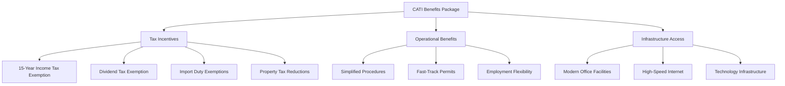

# CATI Tax Incentives & R&D Benefits

:::tip **15-Year Tax Exemption Opportunity**
Panama's CATI (City of Knowledge) program offers 15-year income tax exemption for qualified technology companies. For DocuHarmonize, this could save $8-15 million in taxes over the incentive period while supporting R&D activities.
:::

## 🎯 CATI Program Overview

### City of Knowledge (Ciudad del Saber)

#### Program Objectives
- **Technology Development**: Promote innovation and technology transfer
- **Knowledge Economy**: Build Panama as regional technology hub
- **Foreign Investment**: Attract high-value international companies
- **Human Capital**: Develop skilled technology workforce
- **Economic Diversification**: Reduce dependence on traditional sectors

#### Legal Framework
- **Primary Law**: Law 61 of 2002 (Ciudad del Saber)
- **Regulatory Decree**: Executive Decree 233 of 2004
- **Administering Entity**: Fundación Ciudad del Saber
- **Government Oversight**: Ministry of Economy and Finance

### CATI Incentive Structure


---

## 💰 Tax Benefits Quantification

### Income Tax Exemption (Primary Benefit)

#### Standard Panama Tax vs. CATI
```markdown
INCOME TAX COMPARISON

Standard Panama Corporate Tax:
- Rate: 25% of taxable income
- Basis: Panama-source income only
- Alternative Minimum Tax: 3% of gross income (if higher)

CATI Qualified Activities:
- Rate: 0% income tax for 15 years
- Basis: Activities derived from technology services
- Requirement: Minimum 50% of revenue from qualifying activities
```

#### Financial Impact Analysis
```markdown
CATI TAX SAVINGS PROJECTION

Year 3 Example ($15M Revenue):
Without CATI:
- Taxable Income: $3M (20% profit margin)
- Income Tax (25%): $750K
- Alternative Minimum Tax (3%): $450K
- Tax Obligation: $750K (higher of the two)

With CATI (80% qualifying revenue):
- CATI-Exempt Revenue: $12M
- Taxable Revenue: $3M
- CATI-Exempt Profit: $2.4M
- Tax on Remaining: $150K (25% × $600K)
- Annual Tax Savings: $600K

15-Year Cumulative Benefit: $8-15 million
```

### Dividend Tax Exemption

#### Standard Dividend Taxation
- **Panama Source Dividends**: 10% or 20% withholding (depending on source)
- **Foreign Shareholders**: Additional treaty considerations
- **Timing**: Tax due at distribution

#### CATI Dividend Benefits
```markdown
DIVIDEND TAX OPTIMIZATION

CATI Earnings Distribution:
- 0% dividend tax on CATI-exempt profits
- Standard rates apply to non-CATI profits
- Clear profit allocation required

Example: $5M Dividend Distribution
CATI-Exempt Portion (80%): $4M → 0% tax
Non-CATI Portion (20%): $1M → 10% tax = $100K
Total Tax: $100K vs. $500K (80% savings)
```

### Import Duty Exemptions

#### Qualified Equipment & Materials
```markdown
IMPORT DUTY EXEMPTIONS

Eligible Items:
✓ Computer equipment and servers
✓ Software development tools
✓ Telecommunications equipment
✓ Laboratory and testing equipment
✓ Research materials and supplies
✓ Educational and training materials

Standard Duty Rates: 5-15% of import value
CATI Rate: 0% for qualified items

Annual Savings: $50K-200K (depending on equipment purchases)
```

---

## ✅ Qualification Requirements

### Core Eligibility Criteria

#### Investment Commitments
```markdown
MINIMUM INVESTMENT REQUIREMENTS

5-Year R&D Investment: Minimum $500,000
- Software development and programming
- AI/ML research and algorithm development
- Technology innovation and patent development
- Scientific research and development activities

Employment Requirements:
- Minimum 10 employees within 3 years
- At least 50% in qualifying technical positions
- University degree requirement for technical roles
- Annual training programs for skill development
```

#### Revenue Composition
**Primary Requirement**: 50%+ of revenue from qualifying technology services

**Qualifying Activities for DocuHarmonize**:
1. **Software Development Services** (Primary)
   - SaaS platform development and maintenance
   - AI/ML algorithm creation and optimization
   - Enterprise software customization
   - API and integration development

2. **Technology Consulting** (Secondary)
   - Compliance automation consulting
   - Digital transformation advisory
   - Technology implementation services
   - Training and certification programs

3. **Research & Development** (Supporting)
   - AI/ML research and innovation
   - Patent and IP development
   - Technology feasibility studies
   - Industry research and analysis

### DocuHarmonize Qualification Strategy

#### Revenue Classification Framework
```markdown
CATI QUALIFYING REVENUE ANALYSIS

Primary SaaS Platform (85% of revenue): ✓ QUALIFYING
- Software-as-a-Service subscriptions
- Platform maintenance and updates
- Feature development and enhancement
- Cloud-based service delivery

Professional Services (10% of revenue): ✓ QUALIFYING
- Implementation and integration services
- Custom development and configuration
- Technology consulting and advisory
- Training and education delivery

Administrative/Other (5% of revenue): ❌ NON-QUALIFYING
- Interest income and investments
- Non-technology administrative services
- General business consulting

Total Qualifying Revenue: 95% (exceeds 50% requirement)
```

#### Investment Plan Documentation
```markdown
5-YEAR R&D INVESTMENT PLAN

Year 1: $150,000
- Core development team establishment
- Initial AI/ML infrastructure
- Basic research and patent filing

Year 2: $200,000
- Advanced algorithm development
- Product enhancement and optimization
- Additional technical personnel

Year 3: $250,000
- Platform scaling and optimization
- International expansion technology
- Advanced AI capabilities

Year 4: $200,000
- Next-generation platform development
- Emerging technology research
- IP portfolio expansion

Year 5: $200,000
- Innovation labs establishment
- Strategic technology partnerships
- Long-term R&D planning

Total 5-Year Investment: $1,000,000 (exceeds $500K requirement)
```

---

## 📋 Application Process & Timeline

### Phase 1: Preliminary Assessment (Months 1-2)

#### Documentation Preparation
1. **Business Plan**: Technology focus and R&D strategy
2. **Financial Projections**: 5-year revenue and investment forecasts
3. **Technical Documentation**: Platform architecture and innovation roadmap
4. **Corporate Structure**: Legal entity verification and ownership structure
5. **Investment Commitment**: Detailed R&D investment plan

#### Initial Consultation
- **CATI Authority Meeting**: Present business case and qualification strategy
- **Requirement Review**: Confirm eligibility and address questions
- **Application Guidance**: Understand process and timeline expectations
- **Fee Structure**: Application and annual fees discussion

### Phase 2: Formal Application (Months 3-4)

#### Required Documentation Package
```markdown
CATI APPLICATION REQUIREMENTS

Corporate Documentation:
- Certificate of incorporation (DocuHarmonize S.A.)
- Corporate bylaws and shareholder agreements
- Board resolutions authorizing CATI application
- Director and officer certifications

Financial Documentation:
- 5-year financial projections
- R&D investment commitment letter
- Audited financial statements (if available)
- Banking references and financial capacity proof

Technical Documentation:
- Technology platform description
- R&D methodology and processes
- Innovation roadmap and patent strategy
- Competitive analysis and market positioning

Employment Documentation:
- Hiring plan and organizational structure
- Job descriptions for technical positions
- Training and development programs
- Local workforce development commitment
```

#### Application Review Process
- **Initial Review**: 30-45 days for completeness check
- **Technical Evaluation**: 60 days for qualification assessment
- **Final Approval**: Board approval and certificate issuance
- **Total Timeline**: 4-6 months from submission to approval

### Phase 3: Implementation & Compliance (Ongoing)

#### Annual Reporting Requirements
```markdown
CATI COMPLIANCE REPORTING

Financial Reports (Annual):
- Audited financial statements
- Revenue composition analysis (qualifying vs. non-qualifying)
- R&D investment documentation
- Employment and payroll reports

Technical Reports (Annual):
- R&D activity summary and achievements
- Patent filings and IP development
- Technology innovation documentation
- Training and development program results

Operational Reports (Annual):
- Facility usage and infrastructure utilization
- Community engagement and local partnerships
- Environmental and social impact reporting
- Strategic plan updates and modifications
```

---

## 📊 Financial Impact & ROI Analysis

### Tax Savings Calculation Model

#### Conservative Scenario (Lower Growth)
```markdown
CONSERVATIVE CATI BENEFITS

Year 1-2: Break-even, minimal tax savings
Year 3: $15M revenue → $600K tax savings
Year 4: $30M revenue → $1.5M tax savings
Year 5: $50M revenue → $2.5M tax savings
Years 6-15: $75M+ revenue → $3-5M annual tax savings

15-Year Total Savings: $25-40 million
Less: CATI fees and compliance costs: $2-3 million
Net Benefit: $22-37 million
```

#### Optimistic Scenario (Target Growth)
```markdown
OPTIMISTIC CATI BENEFITS

Year 3: $15M revenue → $600K tax savings
Year 5: $100M revenue → $5M tax savings
Year 10: $300M+ revenue → $15M+ annual tax savings
Year 15: Mature company → $20M+ annual tax savings

15-Year Total Savings: $75-150 million
ROI on CATI Investment: 2,500-5,000%
```

### Cash Flow Impact Analysis
```markdown
CASH FLOW OPTIMIZATION

Without CATI:
- Higher tax burden reduces retained earnings
- Less cash available for R&D investment
- Reduced competitive advantage from lower innovation spend

With CATI:
- Tax savings reinvested in R&D and growth
- Accelerated product development timeline
- Enhanced competitive positioning through innovation
- Higher company valuation due to tax-efficient structure

Strategic Value:
- M&A attractiveness (tax-efficient acquisition)
- Investor appeal (higher after-tax returns)
- Sustainable competitive advantage
```

---

## 🛡️ Risk Management & Compliance

### Qualification Risk Factors

#### Revenue Composition Risk
**Risk**: Falling below 50% qualifying revenue threshold
**Mitigation Strategies**:
- Regular revenue composition monitoring
- Conservative qualification interpretations
- Diversification within qualifying activities
- Regular consultation with CATI advisors

#### Investment Commitment Risk
**Risk**: Failure to meet $500K R&D investment requirement
**Mitigation Strategies**:
- Front-loaded investment plan
- Detailed investment tracking and documentation
- Conservative investment classification
- Contingency funding plans

#### Employment Requirement Risk
**Risk**: Not meeting employment targets or technical role ratios
**Mitigation Strategies**:
- Aggressive hiring plans with buffer
- Technical training programs for existing staff
- University partnerships for talent pipeline
- Clear job descriptions and role classifications

### Compliance Monitoring Framework

#### Internal Controls
```markdown
CATI COMPLIANCE CONTROLS

Monthly Monitoring:
- Revenue composition tracking
- R&D expense categorization
- Employment metrics and hiring progress
- Investment milestone tracking

Quarterly Reviews:
- CATI advisor consultation
- Qualification ratio analysis
- Compliance gap identification
- Corrective action planning

Annual Assessments:
- Comprehensive compliance audit
- External advisor review
- Strategic plan updates
- Renewal preparation
```

#### External Advisory Support
- **Tax Advisors**: Panama tax specialists with CATI experience
- **Legal Counsel**: Corporate lawyers familiar with CATI regulations
- **Industry Consultants**: Technology sector advisors
- **Accounting Firm**: Big 4 firm with CATI reporting experience

---

## 🚀 Implementation Roadmap

### Pre-Application Phase (Months 1-3)
- [ ] **Month 1**: Complete business plan with R&D focus
- [ ] **Month 2**: Engage CATI specialist advisors
- [ ] **Month 3**: Finalize documentation and investment commitments

### Application Phase (Months 4-9)
- [ ] **Month 4-5**: Submit formal CATI application
- [ ] **Month 6-7**: Respond to authority questions and requests
- [ ] **Month 8-9**: Receive approval and begin implementation

### Implementation Phase (Months 10-12)
- [ ] **Month 10**: Establish R&D tracking systems
- [ ] **Month 11**: Begin qualifying hiring and training programs
- [ ] **Month 12**: First annual compliance report preparation

### Ongoing Operations (Years 2-15)
- [ ] **Quarterly**: Compliance monitoring and reporting
- [ ] **Annually**: CATI renewal and strategic review
- [ ] **Year 15**: Transition planning for post-CATI operations

:::info **CATI Strategy Summary**
CATI qualification provides DocuHarmonize with a 15-year competitive advantage through significant tax savings ($8-15M minimum) while supporting R&D investment. The qualification process requires careful planning but offers exceptional ROI for technology companies.
:::

---

**Next Step**: Review [Financial Projections Model →](./financial-projections.md) for detailed 5-year revenue and profitability forecasts.