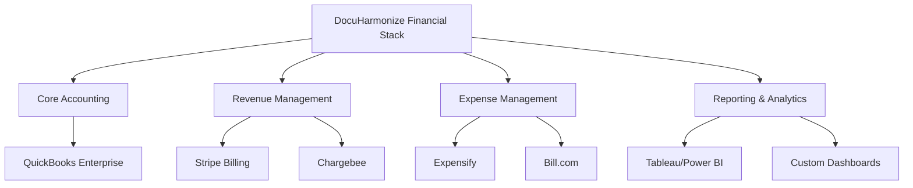

# Panama Accounting & Financial Setup

:::tip **Strategic Financial Foundation**
Panama's territorial tax system combined with CATI R&D incentives creates significant tax optimization opportunities for DocuHarmonize. This framework establishes accounting practices that maximize these benefits while meeting international standards for investor reporting.
:::

## 🏦 Banking & Financial Infrastructure

### Corporate Banking Setup

#### Primary Banking Relationship
**Recommended Bank**: Banco General or BAC Credomatic
**Account Structure**:
```markdown
DOCUHARMONIZE BANKING ARCHITECTURE

Operating Account (USD):
- Daily operations and payroll
- Customer payment processing
- Vendor payments and expenses
- Target balance: 3-6 months operating expenses

Savings/Investment Account (USD):
- Excess cash management
- Emergency reserves (6-12 months expenses)
- Short-term investment opportunities

International Wire Account:
- Customer collections from international clients
- Vendor payments to international suppliers
- Investment fund transfers
```

#### Payment Processing Integration
- **Stripe Atlas**: International credit card processing
- **Wire Transfers**: Enterprise customer payments
- **ACH/Bank Transfers**: Domestic vendor payments
- **Multi-currency**: Support for USD, EUR, GBP customer billing

### Accounting Software & Infrastructure

#### Primary Accounting System
**Recommended**: QuickBooks Enterprise or NetSuite
**SaaS-Specific Requirements**:
- Revenue recognition automation (ASC 606/IFRS 15)
- Subscription billing integration
- Multi-currency support
- Project/department tracking
- Investor reporting capabilities

#### Financial Technology Stack


---

## 📊 Chart of Accounts (SaaS-Optimized)

### Revenue Accounts (4000 Series)

```markdown
REVENUE STRUCTURE

4100 - Subscription Revenue
├── 4110 - Software Subscriptions (Primary SaaS revenue)
├── 4120 - Professional Services Revenue
├── 4130 - Training & Certification Revenue
└── 4140 - Implementation & Setup Revenue

4200 - Other Revenue
├── 4210 - Interest Income
├── 4220 - Foreign Exchange Gains
└── 4290 - Miscellaneous Revenue

4300 - Deferred Revenue (Liability Account)
├── 4310 - Deferred Subscription Revenue
├── 4320 - Deferred Professional Services
└── 4330 - Deferred Training Revenue
```

### Cost of Goods Sold (5000 Series)

```markdown
COGS STRUCTURE

5100 - Direct Costs
├── 5110 - Third-party Software Licenses (AWS, Azure, APIs)
├── 5120 - Payment Processing Fees
├── 5130 - Customer Success & Support Costs
└── 5140 - Professional Services Delivery Costs

5200 - Infrastructure Costs
├── 5210 - Cloud Hosting & Computing
├── 5220 - Data Storage & Backup
├── 5230 - Security & Compliance Tools
└── 5240 - Monitoring & Analytics Tools
```

### Operating Expenses (6000-8000 Series)

```markdown
OPERATING EXPENSE CATEGORIES

6000 - Sales & Marketing
├── 6100 - Sales Team Compensation
├── 6200 - Marketing Programs & Advertising
├── 6300 - Trade Shows & Events
├── 6400 - Sales Tools & CRM Systems
└── 6500 - Business Development

7000 - Research & Development (CATI Eligible)
├── 7100 - Engineering Salaries
├── 7200 - Product Development Tools
├── 7300 - AI/ML Infrastructure & Training
├── 7400 - Technical Research & Innovation
└── 7500 - Patent & IP Development

8000 - General & Administrative
├── 8100 - Executive Compensation
├── 8200 - Legal & Professional Services
├── 8300 - Accounting & Finance
├── 8400 - Office Rent & Utilities
├── 8500 - Insurance & Benefits
├── 8600 - Travel & Entertainment
└── 8700 - Miscellaneous G&A
```

### Panama-Specific Accounts

```markdown
PANAMA TAX & REGULATORY ACCOUNTS

2400 - Panama Tax Liabilities
├── 2410 - Income Tax Payable (25% rate on Panama-source)
├── 2420 - Dividend Tax Withholding
├── 2430 - ITBMS (Sales Tax) Payable
└── 2440 - Social Security Payable

9000 - Tax Optimization Tracking
├── 9100 - Foreign-Source Revenue (0% tax)
├── 9200 - Panama-Source Revenue (25% tax)
├── 9300 - CATI Exempt Revenue (0% tax for 15 years)
└── 9400 - Transfer Pricing Adjustments
```

---

## 📈 Revenue Recognition Framework (ASC 606/IFRS 15)

### SaaS Revenue Recognition Principles

#### 5-Step Process Implementation
```markdown
REVENUE RECOGNITION METHODOLOGY

Step 1: Identify Contract
- Written agreement with customer
- Commercial substance established
- Payment terms defined
- Approved by both parties

Step 2: Identify Performance Obligations
- Software platform access (distinct service)
- Implementation services (separate obligation)
- Training services (separate obligation)
- Support services (included in platform or separate)

Step 3: Determine Transaction Price
- Fixed subscription fees
- Variable consideration (usage-based)
- Professional services fees
- Discounts and incentives

Step 4: Allocate Transaction Price
- Standalone selling price methodology
- Pro-rata allocation across obligations
- Residual approach for bundled services

Step 5: Recognize Revenue
- Over time for SaaS platform (continuous service)
- Over time for implementation (progress toward completion)
- Point in time for training delivery
```

#### Practical Implementation for DocuHarmonize

##### Standard SaaS Subscription
```markdown
EXAMPLE: $100K ANNUAL SUBSCRIPTION

Performance Obligation: Platform access and support
Recognition Pattern: Ratably over 12-month term
Monthly Recognition: $8,333
Deferred Revenue: Decreases monthly by $8,333

Journal Entries:
At Contract Signing:
Dr. Accounts Receivable     $100,000
Cr. Deferred Revenue                   $100,000

Monthly Recognition:
Dr. Deferred Revenue        $8,333
Cr. Subscription Revenue              $8,333
```

##### Professional Services Bundle
```markdown
EXAMPLE: $150K ANNUAL SUBSCRIPTION + $50K IMPLEMENTATION

Total Transaction Price: $200,000
Allocation:
- Platform (standalone price $150K): 75% = $150,000
- Implementation (standalone price $50K): 25% = $50,000

Recognition:
- Platform: $12,500/month over 12 months
- Implementation: Progress-based over 3-6 months
```

### Multi-Element Arrangement (MEA) Considerations

#### Bundled Service Packages
- **Enterprise License**: Platform + implementation + training
- **Premium Support**: Enhanced SLA and dedicated support
- **Custom Development**: Platform modifications and integrations

#### Discount Attribution
```markdown
DISCOUNT ALLOCATION METHODOLOGY

Standard Bundle: Platform ($120K) + Implementation ($40K) = $160K
Customer Price: $140K (12.5% discount)

Allocation:
Platform: $120K/$160K × $140K = $105K
Implementation: $40K/$160K × $140K = $35K

Recognition preserves relative standalone selling prices
```

---

## 🌍 Panama Territorial Tax Optimization

### Foreign vs. Domestic Source Income

#### Revenue Source Classification
```markdown
TERRITORIAL TAX ANALYSIS

Foreign-Source Revenue (0% Panama Tax):
✓ International SaaS customers served from cloud infrastructure
✓ Customers outside Panama using platform remotely
✓ Professional services delivered virtually
✓ Training conducted online or at customer locations

Panama-Source Revenue (25% Panama Tax):
⚠️ On-site services delivered in Panama
⚠️ Panama customer contracts with local service delivery
⚠️ Physical presence required for service delivery
⚠️ Panama-based IP licensing revenue
```

#### Documentation Requirements
1. **Customer Contracts**: Clear service delivery location terms
2. **Service Delivery Records**: Documentation of where services are performed
3. **IP Licensing**: Separate agreements for Panama vs. international use
4. **Employee Time Tracking**: Hours worked on international vs. local customers

### CATI (Science & Technology City) Benefits

#### Qualification Requirements
```markdown
CATI QUALIFICATION FRAMEWORK

Investment Requirements:
- Minimum $500K R&D investment over 5 years
- At least 50% of revenue from technology services
- Research & development activities in Panama
- Employment of qualified technical personnel

Eligible Activities:
✓ Software development and programming
✓ AI/ML research and algorithm development
✓ Technology innovation and patents
✓ Scientific research and development

Tax Benefits (15-year term):
✓ 0% income tax on qualified activities
✓ 0% dividend tax on CATI earnings
✓ Import duty exemptions on R&D equipment
✓ Reduced rates on other taxes and fees
```

#### Financial Impact Analysis
```markdown
CATI BENEFITS QUANTIFICATION

Year 3 Projections (without CATI):
Revenue: $15M
R&D Expenses: $4M (qualified)
Taxable Income: $1M
Income Tax (25%): $250K

Year 3 Projections (with CATI):
Revenue: $15M
CATI-Exempt Revenue: $12M (80% R&D-related)
Taxable Revenue: $3M
Income Tax: $0 (CATI exemption)
Annual Tax Savings: $250K+

15-Year Cumulative Savings: $8-15M
```

---

## 📊 Financial Reporting Framework

### Management Reporting (Monthly)

#### Executive Dashboard Metrics
```markdown
DOCUHARMONIZE EXECUTIVE DASHBOARD

Revenue Metrics:
- Monthly Recurring Revenue (MRR)
- Annual Recurring Revenue (ARR)
- Net Revenue Retention (NRR)
- Customer Acquisition Cost (CAC)
- Customer Lifetime Value (LTV)

Financial Performance:
- Gross Revenue and Gross Margin %
- Operating Expenses by Category
- EBITDA and Cash Flow
- Cash Position and Runway
- Accounts Receivable Aging

Operational KPIs:
- New Customer Acquisitions
- Customer Churn Rate (logo and revenue)
- Average Contract Value (ACV)
- Sales Pipeline and Conversion Rates
- Employee Headcount by Department
```

#### SaaS Unit Economics
```markdown
KEY SAAS METRICS CALCULATION

Monthly Recurring Revenue (MRR):
Sum of monthly subscription values from all active customers

Annual Recurring Revenue (ARR):
MRR × 12 (normalized for annual contracts)

Net Revenue Retention (NRR):
(Starting MRR + Expansion - Churn - Contraction) / Starting MRR × 100

Customer Acquisition Cost (CAC):
Total Sales & Marketing Expenses / Number of New Customers Acquired

Customer Lifetime Value (LTV):
Average Monthly Revenue per Customer / Monthly Churn Rate

LTV:CAC Ratio Target: 3:1 minimum, 5:1+ optimal
CAC Payback Period Target: under 18 months
```

### Investor Reporting (Quarterly)

#### Board Package Components
1. **Executive Summary**: Key achievements, challenges, and outlook
2. **Financial Performance**: P&L, balance sheet, cash flow statements
3. **SaaS Metrics**: Detailed unit economics and cohort analysis
4. **Customer Analysis**: Acquisition, retention, and expansion metrics
5. **Operational Updates**: Product, team, and market developments
6. **Fundraising Status**: Current round progress and future planning

#### IFRS Compliance Considerations
```markdown
INTERNATIONAL REPORTING STANDARDS

Primary Standards for DocuHarmonize:
- IFRS 15: Revenue from Contracts with Customers
- IFRS 16: Leases (office space, equipment leases)
- IFRS 9: Financial Instruments (investments, loans)
- IFRS 2: Share-based Payment (stock options)

Monthly Reporting: Management accounting basis
Quarterly Reporting: IFRS-compliant for investors
Annual Reporting: Audited IFRS statements (when required)
```

---

## 💳 Expense Management & Controls

### Expense Policies by Category

#### Technology & Infrastructure
```markdown
TECHNOLOGY EXPENSE FRAMEWORK

Software Subscriptions:
- Pre-approval required for >$500/month
- Annual contracts preferred for cost optimization
- Departmental budget allocation and tracking
- Vendor consolidation for volume discounts

Cloud Infrastructure:
- Monthly budget: $5K-25K (scales with revenue)
- Auto-scaling monitoring and optimization
- Reserved instance purchasing for predictable workloads
- Cost allocation to customer acquisition metrics
```

#### Travel & Entertainment
**Policy**: Support customer acquisition and team collaboration
**Limits**:
- Domestic travel: Economy class, $200/night hotels
- International travel: Business class for >6 hours, $300/night hotels
- Customer entertainment: $500/event with pre-approval
- Team events: Quarterly team building, annual off-site

#### Professional Services
- **Legal**: $10K monthly budget, case-by-case for major transactions
- **Accounting**: Monthly bookkeeping, quarterly reviews, annual audit
- **Consulting**: Pre-approved for strategic projects only
- **Banking**: Relationship manager for treasury and lending needs

### Approval Workflows
```markdown
EXPENSE APPROVAL MATRIX

Under $1,000: Department manager approval
$1,000-$5,000: VP/Director approval
$5,000-$25,000: CEO approval
>$25,000: Board approval (for major commitments)

Emergency Expenses: CEO discretionary up to $10K
Capital Expenditures: CFO approval for all amounts
Legal/Regulatory: No limit for compliance requirements
```

---

## 🏛️ Tax Compliance & Optimization

### Monthly Tax Obligations

#### Panama Tax Calendar
```markdown
PANAMA TAX COMPLIANCE SCHEDULE

Monthly (by 10th of following month):
- ITBMS (Sales Tax) return and payment (if applicable)
- Social Security contributions (Caja de Seguro Social)
- Payroll tax withholdings remittance

Quarterly:
- Estimated income tax payments (if profitable)
- Dividend tax calculations and planning

Annually (by March 31):
- Corporate income tax return (Form 01)
- Transfer pricing documentation
- CATI compliance report and renewal
- Financial statements filing
```

#### International Tax Considerations
1. **US Tax Compliance** (if US investors/operations)
   - FATCA reporting requirements
   - Form 5472 (foreign corporation transactions)
   - State registration if significant US presence

2. **Transfer Pricing Documentation**
   - Master file and local file preparation
   - Intercompany agreement documentation
   - Arms-length pricing analysis
   - Economic substance requirements

### Tax Optimization Strategies

#### Intellectual Property Structuring
```markdown
IP TAX OPTIMIZATION

Strategy: Centralize IP ownership in Panama
Benefits:
- Licensing income from subsidiaries
- CATI exemption on R&D-derived IP
- Territorial taxation on foreign licensing
- Transfer pricing optimization

Implementation:
1. File patents and trademarks in Panama entity name
2. License IP to operating subsidiaries
3. Document arms-length licensing fees
4. Maintain economic substance in Panama
```

---

## 📈 Financial Projections Framework

### 5-Year Revenue Model

#### Revenue Growth Assumptions
```markdown
DOCUHARMONIZE REVENUE PROJECTIONS

Year 1 (2025): $500K ARR
- 5 enterprise customers
- $100K average contract value (ACV)
- 6-month average sales cycle

Year 2 (2026): $3M ARR
- 20 enterprise customers
- $150K ACV (expansion + new customers)
- 25% gross revenue retention

Year 3 (2027): $15M ARR
- 75 enterprise customers
- $200K ACV
- 120% net revenue retention

Year 4 (2028): $45M ARR
- 180 enterprise customers
- $250K ACV
- 130% net revenue retention

Year 5 (2029): $100M ARR
- 350 enterprise customers
- $285K ACV
- 140% net revenue retention
```

#### Cost Structure Evolution
```markdown
COST STRUCTURE BY REVENUE STAGE

Early Stage (under $5M ARR):
- COGS: 25-30% (infrastructure, support)
- Sales & Marketing: 60-80% (customer acquisition)
- R&D: 40-50% (product development)
- G&A: 20-30% (infrastructure building)

Growth Stage ($5M-$50M ARR):
- COGS: 20-25% (economies of scale)
- Sales & Marketing: 50-60% (efficient growth)
- R&D: 30-40% (continued innovation)
- G&A: 15-20% (operational leverage)

Scale Stage (>$50M ARR):
- COGS: 15-20% (optimized infrastructure)
- Sales & Marketing: 40-50% (mature channels)
- R&D: 25-30% (platform evolution)
- G&A: 10-15% (operational efficiency)
```

:::info **Financial Framework Summary**
Panama's territorial tax system combined with CATI R&D incentives provides DocuHarmonize with significant tax optimization opportunities. The SaaS-optimized accounting framework ensures compliance while maximizing these benefits and providing investor-grade financial reporting.
:::

---

**Next Step**: Explore [CATI Tax Incentives →](./cati-incentives.md) for detailed R&D tax benefits analysis.