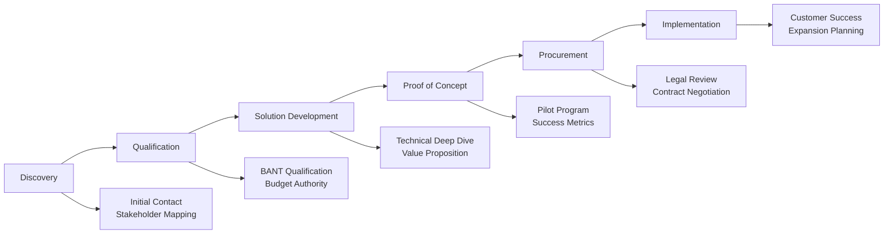

# Enterprise Sales Playbook: Fortune 500 Financial Services

:::tip **Enterprise B2B Sales Excellence**
This playbook provides the complete methodology for selling DocuHarmonize to Fortune 500 financial institutions with 6-18 month sales cycles, multiple stakeholders, and $250K-$2M annual contract values. Based on proven enterprise software sales frameworks.
:::

## 🎯 Sales Process Overview

### Enterprise Sales Methodology

#### 6-Phase Sales Process


#### Sales Cycle Timeline
```markdown
ENTERPRISE SALES TIMELINE

Phase 1: Discovery & Initial Qualification (Months 1-2)
- Stakeholder identification and mapping
- Pain point discovery and validation
- Initial budget and authority confirmation
- Competitive landscape assessment

Phase 2: Solution Development (Months 2-4)
- Technical requirements gathering
- Custom value proposition development
- ROI analysis and business case
- Executive presentation and buy-in

Phase 3: Proof of Concept (Months 4-6)
- POC scope definition and agreement
- Technical implementation and validation
- Success metrics measurement
- Reference and case study development

Phase 4: Procurement & Legal (Months 6-9)
- Security and compliance review
- Legal and contract negotiation
- Vendor management approval
- Final budget approval and signing

Phase 5: Implementation Planning (Months 9-12)
- Implementation project planning
- Change management strategy
- Success metrics and milestones
- Customer success transition

Average Sales Cycle: 8-12 months for new logos
Expansion Sales Cycle: 3-6 months for existing customers
```

---

## 👥 Stakeholder Mapping & Engagement

### Decision Making Unit (DMU)

#### Primary Decision Makers
```markdown
PRIMARY STAKEHOLDERS

Chief Compliance Officer (CCO) - ECONOMIC BUYER
Role: Ultimate decision authority for compliance technology
Pain Points:
- Regulatory violation risk and penalties
- Audit preparation complexity and duration
- Cross-department documentation inconsistency
- Manual compliance processes and inefficiency

Value Proposition:
- 60% reduction in compliance costs
- 85% faster audit preparation
- 90% reduction in compliance violations
- Real-time regulatory change management

Engagement Strategy:
- Lead with compliance ROI and risk mitigation
- Provide regulatory expertise and thought leadership
- Share peer references from similar institutions
- Offer pilot program with measurable outcomes

Chief Information Officer (CIO) - TECHNICAL BUYER
Role: Technology decision authority and budget holder
Pain Points:
- Legacy system modernization challenges
- Integration complexity with existing systems
- Security and data protection requirements
- Vendor proliferation and management overhead

Value Proposition:
- Modern cloud-native architecture
- API-first integration approach
- Enterprise-grade security (SOC 2, ISO 27001)
- 50% reduction in document management TCO

Engagement Strategy:
- Technical architecture review and validation
- Security and compliance certification evidence
- Integration roadmap and implementation timeline
- Reference architecture and customer success stories
```

#### Key Influencers
```markdown
INFLUENCER STAKEHOLDERS

Legal Counsel - COMPLIANCE VALIDATOR
Role: Risk assessment and contract review
Concerns: Legal defensibility, audit trails, regulatory compliance
Engagement: Legal framework review, compliance evidence, risk mitigation

IT Security Director - SECURITY GATEKEEPER
Role: Security assessment and approval
Concerns: Data protection, access controls, vulnerability management
Engagement: Security architecture review, penetration testing results, certifications

Business Unit Leaders - END USER CHAMPIONS
Role: Department heads affected by implementation
Concerns: Workflow disruption, user adoption, productivity impact
Engagement: User experience demonstrations, pilot program success, training plans

Finance/Procurement - BUDGET AUTHORITY
Role: Contract negotiation and vendor management
Concerns: Cost justification, contract terms, vendor risk assessment
Engagement: ROI analysis, TCO modeling, flexible contract terms
```

### Stakeholder Engagement Strategy

#### Multi-Threading Approach
```markdown
STAKEHOLDER ENGAGEMENT PLAN

Week 1-4: Initial Discovery
- CCO: Executive briefing on compliance automation
- CIO: Technical architecture and integration discussion
- Legal: Regulatory compliance framework review
- Security: Initial security and privacy assessment

Week 5-8: Deep Dive Validation
- CCO: Peer reference calls and ROI validation
- CIO: Technical proof-of-concept planning
- Legal: Contract terms and compliance review
- Business Units: User experience and workflow analysis

Week 9-16: Proof of Concept
- All Stakeholders: POC progress reviews and validation
- CCO: Success metrics and outcome measurement
- CIO: Technical performance and integration validation
- Users: Adoption rates and productivity improvements

Week 17-24: Decision and Procurement
- CCO: Final business case and investment approval
- Legal/Procurement: Contract negotiation and finalization
- CIO: Implementation planning and resource allocation
- Security: Final security review and sign-off
```

---

## 🔍 Discovery & Qualification Framework

### BANT+ Qualification Methodology

#### Budget Qualification
```markdown
BUDGET DISCOVERY

Qualification Questions:
1. "What's your current annual spend on compliance technology and consulting?"
2. "How much does a typical compliance violation cost your organization?"
3. "What budget range have you allocated for documentation standardization?"
4. "Who has budget authority for compliance technology investments?"

Qualifying Criteria:
✓ Budget Range: $250K-$2M annually
✓ Budget Cycle: Current fiscal year or next
✓ Budget Authority: Identified and accessible
✓ Investment ROI: Clear cost/benefit understanding

Disqualifying Signals:
❌ No dedicated compliance technology budget
❌ Budget authority unclear or inaccessible
❌ Recent major compliance system implementation
❌ Budget frozen or significant cost-cutting initiatives
```

#### Authority Identification
```markdown
AUTHORITY MAPPING

Decision Authority Levels:
1. Economic Buyer (CCO/CRO): Final spending authority
2. Technical Buyer (CIO/CTO): Technical decision and veto power
3. User Buyer (Compliance Teams): User acceptance and adoption
4. Coach/Champion: Internal advocate and process navigator

Authority Validation Questions:
- "Who makes the final decision on compliance technology investments?"
- "What's the approval process for technology purchases of this size?"
- "Who else needs to be involved in the evaluation and decision?"
- "What happened with your last major technology implementation?"

Champion Development:
- Identify early adopters and innovation advocates
- Provide exclusive insights and thought leadership
- Offer pilot program participation opportunities
- Create internal success stories and wins
```

#### Need Assessment Framework
```markdown
PAIN POINT DISCOVERY

Compliance Pain Points:
1. Regulatory Risk
   - Recent violations or enforcement actions
   - Audit findings and remediation requirements
   - Regulatory change management challenges
   - Cross-border compliance complexity

2. Operational Inefficiency
   - Document creation and review time
   - Manual processes and workflow bottlenecks
   - Resource allocation and workload management
   - Technology fragmentation and integration

3. Quality and Consistency
   - Documentation standardization gaps
   - Version control and change management
   - Training and knowledge management
   - Brand and messaging consistency

Discovery Questions:
- "What keeps you up at night regarding compliance documentation?"
- "How long does it take to prepare for a regulatory audit?"
- "What would happen if you had a compliance violation tomorrow?"
- "How do you ensure consistency across all business units?"
```

#### Timing Assessment
```markdown
TIMING QUALIFICATION

Urgency Indicators:
✓ Upcoming regulatory audit or examination
✓ Recent compliance violation or enforcement action
✓ New regulatory requirements or deadlines
✓ Executive mandate for compliance improvement

Timeline Questions:
- "What's driving the need to address this now?"
- "When do you need to have a solution in place?"
- "What are the consequences of delaying this decision?"
- "What other priorities are competing for attention and resources?"

Ideal Timing Scenarios:
1. Pre-Audit: 6-12 months before major regulatory examination
2. Post-Violation: Recovery and remediation initiatives
3. Regulatory Change: New requirements requiring documentation updates
4. Digital Transformation: Broader compliance modernization programs
```

---

## 💰 Value Proposition & ROI Framework

### Quantified Business Case

#### ROI Calculator Model
```markdown
DOCUHARMONIZE ROI CALCULATOR

INPUT PARAMETERS:

Organization Metrics:
- Annual Revenue: $10B - $500B
- Compliance Staff: 100 - 2,000 employees
- Document Volume: 5,000 - 50,000 documents/year
- Current Compliance Technology Spend: $1M - $50M

Current State Costs:
- Document Creation Time: 8 hours average
- Review Cycles: 5-7 iterations
- Compliance Preparation: 18 months for major audits
- Violation Risk: 2-5% annual probability
- Average Violation Cost: $2.9M per incident

BENEFITS CALCULATION:

Efficiency Improvements:
- Document Creation: 85% time reduction (8 hours → 1.2 hours)
- Review Cycles: 60% reduction (5-7 cycles → 2-3 cycles)
- Audit Preparation: 70% time reduction (18 months → 5.4 months)

Cost Savings (Annual):
- Personnel Efficiency: $2.1M (300 staff × $7K average savings)
- Compliance Consulting: $850K (60% reduction in external costs)
- Technology Consolidation: $450K (legacy system retirement)
- Process Optimization: $1.2M (workflow automation savings)

Risk Mitigation:
- Violation Probability Reduction: 80% (2-5% → 0.4-1%)
- Expected Loss Avoidance: $2.3M annually
- Audit Cost Reduction: $750K (preparation efficiency)
- Regulatory Confidence: Qualitative benefit

TOTAL ANNUAL BENEFIT: $7.65M
DocuHarmonize Investment: $900K annually
NET ANNUAL BENEFIT: $6.75M
ROI: 750% (3-year calculation)
Payback Period: 3.2 months
```

#### Business Case Template
```markdown
EXECUTIVE BUSINESS CASE

THE CHALLENGE:
[Customer Name] faces increasing regulatory complexity with 234 daily regulatory updates requiring manual review and implementation. Current documentation processes take 8+ hours per document with 5-7 review cycles, creating operational inefficiency and compliance risk.

THE SOLUTION:
DocuHarmonize provides AI-powered compliance documentation automation, reducing document creation time by 85% while ensuring 95% compliance accuracy through intelligent rule checking and standardization.

QUANTIFIED BENEFITS:

Year 1: $6.2M net benefit
- Efficiency gains: $3.8M
- Risk reduction: $1.9M
- Technology savings: $0.5M

Year 2: $7.1M net benefit
- Expanded usage: Additional departments
- Process maturity: Higher automation rates
- Reduced support: Self-service capabilities

Year 3: $8.3M net benefit
- Full enterprise deployment
- Advanced AI capabilities
- Strategic competitive advantage

3-Year Total: $21.6M benefit
3-Year Investment: $2.7M
3-Year ROI: 800%

IMPLEMENTATION PLAN:
- Months 1-3: Pilot program with risk management department
- Months 4-6: Expansion to compliance and legal departments
- Months 7-12: Enterprise-wide deployment and optimization
- Ongoing: Continuous improvement and expansion

SUCCESS METRICS:
- Document creation time reduction: >80%
- Review cycle reduction: >50%
- Compliance accuracy improvement: >90%
- User satisfaction score: >8/10
- Audit preparation time: under 6 months
```

### Competitive Differentiation

#### Against Microsoft SharePoint/365
```markdown
COMPETITIVE POSITIONING vs. SHAREPOINT

DocuHarmonize Advantages:
✓ Purpose-Built for Compliance: Designed specifically for regulatory documentation vs. general productivity
✓ AI-Powered Intelligence: 95% automated compliance checking vs. manual review processes
✓ Implementation Speed: 3-6 months vs. 12-24 months for enterprise SharePoint deployments
✓ Total Cost of Ownership: 40-60% lower TCO through purpose-built efficiency

Customer Objections & Responses:
Objection: "We already have SharePoint and Office 365"
Response: "DocuHarmonize enhances your SharePoint investment by adding compliance intelligence and automation. Think of it as making your existing content 10x more compliant and efficient."

Objection: "SharePoint is already integrated with our systems"
Response: "DocuHarmonize integrates seamlessly with SharePoint while adding the compliance-specific capabilities that SharePoint wasn't designed for. You keep your investment and add specialized intelligence."

Objection: "We don't want to train users on another system"
Response: "Our interface is familiar to Office users, and most compliance tasks become automated. Users actually spend less time in systems, not more."
```

#### Against Legacy ECM (OpenText, IBM)
```markdown
COMPETITIVE POSITIONING vs. LEGACY ECM

DocuHarmonize Advantages:
✓ Modern Cloud Architecture: Cloud-native vs. legacy on-premise complexity
✓ User Experience: Consumer-grade interface vs. complex legacy systems
✓ Implementation Speed: 4x faster deployment vs. traditional ECM systems
✓ AI Capabilities: Built-in vs. expensive add-on modules

Value Proposition:
"Legacy ECM systems were built for document storage in the 1990s. DocuHarmonize was built for AI-powered compliance automation in the 2020s. You get modern technology, faster implementation, and lower total cost."

Customer Objections & Responses:
Objection: "We've invested heavily in our current ECM system"
Response: "We can integrate with your existing system while modernizing your compliance processes. Many customers start with compliance use cases and gradually expand as they see results."

Objection: "OpenText has more features and enterprise capabilities"
Response: "More features often means more complexity. We focus on compliance-specific capabilities that deliver immediate ROI. Our customers get 80% of the value with 20% of the complexity."
```

---

## 🎯 Proof of Concept Framework

### POC Structure & Planning

#### 5-Week Pilot Program
```markdown
PROOF OF CONCEPT METHODOLOGY

Week 1: Setup & Configuration
- Environment provisioning and configuration
- Data integration and migration (sample documents)
- User account creation and access provisioning
- Initial training and orientation sessions

Week 2: Basic Functionality Validation
- Document upload and processing testing
- Template library exploration and customization
- Basic workflow configuration and testing
- User interface and experience validation

Week 3: Advanced Features & Integration
- AI-powered compliance checking validation
- Integration with existing systems (SharePoint, email)
- Advanced workflow and approval process testing
- Reporting and analytics capabilities review

Week 4: User Adoption & Training
- End-user training and onboarding
- Real document processing and workflow execution
- User feedback collection and analysis
- Performance and efficiency measurement

Week 5: Results Analysis & Presentation
- Success metrics calculation and validation
- User satisfaction survey and analysis
- Business case validation and ROI confirmation
- Executive presentation and next steps planning

POC Success Criteria:
✓ 80%+ user satisfaction score
✓ 50%+ reduction in document creation time
✓ 90%+ compliance rule detection accuracy
✓ Successful integration with 2+ enterprise systems
✓ Management approval for full implementation
```

#### POC Scope Definition
```markdown
POC SCOPE FRAMEWORK

Document Types (2-3 types maximum):
1. Risk Management Policies
   - Scope: 20-50 existing documents
   - Users: 10-15 risk management professionals
   - Workflow: Policy creation, review, and approval
   - Success Metric: 60% time reduction in policy updates

2. Compliance Procedures
   - Scope: 15-25 procedural documents
   - Users: 8-12 compliance specialists
   - Workflow: Procedure documentation and maintenance
   - Success Metric: 70% improvement in consistency scores

Integration Scope:
- Single system integration (typically SharePoint or email)
- Basic reporting and analytics dashboard
- Standard user authentication (SSO if available)

Excluded from POC:
- Advanced AI model customization
- Complex multi-system integrations
- Full enterprise deployment
- Custom feature development
- Extensive data migration

Expected Outcomes:
- Measurable productivity improvement (>50%)
- High user satisfaction (>80%)
- Technical validation and integration success
- Clear business case for full implementation
- Executive buy-in and approval for next phase
```

### POC Success Metrics

#### Quantitative Measurements
```markdown
POC SUCCESS METRICS

Productivity Metrics:
- Document Creation Time: Baseline vs. POC performance
- Review Cycle Duration: Number of iterations and time
- Approval Workflow Speed: Time from submission to approval
- Search and Retrieval: Time to find relevant documents
- Template Usage: Adoption rate and customization success

Quality Metrics:
- Compliance Accuracy: Automated vs. manual checking results
- Consistency Scores: Standardization improvement measurement
- Error Reduction: Fewer compliance gaps and violations
- Template Effectiveness: User preference and success rates
- Content Quality: Readability and comprehensiveness scores

User Adoption Metrics:
- Login Frequency: Daily and weekly active users
- Feature Utilization: Breadth of feature adoption
- Self-Service Success: Reduced support ticket volume
- Training Effectiveness: Time to productivity for new users
- User Satisfaction: Survey scores and feedback sentiment

Technical Performance:
- System Responsiveness: Page load times and API performance
- Integration Success: Data sync accuracy and reliability
- Uptime and Availability: System reliability during POC
- Security Compliance: No security incidents or concerns
- Scalability Indicators: Performance under increasing load
```

#### Qualitative Assessment
```markdown
QUALITATIVE SUCCESS FACTORS

User Experience:
- Intuitive interface and navigation
- Positive feedback on workflow integration
- Reduced frustration with document processes
- Increased confidence in compliance outcomes
- Enthusiasm for continued usage and expansion

Management Perception:
- Executive satisfaction with progress and results
- Confidence in technology and vendor capability
- Alignment with strategic compliance objectives
- Positive stakeholder feedback and endorsement
- Clear vision for enterprise-wide implementation

Technical Validation:
- IT team confidence in security and architecture
- Successful integration with existing infrastructure
- Scalability assessment for enterprise deployment
- Vendor relationship and support quality evaluation
- Technical documentation and knowledge transfer
```

---

## 📊 Sales Tools & Resources

### Sales Enablement Materials

#### Discovery Questionnaire
```markdown
COMPLIANCE DISCOVERY QUESTIONS

Current State Assessment:
1. How many compliance-related documents does your organization create annually?
2. What's the average time to create a new compliance policy or procedure?
3. How many review cycles typically occur before document approval?
4. What systems currently store and manage your compliance documentation?
5. How do you ensure consistency across different business units and departments?

Pain Point Identification:
6. What's the most time-consuming aspect of compliance documentation?
7. Have you experienced compliance violations related to documentation issues?
8. How do you stay current with regulatory changes and requirements?
9. What challenges do you face during regulatory audits and examinations?
10. How do you measure the effectiveness of your compliance documentation?

Technology Evaluation:
11. What compliance technology solutions have you evaluated or implemented?
12. What integration requirements are critical for your environment?
13. Who are the key stakeholders involved in technology decisions?
14. What's your timeline for addressing compliance documentation challenges?
15. What would success look like for a documentation standardization solution?

Budget and Authority:
16. What budget range have you allocated for compliance technology improvements?
17. Who has authority to approve compliance technology investments?
18. What's your organization's process for evaluating and purchasing enterprise software?
19. How do you measure ROI for compliance technology investments?
20. What other initiatives are competing for budget and attention?
```

#### Objection Handling Guide
```markdown
COMMON OBJECTIONS & RESPONSES

Price/Budget Objections:
Objection: "Your solution is more expensive than alternatives"
Response: "Let's look at the total cost of ownership including implementation time, training, and ongoing support. Our customers typically see 40-60% lower TCO through faster deployment and higher efficiency. Would you like to see a detailed TCO analysis for your specific situation?"

Objection: "We don't have budget approved for this type of investment"
Response: "I understand budget constraints. Many of our customers started with a pilot program that self-funded through immediate efficiency gains. The pilot typically pays for itself in 3-4 months through time savings alone. Can we explore a phased approach that works within your current budget?"

Technical Objections:
Objection: "We're concerned about integration with our existing systems"
Response: "Integration is one of our core strengths. We have pre-built connectors for [specific systems they mentioned] and an API-first architecture. Our implementation team has successfully integrated with [relevant customer examples]. Would you like to see our integration architecture and reference implementations?"

Objection: "We need to see proof that this works in our industry"
Response: "Absolutely. We have [X] customers in financial services, including [specific relevant examples]. I can arrange reference calls with [similar customer] who implemented similar use cases. They achieved [specific results]. Would a reference call be helpful?"

Timing Objections:
Objection: "Now isn't the right time for a major technology implementation"
Response: "I understand the timing concern. That's why we designed our pilot program to minimize disruption and show quick wins. Most customers start with one department and expand based on success. The pilot can begin with minimal IT resources and prove value before broader implementation. When would be the ideal time to show measurable compliance improvement?"

Authority Objections:
Objection: "I need to discuss this with my team/boss/committee"
Response: "Of course, this is an important decision that requires input from key stakeholders. Who else should be involved in the evaluation? I can prepare materials specific to their interests and concerns. Would it be helpful if I presented to the broader team to address questions directly?"
```

### Competitive Battle Cards

#### Detailed Competitive Intelligence
```markdown
COMPETITIVE BATTLE CARD: MICROSOFT SHAREPOINT

Competitor Overview:
- Market Position: Dominant incumbent in enterprise content management
- Strengths: Broad adoption, Office integration, familiar user interface
- Weaknesses: Generic focus, complex customization, limited compliance automation
- Typical Customer: Organizations already invested in Microsoft ecosystem

When You'll Face This Competitor:
- Existing SharePoint customers looking to enhance capabilities
- Microsoft-centric IT environments and strategies
- Cost-conscious customers focusing on licensing efficiency
- Organizations with strong Office 365 adoption

Competitive Strategies:
1. Position as Enhancement, Not Replacement
   "We make your SharePoint investment more valuable by adding compliance intelligence"

2. Focus on Purpose-Built Advantages
   "SharePoint is excellent for collaboration; DocuHarmonize is purpose-built for compliance"

3. Emphasize Speed of Value
   "Get compliance automation in 90 days vs. 18+ months for SharePoint customization"

4. Highlight Specialized Expertise
   "Our team includes former compliance officers who understand your challenges"

Key Differentiation Points:
✓ 95% out-of-box compliance functionality vs. extensive customization required
✓ 3-6 month implementation vs. 12-24 months for equivalent SharePoint solution
✓ AI-powered compliance checking vs. manual rule configuration
✓ Purpose-built compliance workflows vs. generic document approval
✓ Specialized expertise vs. general IT consulting

Common Customer Concerns:
- Integration with existing SharePoint investment
- User adoption and training requirements
- Vendor proliferation and management
- Cost justification for specialized solution

Response Strategies:
- Demonstrate seamless SharePoint integration
- Show familiar user experience and minimal training
- Position as compliance center of excellence
- Calculate compliance-specific ROI and value
```

---

## 🎯 Customer Success & Implementation

### Implementation Methodology

#### 24-Week Implementation Framework
```markdown
CUSTOMER SUCCESS IMPLEMENTATION

Phase 1: Foundation (Weeks 1-6)
Objectives: Environment setup, stakeholder alignment, initial training

Week 1-2: Project Initiation
- Executive kickoff and stakeholder introductions
- Project plan finalization and milestone agreement
- Technical environment provisioning and configuration
- Security review and compliance validation

Week 3-4: Data Integration & Migration
- Document inventory and classification
- System integration and data mapping
- Initial content migration and validation
- User account setup and permission configuration

Week 5-6: Initial Training & Orientation
- Administrator training and system configuration
- End-user orientation and basic workflows
- Initial template library setup and customization
- Feedback collection and process refinement

Phase 2: Pilot Deployment (Weeks 7-12)
Objectives: Controlled rollout, process validation, user adoption

Week 7-8: Pilot Group Onboarding
- Pilot user group training and certification
- Real-world workflow testing and validation
- Performance monitoring and optimization
- Issue identification and resolution

Week 9-10: Process Optimization
- Workflow refinement based on pilot feedback
- Template optimization and standardization
- Integration testing and performance tuning
- User experience improvements and customization

Week 11-12: Pilot Success Validation
- Success metrics measurement and validation
- User satisfaction assessment and feedback
- Business case confirmation and ROI calculation
- Executive review and expansion approval

Phase 3: Enterprise Rollout (Weeks 13-18)
Objectives: Department-by-department expansion, full feature utilization

Week 13-14: Department 2 Rollout
- Risk management or legal department onboarding
- Advanced feature training and utilization
- Cross-department workflow integration
- Expanded template library and customization

Week 15-16: Department 3 Rollout
- Operations or business unit deployment
- Advanced reporting and analytics implementation
- Integration with additional enterprise systems
- Power user training and certification

Week 17-18: Full Enterprise Integration
- Remaining department onboarding completion
- Enterprise-wide workflow optimization
- Advanced AI feature activation and training
- System performance optimization and tuning

Phase 4: Optimization & Expansion (Weeks 19-24)
Objectives: Advanced features, optimization, strategic planning

Week 19-20: Advanced Feature Adoption
- AI model customization and optimization
- Advanced analytics and reporting deployment
- Integration with additional enterprise systems
- Custom workflow development and implementation

Week 21-22: Performance Optimization
- System performance tuning and optimization
- User adoption analysis and improvement initiatives
- Process standardization and best practice sharing
- Success story documentation and case study development

Week 23-24: Strategic Planning & Expansion
- Future roadmap planning and prioritization
- Additional use case identification and planning
- Success metrics review and goal setting
- Quarterly business review and relationship planning
```

### Success Metrics & KPIs

#### Customer Health Scoring
```markdown
CUSTOMER SUCCESS METRICS

Product Adoption Metrics (40% weight):
- Daily Active Users: >70% of licensed users
- Feature Utilization: >60% of available features used
- Document Processing Volume: Increasing month-over-month
- Template Usage: >80% of documents use templates
- Workflow Adoption: >90% of documents use automated workflows

Business Outcome Metrics (35% weight):
- Time Savings: >60% reduction in document creation time
- Quality Improvement: >80% compliance score improvement
- Cost Reduction: Measurable ROI achievement >300%
- Risk Mitigation: Compliance violation reduction
- Audit Readiness: under 6 months audit preparation time

User Satisfaction Metrics (25% weight):
- NPS Score: >50 (promoter score)
- Support Ticket Volume: less than 5 tickets/month per 100 users
- Training Completion: >90% user certification rate
- User Feedback: >4.5/5 satisfaction rating
- Executive Satisfaction: Positive quarterly business reviews

Health Score Calculation:
- Green (90-100): Excellent health, expansion opportunity
- Yellow (70-89): Good health, monitor closely
- Red (50-69): At-risk, intervention required
- Critical (under 50): Immediate escalation and recovery plan

Customer Success Actions:
- Green: Expansion discussion, reference opportunity, case study
- Yellow: Regular check-ins, optimization recommendations
- Red: Success plan development, executive engagement
- Critical: Escalation to leadership, recovery planning
```

:::info **Sales Playbook Summary**
This enterprise sales playbook provides the complete methodology for successfully selling DocuHarmonize to Fortune 500 financial services companies. The framework combines proven B2B sales techniques with compliance industry expertise to achieve consistent $250K-$2M annual contract values.
:::

---

**🎉 Congratulations! You've completed the comprehensive DocuHarmonize Startup OS**

Your enterprise documentation standardization platform now has:
- ✅ **Market Discovery**: Validated beachhead market and customer personas
- ✅ **Legal Foundation**: Complete Panama legal framework
- ✅ **Financial Framework**: Path to $100M ARR with tax optimization
- ✅ **Product Architecture**: Enterprise-grade AI/ML platform
- ✅ **Sales & Marketing**: Fortune 500 B2B sales methodology

**Next Steps**: Execute your [roadmap](../README.md) starting with corporate formation, customer discovery, and MVP development!