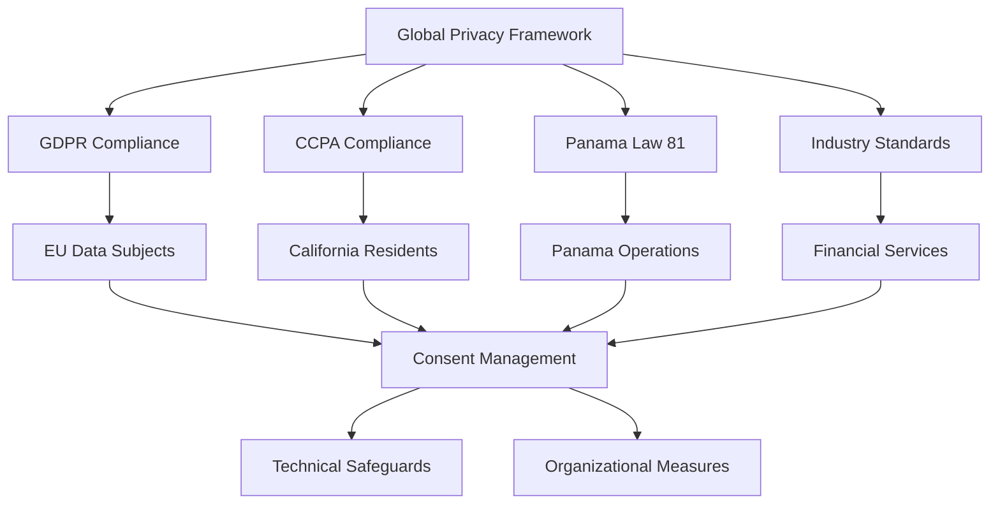
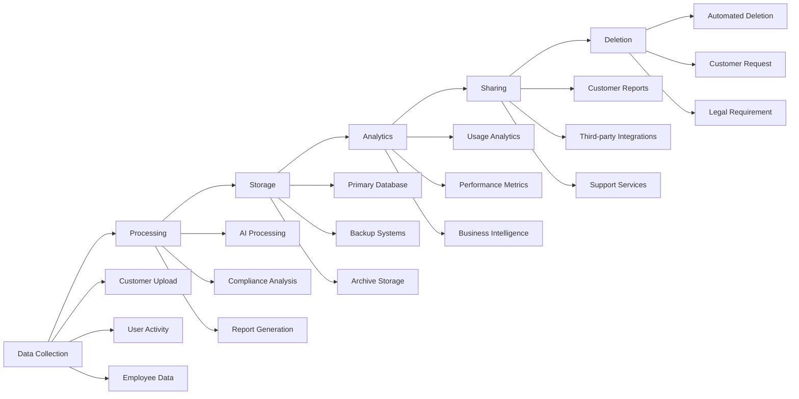

# Data Privacy & Compliance Framework

:::tip **Enterprise Privacy by Design**
DocuHarmonize handles sensitive financial and compliance data for Fortune 500 clients. A robust privacy framework is essential for regulatory compliance, customer trust, and competitive advantage in enterprise sales.
:::

## 🌍 Global Privacy Regulatory Landscape

### Applicable Privacy Regulations

#### Primary Regulations (High Impact)
1. **EU General Data Protection Regulation (GDPR)**
   - **Scope**: EU residents' personal data regardless of processing location
   - **Applicability**: European financial services customers
   - **Penalties**: Up to €20M or 4% of annual turnover
   - **Requirements**: Consent, data minimization, right to be forgotten

2. **California Consumer Privacy Act (CCPA/CPRA)**
   - **Scope**: California residents' personal information
   - **Applicability**: US enterprise customers with CA employees
   - **Penalties**: Up to $7,500 per intentional violation
   - **Requirements**: Right to know, delete, opt-out of sale

3. **Panama Data Protection Law (Law 81 of 2019)**
   - **Scope**: Personal data processed in Panama
   - **Applicability**: DocuHarmonize operations and local employees
   - **Requirements**: Consent, purpose limitation, data subject rights
   - **Authority**: National Authority for Personal Data Protection (ANPDP)

#### Secondary Regulations (Medium Impact)
- **UK Data Protection Act 2018** (Post-Brexit GDPR implementation)
- **Canada Personal Information Protection and Electronic Documents Act (PIPEDA)**
- **Singapore Personal Data Protection Act (PDPA)**
- **Brazil Lei Geral de Proteção de Dados (LGPD)**

### Privacy Framework Strategy


---

## 📊 Data Mapping & Classification

### DocuHarmonize Data Categories

#### 1. **Customer Business Data** (Primary Asset)
**Data Types**:
- Policy documents and procedures
- Compliance reports and audit trails
- Regulatory documentation
- Training materials and content
- Business process workflows

**Privacy Classification**:
- **Personal Data**: Minimal (author names, reviewers)
- **Sensitive Data**: Business confidential
- **Retention**: Customer-controlled, up to 7 years post-contract

#### 2. **Platform Usage Data** (Analytics)
**Data Types**:
- User activity logs and session data
- Feature usage patterns and preferences
- Performance metrics and error logs
- Integration data and API calls

**Privacy Classification**:
- **Personal Data**: User identifiers, IP addresses
- **Sensitive Data**: Behavioral patterns
- **Retention**: 2 years for analytics, 7 years for audit

#### 3. **Employee & Contact Data** (HR/CRM)
**Data Types**:
- Employee personal information
- Customer contact details
- Vendor and partner information
- Prospect and lead data

**Privacy Classification**:
- **Personal Data**: Names, emails, phone numbers
- **Sensitive Data**: Employment records, compensation
- **Retention**: As required by law and business needs

#### 4. **AI Training Data** (Machine Learning)
**Data Types**:
- Anonymized document samples
- Compliance pattern datasets
- Model training and validation data
- Performance benchmarks

**Privacy Classification**:
- **Personal Data**: Anonymized/pseudonymized
- **Sensitive Data**: Proprietary business information
- **Retention**: Indefinite for model improvement

### Data Flow Mapping


---

## 🛡️ Privacy by Design Implementation

### Technical Privacy Safeguards

#### Data Protection Architecture
```markdown
PRIVACY-BY-DESIGN TECHNICAL FRAMEWORK

1. ENCRYPTION & SECURITY
   - AES-256 encryption at rest and in transit
   - TLS 1.3 for all data communications
   - Hardware Security Module (HSM) for key management
   - Zero-trust network architecture

2. ACCESS CONTROLS
   - Role-based access control (RBAC) with least privilege
   - Multi-factor authentication for all users
   - Privileged access management (PAM) for administrators
   - Regular access reviews and certification

3. DATA MINIMIZATION
   - Collection limited to business necessity
   - Automated data retention and deletion policies
   - Data pseudonymization for analytics
   - Purpose limitation enforcement

4. AUDIT & MONITORING
   - Comprehensive audit logging of data access
   - Real-time monitoring and alerting
   - Regular security assessments and penetration testing
   - Privacy impact assessments for new features
```

#### Pseudonymization & Anonymization
**Pseudonymization Strategy**:
- Replace direct identifiers with pseudonyms
- Separate storage of pseudonymization keys
- Role-based access to re-identification capability
- Cryptographic protection of pseudonyms

**Anonymization for AI Training**:
- Statistical disclosure control techniques
- K-anonymity and l-diversity implementation
- Differential privacy for aggregate analytics
- Regular re-identification risk assessments

### Organizational Privacy Measures

#### Privacy Governance Structure
```markdown
PRIVACY ORGANIZATION

Data Protection Officer (DPO):
- Independent privacy oversight and guidance
- Privacy impact assessment coordination
- Data subject rights management
- Regulatory authority liaison

Privacy Committee:
- Cross-functional privacy decision making
- Product development privacy review
- Incident response coordination
- Policy development and updates

Data Stewards:
- Departmental data responsibility
- Privacy training and awareness
- Data quality and lifecycle management
- Local compliance implementation
```

#### Privacy Policies & Procedures
1. **Data Protection Impact Assessment (DPIA) Process**
2. **Data Subject Rights Management Procedures**
3. **Data Breach Incident Response Plan**
4. **Vendor Privacy Due Diligence Framework**
5. **Employee Privacy Training Program**
6. **Cross-Border Data Transfer Procedures**

---

## 📋 GDPR Compliance Framework

### Legal Basis for Processing

#### Customer Data Processing
**Primary Legal Basis**: **Contract Performance** (Article 6(1)(b))
- Processing necessary for service delivery
- Customer-initiated compliance document management
- Platform functionality and feature provision

**Secondary Legal Basis**: **Legitimate Interest** (Article 6(1)(f))
- Service improvement and optimization
- Security monitoring and fraud prevention
- Anonymous analytics and benchmarking

#### Employee Data Processing
**Primary Legal Basis**: **Contract Performance & Legal Obligation**
- Employment relationship management
- Payroll and benefits administration
- Compliance with labor laws

#### Marketing & Sales Data
**Legal Basis**: **Consent** (Article 6(1)(a))
- Newsletter subscriptions and marketing communications
- Event registration and follow-up
- Product demonstrations and trials

### Data Subject Rights Implementation

#### Right to Information (Articles 13-14)
**Privacy Notice Requirements**:
- Clear and plain language explanations
- Comprehensive purpose and legal basis disclosure
- Data retention period specification
- Third-party sharing information
- Data subject rights description

**Multi-Layered Privacy Notice**:
- Short-form notice at point of collection
- Detailed privacy policy with full information
- Just-in-time notices for specific processing activities

#### Right of Access (Article 15)
**Access Request Process**:
- Secure online portal for authenticated requests
- 30-day response timeframe (with extension if complex)
- Comprehensive data export in machine-readable format
- Identity verification procedures

#### Right to Rectification (Article 16)
**Data Correction Process**:
- Online profile management for direct corrections
- Verification procedures for sensitive data changes
- Cascading updates across all data systems
- Notification to third parties if applicable

#### Right to Erasure (Article 17)
**Deletion Request Process**:
- Automated deletion workflows for eligible requests
- Business necessity and legal obligation exceptions
- Secure deletion procedures and verification
- Third-party notification requirements

#### Right to Data Portability (Article 20)
**Data Export Process**:
- Structured, machine-readable data formats (JSON, CSV)
- Comprehensive data package including metadata
- Secure download with authentication
- Direct transmission to other controllers (where technically feasible)

### Cross-Border Data Transfer Framework

#### Transfer Mechanisms
1. **Adequacy Decisions**
   - EU Commission approved countries (limited scope)
   - Monitor for changes and updates

2. **Standard Contractual Clauses (SCCs)**
   - EU Commission approved SCCs (2021 version)
   - Technical and organizational measures (TOMs) assessment
   - Transfer impact assessment (TIA) documentation

3. **Binding Corporate Rules (BCRs)**
   - Long-term strategy for multinational operations
   - Comprehensive internal data protection rules
   - Regulatory authority approval process

#### DocuHarmonize Transfer Architecture
```markdown
DATA TRANSFER STRATEGY

Panama → EU:
- Standard Contractual Clauses (SCCs)
- Technical safeguards (encryption, access controls)
- Transfer Impact Assessment (TIA)
- Regular monitoring and review

Panama → US:
- SCCs with appropriate safeguards
- Supplementary measures beyond SCCs
- US surveillance law risk assessment
- Alternative architecture if needed (EU data residency)

EU → Other Jurisdictions:
- Adequacy decision or SCCs
- Supplementary measures assessment
- Case-by-case transfer evaluation
- Data localization options
```

---

## 🇺🇸 CCPA/CPRA Compliance Framework

### Consumer Rights Implementation

#### Right to Know (CCPA Section 1798.110)
**Information Requirements**:
- Categories of personal information collected
- Sources of personal information
- Business or commercial purposes for collection
- Categories of third parties with whom information is shared

#### Right to Delete (CCPA Section 1798.105)
**Deletion Process**:
- Consumer-initiated deletion requests
- 45-day response timeframe
- Verification procedures for requestor identity
- Exceptions for business purposes and legal obligations

#### Right to Opt-Out of Sale (CCPA Section 1798.120)
**Opt-Out Implementation**:
- Clear "Do Not Sell My Personal Information" link
- DocuHarmonize Position: No sale of personal information
- Opt-out of analytics sharing if applicable

#### Right to Non-Discrimination (CCPA Section 1798.125)
**Equal Treatment Guarantee**:
- No denial of services for privacy rights exercise
- No different pricing or service quality
- Financial incentive programs must be transparent

### CPRA Enhancements (Effective 2023)

#### Sensitive Personal Information
**Enhanced Protection for**:
- Social Security numbers and government IDs
- Financial account information
- Precise geolocation data
- Biometric information

#### Risk Assessment & Data Minimization
**CPRA Requirements**:
- Regular risk assessments for high-risk processing
- Data minimization and purpose limitation
- Retention period limitations
- Enhanced vendor due diligence

---

## 🇵🇦 Panama Law 81 Compliance

### Panama Data Protection Authority (ANPDP)

#### Registration Requirements
**Data Controller Registration**:
- Company information and contact details
- Data protection officer appointment (if required)
- Data processing activities description
- International data transfer notifications

#### Compliance Framework
```markdown
PANAMA LAW 81 COMPLIANCE CHECKLIST

1. LEGAL BASIS
   ✓ Explicit consent for personal data processing
   ✓ Purpose specification and limitation
   ✓ Data minimization principles
   ✓ Retention period limitations

2. DATA SUBJECT RIGHTS
   ✓ Right to information and access
   ✓ Right to rectification and deletion
   ✓ Right to object and restrict processing
   ✓ Right to data portability

3. ORGANIZATIONAL MEASURES
   ✓ Data protection officer (DPO) appointment
   ✓ Privacy policy and procedures
   ✓ Employee training and awareness
   ✓ Vendor management and contracts

4. TECHNICAL SAFEGUARDS
   ✓ Appropriate security measures
   ✓ Data encryption and access controls
   ✓ Incident response procedures
   ✓ Regular security assessments
```

---

## 🔧 Technical Implementation

### Privacy-Enhancing Technologies

#### Data Encryption Strategy
```markdown
ENCRYPTION IMPLEMENTATION

Data at Rest:
- AES-256 encryption for all databases
- Transparent Data Encryption (TDE) for database level
- File-level encryption for backup storage
- Hardware Security Module (HSM) key management

Data in Transit:
- TLS 1.3 for all web communications
- VPN tunnels for internal communications
- Certificate pinning for mobile applications
- Perfect Forward Secrecy (PFS) implementation

Application-Level Encryption:
- Field-level encryption for sensitive data
- Searchable encryption for encrypted data queries
- Format-preserving encryption where applicable
- Homomorphic encryption for privacy-preserving analytics
```

#### Access Control Implementation
1. **Zero Trust Architecture**
   - Verify every access request
   - Least privilege access principles
   - Continuous monitoring and validation

2. **Identity & Access Management (IAM)**
   - Single Sign-On (SSO) with SAML/OIDC
   - Multi-factor authentication (MFA) enforcement
   - Privileged Access Management (PAM)
   - Regular access reviews and certification

3. **Data Loss Prevention (DLP)**
   - Real-time monitoring of data access
   - Automated policy enforcement
   - Incident detection and response
   - User behavior analytics (UBA)

### Privacy Engineering Best Practices

#### Secure Development Lifecycle
```markdown
PRIVACY-FOCUSED DEVELOPMENT PROCESS

1. DESIGN PHASE
   - Privacy Impact Assessment (PIA/DPIA)
   - Threat modeling with privacy considerations
   - Data minimization design patterns
   - Privacy by design architecture review

2. DEVELOPMENT PHASE
   - Secure coding standards and training
   - Static analysis for privacy vulnerabilities
   - Dynamic testing with privacy test cases
   - Code review with privacy focus

3. TESTING PHASE
   - Privacy functional testing
   - Security testing with privacy scenarios
   - Penetration testing including privacy attacks
   - User acceptance testing for privacy controls

4. DEPLOYMENT PHASE
   - Production privacy configuration review
   - Monitoring and alerting setup
   - Incident response procedure testing
   - Privacy control operational validation
```

---

## 🚨 Data Breach Response Framework

### Incident Response Organization

#### Incident Response Team
- **Incident Commander**: CTO or designated technical leader
- **Privacy Officer**: DPO or legal counsel
- **Communications Lead**: Marketing/PR or external counsel
- **Technical Lead**: Security engineer or system administrator
- **Legal Counsel**: Internal or external privacy lawyer

### 72-Hour Response Timeline (GDPR)

#### Hour 0-6: Initial Response
- [ ] Incident detection and initial assessment
- [ ] Incident response team activation
- [ ] Immediate containment and mitigation measures
- [ ] Preliminary impact assessment

#### Hour 6-24: Investigation & Assessment
- [ ] Detailed technical investigation
- [ ] Data breach scope and impact determination
- [ ] Legal and regulatory requirement analysis
- [ ] Customer and stakeholder impact assessment

#### Hour 24-72: Regulatory Notification
- [ ] Supervisory authority notification (GDPR Article 33)
- [ ] Internal stakeholder communication
- [ ] Customer notification preparation
- [ ] Public relations strategy development

#### Hour 72+: Ongoing Response
- [ ] Individual notification (if high risk to rights/freedoms)
- [ ] Remediation and recovery measures
- [ ] Post-incident review and lessons learned
- [ ] Process improvement implementation

### Notification Templates

#### Regulatory Authority Notification
```markdown
DATA BREACH NOTIFICATION
TO: [Relevant Supervisory Authority]

BREACH DETAILS:
- Date/time of breach: [Timestamp]
- Nature of breach: [Description]
- Data categories affected: [Types]
- Number of data subjects: [Count]
- Likely consequences: [Assessment]

RESPONSE MEASURES:
- Immediate actions taken: [Description]
- Mitigation measures: [Details]
- Contact information: [DPO details]
- Timeline for further information: [Schedule]
```

#### Customer Notification Template
```markdown
IMPORTANT SECURITY NOTICE
RE: Data Security Incident at DocuHarmonize

We are writing to inform you of a security incident that may have
affected some of your information in our systems.

WHAT HAPPENED:
[Clear, non-technical description of incident]

WHAT INFORMATION WAS INVOLVED:
[Specific data types affected]

WHAT WE ARE DOING:
[Response measures and improvements]

WHAT YOU CAN DO:
[Recommended actions for affected individuals]

FOR MORE INFORMATION:
Contact our privacy team at privacy@docuharmonize.com
```

---

## 📊 Privacy Compliance Monitoring

### Privacy Metrics & KPIs

#### Operational Metrics
- **Data Subject Request Volume**: Monthly requests by type
- **Response Timeframes**: Compliance with regulatory deadlines
- **Privacy Training Completion**: Employee training completion rates
- **Vendor Compliance**: Third-party privacy assessment scores

#### Risk Metrics
- **Privacy Risk Assessments**: Number and outcomes of DPIAs
- **Security Incidents**: Privacy-related incident frequency and severity
- **Audit Findings**: Internal and external privacy audit results
- **Regulatory Changes**: Tracking and implementation of new requirements

#### Business Metrics
- **Customer Trust**: Privacy-related customer satisfaction scores
- **Sales Impact**: Privacy as factor in enterprise sales decisions
- **Competitive Advantage**: Privacy differentiators vs. competitors
- **Cost Management**: Privacy compliance cost as % of revenue

### Continuous Improvement Framework

#### Regular Assessments
1. **Quarterly Privacy Reviews**
   - Data processing activity updates
   - Privacy policy and notice reviews
   - Vendor privacy assessment updates
   - Regulatory requirement changes

2. **Annual Privacy Audit**
   - Comprehensive privacy program assessment
   - Third-party privacy audit engagement
   - Gap analysis and remediation planning
   - Privacy maturity assessment

3. **Ongoing Monitoring**
   - Automated privacy control testing
   - Regular vulnerability assessments
   - Privacy training effectiveness measurement
   - Industry best practice benchmarking

:::info **Privacy Framework Summary**
DocuHarmonize's privacy framework provides comprehensive protection for customer data while enabling business operations across global markets. The privacy-by-design approach ensures compliance with GDPR, CCPA, and Panama Law 81 while building customer trust and competitive advantage.
:::

---

**Next Step**: Review [Convertible Notes Framework →](./convertible-notes.md) for fundraising legal documentation.