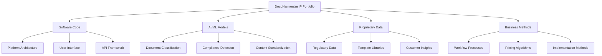
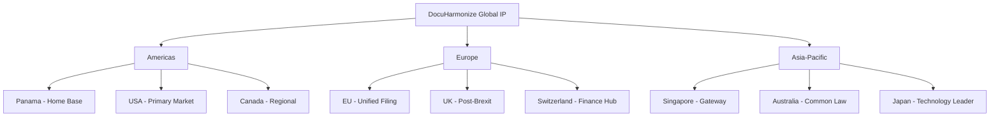

# Intellectual Property Protection Strategy

:::tip **Strategic IP Framework**
DocuHarmonize's value lies in its AI algorithms, compliance expertise, and proprietary datasets. A robust IP protection strategy is essential for competitive advantage, investor confidence, and long-term business value creation.
:::

## 🧠 IP Asset Inventory & Classification

### Core Intellectual Property Assets

#### 1. **Software & Technology** (Primary Assets)


#### 2. **AI/ML Algorithms** (Crown Jewels)
- **Document Processing Pipeline**: OCR enhancement, entity recognition
- **Compliance Intelligence**: Regulatory requirement mapping, risk scoring
- **Content Standardization**: Template generation, language optimization
- **Knowledge Graph**: Relationship mapping, semantic analysis
- **Predictive Analytics**: Risk assessment, audit preparation

#### 3. **Proprietary Datasets**
- **Regulatory Corpus**: Comprehensive financial services regulation database
- **Compliance Templates**: Industry-specific document templates
- **Training Data**: Annotated compliance documents for ML training
- **Performance Metrics**: Anonymized customer usage and outcome data

#### 4. **Business Processes & Methods**
- **Implementation Methodology**: Customer onboarding and change management
- **Pricing Model**: Value-based pricing algorithms
- **Sales Process**: Enterprise B2B sales methodology
- **Customer Success Framework**: Adoption and expansion strategies

---

## 📄 Copyright Protection Strategy

### Software Copyright Framework

#### Automatic Protection (Panama & International)
**Coverage**: Source code, object code, documentation, user interfaces
**Duration**: Life of author + 70 years (or 95 years for corporate work)
**Jurisdiction**: Panama (primary) + international through treaties

#### Copyright Registration Strategy
```markdown
PRIORITY REGISTRATION PLAN

Year 1 (Immediate):
- Core platform source code
- AI/ML algorithm implementations
- User interface designs and wireframes
- API documentation and specifications

Year 2 (Product Evolution):
- Mobile application code
- Advanced AI model implementations
- Integration modules and connectors
- Customer training materials

Year 3 (Market Expansion):
- Multi-language platform versions
- Industry-specific customizations
- White-label platform variants
- Knowledge base and help documentation
```

#### Copyright Management Best Practices
1. **Code Documentation**: Clear authorship and creation date records
2. **Version Control**: Git history as evidence of creation and evolution
3. **Employee Agreements**: Comprehensive work-for-hire clauses
4. **Contractor Agreements**: IP assignment for all external development
5. **Open Source Compliance**: Clear separation of proprietary and OSS code

### Documentation & Content Copyright
- **User Manuals**: Comprehensive platform documentation
- **Training Materials**: Customer education and certification content
- **Marketing Assets**: Website content, sales materials, case studies
- **Research Publications**: Thought leadership and industry analysis

---

## 🏷️ Trademark Protection Strategy

### Brand Portfolio Development

#### Primary Trademarks (Year 1 Registration)
1. **"DocuHarmonize"**
   - **Classes**: Software (Class 9), SaaS (Class 42)
   - **Jurisdictions**: Panama, United States, European Union
   - **Protection Scope**: Enterprise software, compliance automation

2. **"AI-Powered Compliance Documentation"**
   - **Type**: Descriptive mark with secondary meaning
   - **Strategy**: Build brand recognition before competitor adoption
   - **Timeline**: 2-3 years to establish distinctiveness

#### Logo & Design Marks
- **DocuHarmonize Logo**: Stylized wordmark with distinctive typography
- **Icon/Symbol**: Abstract representation of document harmony/standardization
- **Color Scheme**: Proprietary brand color combinations
- **Typography**: Custom font modifications for brand consistency

#### International Trademark Strategy
```markdown
MADRID PROTOCOL FILING STRATEGY

Priority Markets (Year 1):
- United States: Primary market for enterprise sales
- European Union: Secondary expansion market
- United Kingdom: Post-Brexit separate filing
- Canada: North American market completion

Growth Markets (Year 2-3):
- Australia: English-speaking developed market
- Singapore: Asia-Pacific entry point
- Switzerland: Banking and compliance hub
- Japan: Major financial services market

Emerging Markets (Year 3-5):
- Brazil: Latin American expansion
- India: Technology services market
- South Korea: Advanced technology adoption
- Mexico: Regional market development
```

### Trademark Monitoring & Enforcement
- **Watch Services**: Automated monitoring for similar marks
- **Opposition Proceedings**: Challenge conflicting applications
- **Enforcement Actions**: Cease and desist, domain disputes
- **Renewal Management**: Systematic renewal tracking and filing

---

## 🔒 Trade Secret Protection Program

### Trade Secret Classification Framework

#### Level 1: Ultra-Confidential (Crown Jewels)
- **AI/ML Model Architectures**: Detailed algorithm implementations
- **Training Datasets**: Proprietary compliance data and annotations
- **Customer Data**: Usage patterns, performance metrics, business intelligence
- **Pricing Algorithms**: Value-based pricing models and optimization

#### Level 2: Highly Confidential (Competitive Advantage)
- **Product Roadmap**: Future feature development and strategic direction
- **Customer Lists**: Contact information, contract terms, relationship details
- **Financial Information**: Revenue, profitability, cost structures
- **Strategic Partnerships**: Integration roadmaps, joint venture plans

#### Level 3: Confidential (Business Sensitive)
- **Employee Information**: Compensation, performance, organizational structure
- **Vendor Relationships**: Contract terms, negotiated pricing, service levels
- **Marketing Strategy**: Campaign plans, competitive positioning, messaging
- **Operational Procedures**: Internal processes, quality standards, methodologies

### Technical Protection Measures

#### Access Controls & Security
```markdown
TRADE SECRET SECURITY FRAMEWORK

Technical Controls:
- Multi-factor authentication for all systems
- Role-based access control (RBAC) with least privilege
- Encryption at rest and in transit (AES-256)
- Audit logging and monitoring for sensitive data access

Physical Controls:
- Secured office spaces with access card requirements
- Visitor management and escort procedures
- Clean desk policy and secure storage
- Device management and remote wipe capabilities

Administrative Controls:
- Need-to-know basis for confidential information
- Regular security training and awareness programs
- Confidentiality agreements for all personnel
- Third-party due diligence and contract protections
```

#### Data Loss Prevention (DLP)
- **Email Monitoring**: Automated detection of confidential information
- **Endpoint Protection**: USB/removable media controls
- **Cloud Security**: CASB (Cloud Access Security Broker) implementation
- **Network Monitoring**: Data exfiltration detection and prevention

### Legal Protection Framework

#### Confidentiality Agreements
1. **Employee Confidentiality** (All Employees)
   - Comprehensive definition of confidential information
   - Perpetual confidentiality obligations
   - Return of materials upon termination
   - Specific remedies for breach

2. **Contractor/Consultant NDAs** (External Resources)
   - Project-specific confidentiality scope
   - Limited access and use provisions
   - Subcontractor flow-down requirements
   - Indemnification for unauthorized disclosure

3. **Customer/Partner NDAs** (Business Relationships)
   - Mutual confidentiality protections
   - Permitted uses for evaluation purposes
   - Term limitations and return obligations
   - Survival clauses for ongoing protection

4. **Investor NDAs** (Fundraising Process)
   - Due diligence specific protections
   - Standard terms for venture capital industry
   - Investment committee disclosure permissions
   - Non-use and non-disclosure obligations

---

## 🏛️ Patent Strategy & Analysis

### Patent Landscape Assessment

#### Current Patent Environment
**AI/ML Patents in Enterprise Software**:
- **High Patent Activity**: Document processing, natural language processing
- **Patent Thickets**: Complex overlapping patent portfolios
- **Defensive Strategies**: Focus on freedom to operate analysis
- **Offensive Opportunities**: Novel compliance-specific innovations

#### Patentability Analysis for DocuHarmonize

##### Potentially Patentable Innovations
1. **Method for AI-Powered Compliance Document Standardization**
   - Novel combination of NLP and regulatory rule engines
   - Specific technical implementation for compliance automation
   - Industry-specific adaptation and optimization

2. **System for Real-Time Regulatory Compliance Monitoring**
   - Automated regulatory change detection and impact analysis
   - Dynamic document updating based on regulatory changes
   - Risk scoring algorithms for compliance violations

3. **Enterprise Knowledge Graph Construction for Compliance**
   - Automated entity relationship extraction from documents
   - Compliance-specific ontology and semantic modeling
   - Cross-document consistency validation algorithms

##### Patent Strategy Recommendation: **Defensive Focus**
**Rationale**:
- **Cost**: Patent prosecution and maintenance costs ($50K-200K per patent)
- **Timeline**: 2-3 years for patent issuance vs. fast product development
- **Enforcement**: Difficult and expensive to enforce against large competitors
- **Trade Secrets**: Greater protection for algorithmic innovations

### Defensive Patent Strategy
1. **Freedom to Operate (FTO) Analysis**: Regular patent landscape review
2. **Patent Monitoring**: Track competitor patent filings
3. **Prior Art Development**: Publish defensive publications for key innovations
4. **Patent Insurance**: Intellectual property liability insurance
5. **Cross-Licensing**: Strategic partnerships for patent sharing

---

## 🌍 International IP Strategy

### Global IP Protection Framework

#### Tier 1 Markets (Immediate Protection)
**United States**:
- Copyright: Automatic protection + optional registration
- Trademarks: Federal registration through USPTO
- Trade Secrets: State law protection (varies by state)
- Patents: USPTO filing if pursuing patent strategy

**European Union**:
- Copyright: Automatic protection under EU directives
- Trademarks: EU-wide registration through EUIPO
- Trade Secrets: EU Trade Secrets Directive protection
- Patents: European Patent Office (EPO) filing

**Panama** (Home Jurisdiction):
- Copyright: Automatic protection under Law 15 of 1994
- Trademarks: DIGERPI registration and maintenance
- Trade Secrets: Commercial Code and unfair competition law
- Patents: Limited scope, focus on other jurisdictions

#### IP Management & Coordination


### IP Ownership Structure
**Centralized IP Holding**:
- **DocuHarmonize S.A. (Panama)**: Master IP owner
- **Subsidiary Licensing**: License to operating subsidiaries
- **Tax Optimization**: IP income flows to Panama (territorial taxation)
- **Global Enforcement**: Centralized IP management and enforcement

---

## 📊 IP Valuation & Monetization

### IP Asset Valuation Methods

#### Cost-Based Approach
- **Development Costs**: $2-5M invested in platform development
- **Replacement Cost**: $10-20M to recreate equivalent platform
- **Enhancement Value**: Ongoing R&D investment and improvements

#### Market-Based Approach
- **Comparable Transactions**: Similar AI/enterprise software IP sales
- **Industry Multiples**: Revenue multiples for SaaS IP assets
- **Licensing Rates**: Market rates for enterprise software licensing

#### Income-Based Approach
- **Future Cash Flows**: Projected revenue from IP-enabled products
- **Cost Savings**: Customer efficiency gains from IP utilization
- **Risk Adjustment**: Technology and market risk considerations

### IP Monetization Strategy

#### Primary Monetization (Core Business)
- **SaaS Platform**: Direct customer revenue from IP-enabled software
- **Professional Services**: Implementation and customization services
- **Training & Certification**: Educational content and programs

#### Secondary Monetization (Strategic)
- **White-Label Licensing**: Platform licensing to system integrators
- **API Access**: Third-party developer access to core algorithms
- **Data Insights**: Anonymized benchmarking and analytics services

#### Defensive Monetization (Portfolio Management)
- **Cross-Licensing**: Patent and IP sharing with strategic partners
- **Acquisition Defense**: IP portfolio value for M&A scenarios
- **Investment Leverage**: IP assets as collateral for financing

---

## 🚨 IP Risk Management & Compliance

### Infringement Risk Assessment

#### Inbound Risk Management
1. **Freedom to Operate Analysis**
   - Patent landscape review before product development
   - Ongoing monitoring of competitor patent filings
   - Alternative design strategies for patent workarounds

2. **Open Source Compliance**
   - Comprehensive open source software audit
   - License compliance verification (GPL, Apache, MIT)
   - Contribution policies for employee open source participation

3. **Third-Party Content**
   - Licensed content verification and compliance
   - Attribution requirements and management
   - Renewal and termination procedures

#### Outbound Enforcement Strategy
1. **Monitoring Program**
   - Automated web scanning for trademark infringement
   - Competitive intelligence for IP violations
   - Customer reporting channels for infringement

2. **Enforcement Procedures**
   - Cease and desist letter templates
   - Domain name dispute procedures (UDRP)
   - Litigation strategy and budget planning

### IP Insurance & Risk Transfer
- **IP Liability Insurance**: $5-10M coverage for infringement claims
- **Defensive Coverage**: Protection against patent trolls and NPEs
- **Pursuit Coverage**: Insurance for IP enforcement actions
- **Cyber Liability**: Protection for trade secret theft and data breaches

---

## 📅 IP Implementation Roadmap

### Year 1: Foundation (Pre-Seed/Seed)
- [ ] **Month 1-3**: Core copyright registrations and employee agreements
- [ ] **Month 3-6**: Trademark filings in Panama and United States
- [ ] **Month 6-9**: Trade secret protection program implementation
- [ ] **Month 9-12**: FTO analysis and patent landscape assessment

### Year 2: Growth (Series A)
- [ ] **Q1**: International trademark expansion (EU, UK, Canada)
- [ ] **Q2**: Comprehensive IP audit and portfolio assessment
- [ ] **Q3**: IP insurance procurement and risk management
- [ ] **Q4**: Strategic IP licensing framework development

### Year 3: Scale (Series B+)
- [ ] **Q1**: Global trademark portfolio completion
- [ ] **Q2**: IP monetization strategy implementation
- [ ] **Q3**: Defensive patent strategy evaluation
- [ ] **Q4**: M&A IP due diligence preparation

### Ongoing: Maintenance & Enforcement
- **Monthly**: IP monitoring and competitive intelligence
- **Quarterly**: IP portfolio review and strategic assessment
- **Annually**: IP valuation and portfolio optimization
- **As Needed**: Enforcement actions and dispute resolution

:::info **IP Strategy Summary**
DocuHarmonize's IP strategy emphasizes trade secret protection for core algorithms, strategic trademark development for brand protection, and comprehensive copyright coverage for software assets. This balanced approach provides maximum competitive advantage while optimizing cost and resource allocation.
:::

---

**Next Step**: Review [Data Privacy & Compliance Framework →](./data-privacy-compliance.md) for GDPR and international data protection.