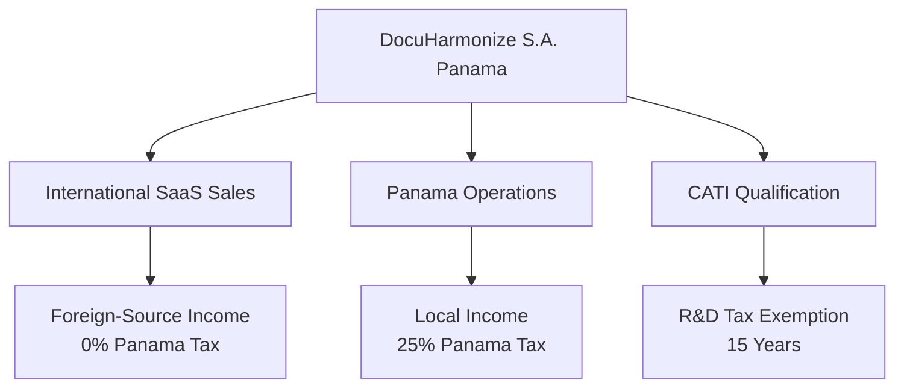

# Panama Corporate Structure for DocuHarmonize

:::tip **Strategic Legal Foundation**
Proper corporate structure in Panama provides significant advantages for international SaaS businesses, including territorial taxation, CATI R&D incentives, and strategic positioning for global expansion. This framework is specifically designed for DocuHarmonize's enterprise software business model.
:::

## 🏛️ Recommended Structure: Sociedad Anónima (S.A.)

### Why S.A. vs. S.R.L. for DocuHarmonize

#### Strategic Advantages of S.A. Structure
1. **Investment Readiness**: Better suited for venture capital and international investment
2. **Flexible Share Classes**: Ability to create preferred shares for funding rounds
3. **Stock Option Plans**: Framework for employee equity compensation
4. **Professional Image**: Enhanced credibility with Fortune 500 enterprise clients
5. **International Expansion**: Easier subsidiary creation and cross-border operations
6. **Liquidity Options**: Facilitates future M&A or IPO opportunities

#### Comparison Matrix

| Factor | Sociedad Anónima (S.A.) | Sociedad de Responsabilidad Limitada (S.R.L.) |
|--------|------------------------|------------------------------------------------|
| **Shareholders** | Minimum 3, maximum unlimited | Minimum 2, maximum 20 |
| **Share Transfer** | Freely transferable | Restricted, requires approval |
| **Capital Requirements** | $2,000 minimum | $2,000 minimum |
| **Management Structure** | Board of Directors required | Simplified management |
| **Venture Capital** | ✅ Preferred structure | ❌ Limited flexibility |
| **Employee Equity** | ✅ Stock option plans | ⚠️ Complex implementation |
| **International Business** | ✅ Professional structure | ⚠️ Less recognized |
| **Regulatory Compliance** | Higher requirements | Lower requirements |

**Recommendation**: S.A. structure for DocuHarmonize due to international enterprise focus and funding requirements.

---

## 📋 Incorporation Process & Timeline

### Phase 1: Pre-Incorporation Setup (Weeks 1-2)

#### Required Documentation
1. **Corporate Name Reservation**
   - Primary: "DocuHarmonize Sociedad Anónima"
   - Alternatives: "DocuHarmonize Panama S.A.", "DH Enterprise Solutions S.A."
   - Cost: $25
   - Processing: 2-3 business days

2. **Founding Shareholder Information**
   - **Jose Garcia**: Founder and initial majority shareholder
   - **Future Investors**: Framework for preferred share classes
   - **Employee Pool**: 20% reserved for employee stock option plan (ESOP)

3. **Registered Office**
   - **Requirement**: Physical address in Panama
   - **Options**:
     - Shared office space in Panama City business district
     - Law firm registered office service
     - Co-working space with business registration services
   - **Cost**: $200-500/month

#### Initial Capitalization Structure
```
Total Authorized Shares: 1,000,000
├── Common Stock (Class A): 800,000 shares
│   ├── Founder Shares: 600,000 shares (75%)
│   └── Employee Pool: 200,000 shares (25%)
└── Preferred Stock (Class B): 200,000 shares (reserved for investors)

Initial Paid-in Capital: $2,000
Share Value: $0.001 per share (nominal)
```

### Phase 2: Legal Documentation (Weeks 3-4)

#### Articles of Incorporation (Estatutos Sociales)
**Key Provisions for DocuHarmonize**:

```markdown
COMPANY NAME: DocuHarmonize Sociedad Anónima
PURPOSE: Development and commercialization of enterprise software
         solutions for documentation standardization and compliance automation
TERM: Indefinite (perpetual)
DOMICILE: Republic of Panama
AUTHORIZED CAPITAL: $1,000,000 USD (1,000,000 shares at $1 nominal value)
BOARD STRUCTURE: 3-7 directors, expandable for growth
SHARE CLASSES: Common (voting) and Preferred (investor rights)
```

#### Corporate Bylaws (Reglamento Interno)
**Investor-Ready Provisions**:
- Board composition and voting requirements
- Share transfer restrictions and rights of first refusal
- Preferred shareholder protective provisions
- Stock option plan authorization
- Dividend and liquidation preferences
- Anti-dilution protections for investors

### Phase 3: Registration & Compliance (Weeks 5-6)

#### Government Registrations
1. **Public Registry** (Registro Público)
   - Articles of incorporation filing
   - Initial director appointments
   - Share certificate registration
   - Cost: $300-500
   - Timeline: 5-7 business days

2. **Ministry of Commerce and Industries** (MICI)
   - Business license application
   - Economic activity classification (Software Development)
   - Cost: $250
   - Timeline: 7-10 business days

3. **Tax Registration** (DGI)
   - RUC (Tax ID) registration
   - ITBMS (Sales Tax) registration if applicable
   - Income tax registration
   - Cost: Free
   - Timeline: 3-5 business days

---

## 💰 Taxation Framework & Optimization

### Panama Territorial Tax System Benefits

#### Income Tax Structure
- **Territorial Principle**: Only Panama-source income is taxable
- **Foreign Income**: Generally exempt from Panama taxation
- **SaaS Revenue**: International sales likely qualify as foreign-source income
- **Rate Structure**: 25% corporate tax on Panama-source income only

#### DocuHarmonize Tax Strategy


#### CATI (Science and Technology City) Benefits
- **Income Tax Exemption**: 15 years for qualifying R&D activities
- **Import Duty Exemption**: Equipment and materials for R&D
- **Dividend Tax Exemption**: Distributions to shareholders
- **Qualification Requirements**:
  - Minimum $500K R&D investment over 5 years
  - Local employment requirements
  - Technology development activities

### Transfer Pricing Strategy
**HoldCo/OpCo Structure for International Expansion**:

```
DocuHarmonize Holdings S.A. (Panama)
├── DocuHarmonize US LLC (Sales Entity)
├── DocuHarmonize EU B.V. (European Operations)
└── DocuHarmonize Asia Pte Ltd (APAC Operations)
```

**Benefits**:
- Centralized IP ownership in Panama (tax-efficient jurisdiction)
- Service fees from operating subsidiaries to Panama
- Optimized global effective tax rate
- Simplified international expansion

---

## 👥 Corporate Governance Framework

### Board of Directors Structure

#### Initial Board Composition (3 Directors)
1. **Jose Garcia** - Chairman & CEO
   - Strategic leadership and day-to-day operations
   - Majority shareholder representation

2. **Independent Director** - Technology Expert
   - AI/ML or enterprise software background
   - Technical oversight and strategic guidance

3. **Independent Director** - Financial Services Expert
   - Former compliance officer or financial services executive
   - Industry expertise and customer connections

#### Expansion Board (Post-Series A: 5-7 Directors)
- **Founder Representative**: Jose Garcia
- **Investor Representatives**: 2 seats (Series A lead + additional investor)
- **Independent Directors**: 2-3 seats (CEO, CTO, industry expert)
- **Employee Representative**: 1 seat (post-IPO consideration)

### Board Committees (Future)
#### Audit Committee
- Financial oversight and compliance
- External auditor relationship management
- Risk management oversight

#### Compensation Committee
- Executive compensation decisions
- Equity compensation plan administration
- Performance evaluation frameworks

#### Nominating & Governance Committee
- Director nomination process
- Corporate governance best practices
- ESG (Environmental, Social, Governance) oversight

### Shareholder Rights Framework

#### Common Stock Rights
- **Voting**: 1 vote per share
- **Dividends**: Pro-rata participation
- **Liquidation**: Residual claims after preferred

#### Preferred Stock Rights (Investor Shares)
- **Liquidation Preference**: 1x non-participating preferred
- **Anti-Dilution**: Weighted average broad-based
- **Protective Provisions**: Standard VC protective rights
- **Board Representation**: Pro-rata board seats
- **Information Rights**: Financial reporting and inspection rights

---

## 📄 Required Corporate Documents

### Foundational Documents
1. **Articles of Incorporation** (Escritura de Constitución)
2. **Corporate Bylaws** (Reglamento Interno)
3. **Shareholder Agreement** (Pacto de Accionistas)
4. **Board Resolutions** (Actas del Consejo de Administración)
5. **Share Certificates** (Certificados de Acciones)

### Ongoing Compliance Documents
1. **Annual Shareholders Meeting Minutes**
2. **Board Meeting Minutes** (quarterly minimum)
3. **Annual Financial Statements**
4. **Registered Agent Confirmation**
5. **Good Standing Certificates**

### Templates & Forms
All templates customized for DocuHarmonize's SaaS business model:

#### Template 1: Board Resolution (Director Appointment)
```markdown
BOARD RESOLUTION NO. 001-2025
DOCUHARMONIZE SOCIEDAD ANÓNIMA

RESOLVED: That [Name] is hereby appointed as [Director/Officer position]
of DocuHarmonize Sociedad Anónima, effective [Date], with the powers
and responsibilities outlined in the Corporate Bylaws.

Approved by unanimous consent of the Board of Directors.
Date: [Date]
Signed: [Directors]
```

#### Template 2: Stock Option Grant Agreement
```markdown
STOCK OPTION AGREEMENT
DOCUHARMONIZE SOCIEDAD ANÓNIMA

Employee: [Name]
Grant Date: [Date]
Options Granted: [Number] shares of Common Stock
Exercise Price: $[Price] per share (Fair Market Value)
Vesting Schedule: 4 years, 25% after 1 year, then monthly
```

---

## 🔒 Compliance & Regulatory Requirements

### Annual Compliance Obligations

#### Corporate Maintenance
- **Annual Shareholders Meeting**: Required by law
- **Director Re-election**: 1-year terms (re-appointable)
- **Registered Agent Fee**: $300-500 annually
- **Government Fees**: $300 annual registration renewal

#### Tax Compliance
- **Corporate Tax Return**: Due March 31 annually
- **Transfer Pricing Documentation**: For international transactions
- **CATI Reporting**: Annual compliance report for tax benefits
- **Withholding Tax**: On local payments (if applicable)

#### Employment Compliance
- **Social Security Registration**: For local employees
- **Labor Ministry Registration**: Employment contracts
- **Payroll Taxes**: Monthly calculations and payments
- **Workers' Compensation**: Insurance coverage required

### Financial Reporting Standards

#### Accounting Framework
- **IFRS Adoption**: International Financial Reporting Standards
- **Audit Requirements**: Annual audit required for companies >$3M revenue
- **Financial Statements**: Balance sheet, P&L, cash flow, equity statement
- **Management Discussion**: Annual narrative report

#### Investor Reporting (Post-Funding)
- **Monthly Reports**: Financial performance and KPIs
- **Quarterly Reports**: Detailed financial statements and metrics
- **Annual Reports**: Comprehensive business and financial review
- **Board Packages**: Regular governance and oversight materials

---

## 💡 Strategic Legal Advantages

### International Business Benefits
1. **US Market Access**: No restrictions on US business operations
2. **EU Expansion**: No complex corporate structure requirements
3. **Banking Relationships**: International banking without US tax complications
4. **Contract Law**: Based on civil law system, internationally recognized
5. **Dispute Resolution**: Panama is party to major international arbitration conventions

### Intellectual Property Protection
- **Copyright**: Automatic protection for software
- **Trademark**: Registration available for brand protection
- **Trade Secrets**: Legal framework for confidential information
- **International Treaties**: Member of WIPO and major IP conventions

### Employment Law Flexibility
- **At-Will Employment**: More flexible than many Latin American countries
- **Stock Options**: Legal framework for equity compensation
- **Remote Work**: Clear legal framework for distributed teams
- **Termination**: Reasonable notice periods and severance requirements

## 🚀 Implementation Roadmap

### Month 1: Foundation
- [ ] Corporate name reservation and approval
- [ ] Registered office establishment
- [ ] Initial founding documents preparation
- [ ] Legal counsel engagement and retainer

### Month 2: Registration
- [ ] Articles of incorporation filing
- [ ] Government registration completion
- [ ] Tax ID and business license acquisition
- [ ] Corporate bank account opening

### Month 3: Operations
- [ ] Board of directors appointment
- [ ] Corporate governance policies implementation
- [ ] Employee agreements and policies
- [ ] CATI qualification application initiation

### Ongoing: Compliance
- [ ] Monthly accounting and bookkeeping
- [ ] Quarterly board meetings and resolutions
- [ ] Annual compliance filings and renewals
- [ ] Legal document updates as business grows

:::info **Legal Foundation Summary**
The S.A. structure in Panama provides DocuHarmonize with optimal tax benefits, international business flexibility, and investor-ready governance framework. Combined with CATI qualification, this structure can reduce effective tax rate to near zero while maintaining professional credibility for enterprise sales.
:::

---

**Next Step**: Review [Employment Contracts →](./employment-contracts.md) for hiring your initial team in Panama.