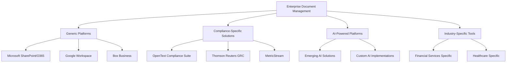

# Competitive Landscape Analysis

:::tip **Bill Aulet Step 6: Full Life Cycle Use Case**
Understanding the competitive landscape is essential for positioning, product differentiation, and go-to-market strategy. This analysis identifies current solutions, their limitations, and DocuHarmonize's unique positioning opportunity.
:::

## 🎯 Competitive Categories Overview

### Market Segmentation by Solution Type

---

## 🏢 Tier 1 Competitors (Direct Competition)

### Microsoft SharePoint/Microsoft 365
**Market Position**: Dominant incumbent with 190M+ users

#### Strengths
- **Market Penetration**: Already deployed in 95% of Fortune 500
- **Integration**: Deep Office 365 ecosystem integration
- **Enterprise Features**: Robust security, compliance, and governance
- **Cost Advantage**: Bundled pricing with existing Office licenses
- **Ecosystem**: Massive partner and developer ecosystem

#### Weaknesses
- **Complexity**: Steep learning curve, requires significant customization
- **Generic Focus**: Not purpose-built for compliance documentation
- **User Experience**: Outdated interface, poor mobile experience
- **AI Limitations**: Limited intelligent automation for compliance
- **Standardization**: No built-in document standardization capabilities

#### Market Share & Pricing
- **Market Share**: 35-40% of enterprise document management
- **Pricing**: $12-22/user/month (bundled with Office 365)
- **Enterprise Deals**: $500K-5M annually for large deployments
- **Total Addressable Revenue**: ~$1.2B annually in target market

#### DocuHarmonize Competitive Strategy
- **Positioning**: "Purpose-built for compliance vs. generic productivity"
- **Value Prop**: "10x better compliance outcomes at comparable cost"
- **Migration Strategy**: "Enhance your SharePoint investment with AI compliance"
- **Differentiation**: AI-powered standardization, regulatory intelligence

---

### Box Business/Box for Government
**Market Position**: Security-focused cloud content management

#### Strengths
- **Security**: Enterprise-grade security with government certifications
- **Compliance**: Built-in compliance features for regulated industries
- **User Experience**: Intuitive interface and mobile experience
- **API Platform**: Strong developer platform for integrations
- **Industry Focus**: Specific solutions for financial services and government

#### Weaknesses
- **Limited AI**: Basic content intelligence, no compliance automation
- **Standardization**: No document standardization or template management
- **Workflow**: Basic approval workflows, not compliance-specific
- **Cost**: Higher per-seat pricing for enterprise features
- **Market Position**: Smaller market share vs. Microsoft

#### Market Share & Pricing
- **Market Share**: 8-12% of enterprise document management
- **Pricing**: $15-35/user/month for enterprise features
- **Enterprise Deals**: $200K-2M annually for large deployments
- **Customer Base**: 100K+ businesses, focused on mid-market to enterprise

#### Competitive Positioning vs. Box
- **AI Advantage**: "Intelligent compliance vs. basic content management"
- **ROI Focus**: "Measurable compliance efficiency vs. storage solution"
- **Industry Expertise**: "Financial services purpose-built vs. generic vertical"

---

### OpenText Extended ECM for Compliance
**Market Position**: Legacy enterprise content management leader

#### Strengths
- **Enterprise Heritage**: 30+ years in enterprise content management
- **Compliance Features**: Purpose-built compliance and governance capabilities
- **Integration**: Deep integration with enterprise systems (SAP, Oracle)
- **Industry Expertise**: Strong presence in financial services and government
- **Professional Services**: Extensive implementation and consulting services

#### Weaknesses
- **Legacy Architecture**: On-premise heritage, slow cloud transition
- **User Experience**: Outdated interface, poor user adoption
- **Cost**: High implementation and maintenance costs
- **Innovation Speed**: Slow to adopt modern technologies (AI, mobile)
- **Complexity**: Requires significant customization and technical expertise

#### Market Share & Pricing
- **Market Share**: 15-20% of enterprise document management
- **Pricing**: $50-150/user/month with high implementation costs
- **Enterprise Deals**: $1M-10M+ for large implementations
- **Implementation Time**: 12-24 months for full deployment

#### Competitive Advantage vs. OpenText
- **Modern Architecture**: "Cloud-native vs. legacy on-premise"
- **Implementation Speed**: "3-6 months vs. 12-24 months"
- **Total Cost**: "50-70% lower TCO through modern architecture"
- **User Experience**: "Consumer-grade UX vs. legacy complexity"

---

## 🚀 Tier 2 Competitors (Indirect Competition)

### Atlassian Confluence
**Category**: Collaborative documentation platform

#### Market Position
- **Strengths**: Developer-friendly, strong collaboration features
- **Weaknesses**: Not compliance-focused, limited enterprise governance
- **Differentiation**: "Compliance-specific vs. general collaboration"

### Google Workspace
**Category**: Productivity and collaboration suite

#### Market Position
- **Strengths**: Ease of use, real-time collaboration, cost-effective
- **Weaknesses**: Limited enterprise security, no compliance features
- **Differentiation**: "Enterprise compliance vs. productivity collaboration"

### ServiceNow GRC
**Category**: IT service management expanding into compliance

#### Market Position
- **Strengths**: Strong in IT governance, workflow automation
- **Weaknesses**: Limited document management, complex implementation
- **Differentiation**: "Document-centric compliance vs. IT process automation"

---

## 🤖 Emerging AI-Powered Competitors

### Anthropic/Claude Enterprise Solutions
**Threat Level**: Medium (potential future competition)

#### Potential Overlap
- **AI Capabilities**: Advanced language models for document generation
- **Enterprise Focus**: Growing enterprise AI adoption
- **Limitations**: Not compliance-specific, no industry expertise

#### Competitive Strategy
- **First-Mover Advantage**: Establish market before general AI tools adapt
- **Industry Specialization**: Deep financial services expertise
- **Integration**: Enterprise system connectivity vs. general AI tools

### Microsoft Copilot for Compliance
**Threat Level**: High (potential future threat)

#### Risk Assessment
- **Timeline**: 12-24 months for compliance-specific features
- **Advantage**: Existing SharePoint integration and customer base
- **Limitation**: Generic AI vs. compliance-specific training

#### Mitigation Strategy
- **Speed to Market**: Establish customer base before Microsoft pivot
- **Superior AI**: Financial services-trained models vs. general purpose
- **Switching Costs**: Create customer lock-in through workflow integration

---

## 📊 Competitive Positioning Matrix

### Feature Comparison Analysis

| Capability | DocuHarmonize | Microsoft 365 | Box | OpenText | Confluence |
|------------|---------------|---------------|-----|----------|------------|
| **AI-Powered Standardization** | ✅ Best-in-class | ❌ Limited | ❌ None | ❌ None | ❌ None |
| **Regulatory Intelligence** | ✅ Built-in | ❌ Manual | ❌ Manual | ⚠️ Limited | ❌ None |
| **Compliance Automation** | ✅ Advanced | ❌ Basic | ❌ Basic | ⚠️ Legacy | ❌ None |
| **Enterprise Integration** | ✅ API-first | ✅ Native | ⚠️ Good | ✅ Extensive | ⚠️ Limited |
| **User Experience** | ✅ Modern | ❌ Complex | ✅ Good | ❌ Poor | ✅ Good |
| **Implementation Time** | ✅ 3-6 months | ⚠️ 6-12 months | ⚠️ 3-9 months | ❌ 12-24 months | ✅ 1-3 months |
| **Total Cost of Ownership** | ✅ Optimized | ⚠️ Variable | ❌ High | ❌ Very High | ✅ Low |
| **Financial Services Focus** | ✅ Purpose-built | ❌ Generic | ⚠️ Vertical | ⚠️ Some | ❌ None |

### Competitive Advantage Analysis

#### DocuHarmonize Unique Differentiators
1. **AI-First Compliance**: Purpose-built AI for regulatory documentation
2. **Financial Services Expertise**: Deep industry knowledge and templates
3. **Modern Architecture**: Cloud-native, API-first, mobile-optimized
4. **Rapid Implementation**: 90% faster deployment than legacy solutions
5. **Measurable ROI**: Quantified compliance efficiency improvements

---

## 🎯 Market Positioning Strategy

### Primary Positioning: "AI-Powered Compliance Documentation Leader"

#### Core Message Framework
- **Primary**: "The only AI-powered platform purpose-built for enterprise compliance documentation"
- **Proof Points**: 95% AI accuracy, 60% time savings, Fortune 500 validation
- **Differentiation**: "Compliance-specific AI vs. generic document management"

#### Target Audience Messaging

##### For Chief Compliance Officers
- **Message**: "Transform regulatory compliance through intelligent documentation"
- **Value**: Risk mitigation, audit readiness, regulatory confidence
- **Proof**: Quantified compliance improvement metrics

##### For CIOs/CTOs
- **Message**: "Modern, secure platform that integrates with your existing stack"
- **Value**: Reduced complexity, lower TCO, faster implementation
- **Proof**: Enterprise architecture, security certifications

##### For Business Users
- **Message**: "Create compliant documents 80% faster with zero errors"
- **Value**: Productivity gains, quality improvement, ease of use
- **Proof**: User experience demonstrations, productivity metrics

### Competitive Battle Cards

#### vs. Microsoft SharePoint/365
**When to Use**: Customers evaluating SharePoint enhancement or replacement

##### DocuHarmonize Advantages
- ✅ **Purpose-Built**: Designed specifically for compliance documentation
- ✅ **AI Intelligence**: 95% automated compliance checking vs. manual review
- ✅ **Implementation**: 3x faster deployment with better user adoption
- ✅ **ROI**: Measurable 60% efficiency improvement vs. incremental gains

##### Address SharePoint Strengths
- **Integration Concern**: "We enhance your existing SharePoint investment"
- **Cost Concern**: "Compare total ROI, not just licensing costs"
- **Change Management**: "Evolutionary enhancement vs. revolutionary change"

#### vs. Box Business
**When to Use**: Security-conscious customers evaluating cloud solutions

##### DocuHarmonize Advantages
- ✅ **Compliance AI**: Intelligent automation vs. basic content management
- ✅ **Industry Focus**: Financial services expertise vs. horizontal platform
- ✅ **ROI**: Measurable compliance efficiency vs. storage optimization
- ✅ **Features**: Purpose-built workflows vs. generic collaboration

##### Address Box Strengths
- **Security**: "Enterprise-grade security with compliance intelligence"
- **Ease of Use**: "Intuitive interface enhanced with AI guidance"
- **Mobile**: "Full mobile experience with offline compliance capabilities"

#### vs. OpenText
**When to Use**: Customers with existing OpenText or considering legacy vendors

##### DocuHarmonize Advantages
- ✅ **Modern Architecture**: Cloud-native vs. legacy on-premise
- ✅ **User Experience**: Consumer-grade interface vs. complex legacy UI
- ✅ **Implementation**: 75% faster deployment vs. lengthy projects
- ✅ **Total Cost**: 50-70% lower TCO through modern efficiency

##### Address OpenText Strengths
- **Enterprise Heritage**: "Modern solutions for modern compliance challenges"
- **Feature Depth**: "AI-powered intelligence vs. manual configuration"
- **Professional Services**: "Built for business users vs. technical implementations"

---

## 📈 Competitive Intelligence Program

### Intelligence Gathering Strategy

#### Public Information Sources
- **Company Websites**: Feature announcements, pricing updates
- **Industry Reports**: Gartner, Forrester competitive analysis
- **Customer References**: Case studies, success stories, complaints
- **Financial Reports**: Revenue, growth, investment priorities

#### Sales Intelligence
- **Win/Loss Analysis**: Systematic analysis of competitive deals
- **Customer Interviews**: Feedback on competitive solutions
- **Partner Feedback**: System integrator and consultant insights
- **Procurement Intel**: RFP responses and evaluation criteria

#### Product Intelligence
- **Feature Monitoring**: Competitive product updates and releases
- **Pricing Analysis**: Public and competitive pricing intelligence
- **Technology Assessment**: Architecture and capability analysis
- **User Feedback**: G2, Capterra, and user review analysis

### Competitive Response Framework

#### Defensive Strategies
- **Product Roadmap**: Address competitive feature gaps
- **Pricing Strategy**: Competitive pricing without margin erosion
- **Customer Retention**: Proactive account management and expansion
- **Reference Building**: Strengthen customer advocacy program

#### Offensive Strategies
- **Market Education**: Thought leadership on AI-powered compliance
- **Competitive Displacement**: Target dissatisfied competitor customers
- **Partner Channel**: Leverage system integrator relationships
- **Innovation Leadership**: Maintain technology and feature advantages

---

## 🚀 Future Competitive Landscape

### 3-Year Market Evolution Predictions

#### Incumbent Response (Microsoft, Box, OpenText)
- **Microsoft**: Will likely add AI compliance features to 365 by 2026
- **Box**: May acquire compliance-focused AI company for differentiation
- **OpenText**: Slow modernization, risk of market share loss

#### New Entrant Threats
- **Big Tech**: Google, Amazon may enter with general AI solutions
- **Pure-Play AI**: OpenAI, Anthropic may develop enterprise compliance tools
- **Startups**: VC-funded competitors focusing on specific compliance verticals

#### Market Consolidation
- **Acquisition Activity**: Legacy players acquiring AI startups
- **Partnership Trends**: Platform companies partnering vs. building
- **Specialization**: Market moving toward industry-specific solutions

### DocuHarmonize Competitive Moats

#### Short-Term (1-2 Years)
- **First-Mover Advantage**: AI-powered compliance documentation leadership
- **Customer Base**: Reference customers and case studies
- **Technology Lead**: 12-18 month advantage in compliance-specific AI
- **Market Position**: Category creation and thought leadership

#### Long-Term (3-5 Years)
- **Data Network Effects**: Customer data improves AI for all users
- **Integration Ecosystem**: Deep enterprise system integrations
- **Industry Expertise**: Unmatched financial services domain knowledge
- **Customer Switching Costs**: Workflow integration and customization

:::info **Competitive Strategy Summary**
DocuHarmonize has a unique opportunity to establish category leadership in AI-powered compliance documentation before incumbents adapt. Focus on rapid customer acquisition and reference building to create sustainable competitive advantages through network effects and switching costs.
:::

---

**Next Step**: Begin [Product Development →](/product-development/core-platform-overview.md) with insights from market discovery.