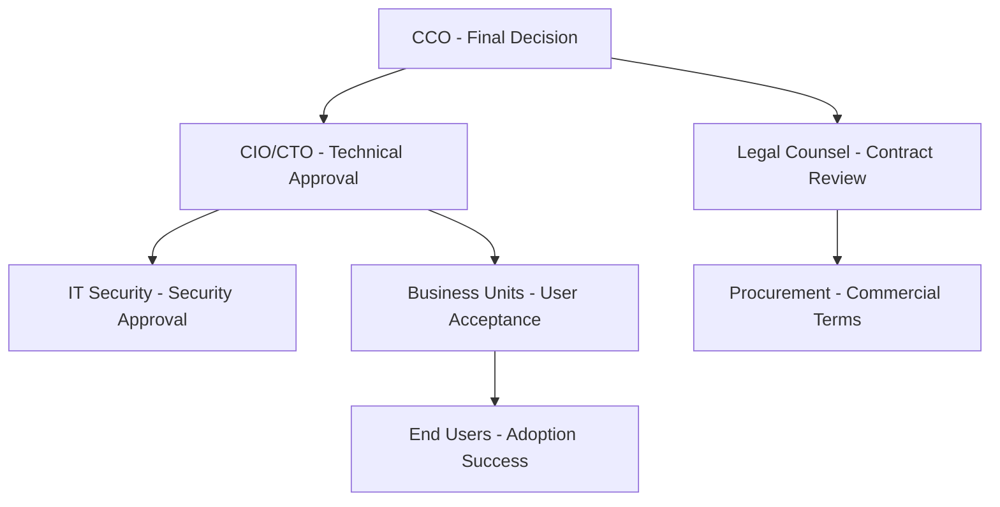

# Customer Personas: Fortune 500 Financial Services

:::tip **Bill Aulet Step 2: Select Beachhead Market**
Understanding your specific customer personas within the beachhead market is crucial for product development, sales strategy, and marketing effectiveness. These personas represent real decision makers at Fortune 500 financial institutions.
:::

## 🎯 Primary Decision Maker Personas

### Persona 1: Chief Compliance Officer (CCO)
**The Ultimate Decision Maker**

#### Demographics
- **Title**: Chief Compliance Officer, Chief Risk Officer, Head of Regulatory Affairs
- **Age**: 45-60 years old
- **Experience**: 15+ years in financial services, 8+ years in compliance leadership
- **Education**: MBA, JD, or advanced degree in finance/law
- **Team Size**: 50-500 compliance professionals

#### Professional Background
- **Career Path**: Legal → Compliance → Executive leadership
- **Previous Roles**: Regulatory counsel, audit manager, risk director
- **Industry Experience**: Deep regulatory knowledge across multiple jurisdictions
- **Network**: Strong relationships with regulators, industry peers, consultants

#### Daily Responsibilities
- **Strategic**: Board reporting, regulatory relationship management
- **Operational**: Compliance program oversight, risk assessment
- **Crisis Management**: Regulatory investigations, violation response
- **Team Leadership**: Hiring, training, performance management

#### Pain Points & Challenges
1. **Regulatory Complexity** (Critical Pain - 10/10)
   - 234 daily regulatory updates across jurisdictions
   - Inconsistent interpretation across business units
   - Manual tracking of regulatory changes

2. **Documentation Standardization** (High Pain - 9/10)
   - Inconsistent policy formats across departments
   - Version control issues during audits
   - Time-consuming manual review processes

3. **Audit Readiness** (Critical Pain - 10/10)
   - 18-month preparation cycles for major audits
   - Document retrieval delays during examinations
   - Inconsistent documentation quality

4. **Cross-Border Compliance** (High Pain - 8/10)
   - Harmonizing US, EU, and other regulatory requirements
   - Multiple compliance frameworks (SOX, BASEL III, GDPR)
   - Subsidiary compliance coordination

#### Goals & Motivations
- **Primary Goal**: Ensure 100% regulatory compliance
- **Success Metrics**: Zero regulatory violations, clean audit results
- **Career Motivation**: Reputation protection, board confidence
- **Personal Drivers**: Risk mitigation, operational efficiency

#### Technology Adoption
- **Digital Literacy**: High (extensive use of compliance software)
- **Decision Style**: Conservative, risk-averse, evidence-based
- **Vendor Evaluation**: Thorough, includes legal and IT review
- **Budget Authority**: $500K-$5M for compliance technology

#### Value Proposition for DocuHarmonize
- **Regulatory Confidence**: "Sleep well knowing all documentation meets regulatory standards"
- **Efficiency Gains**: "Reduce compliance preparation time by 60%"
- **Risk Mitigation**: "Eliminate documentation gaps that lead to violations"
- **Board Reporting**: "Real-time compliance dashboards for executive reporting"

#### Objections & Concerns
- **Data Security**: "How do we ensure regulatory data remains secure?"
- **Implementation Risk**: "What if the system fails during an audit?"
- **Regulatory Acceptance**: "Will regulators accept AI-generated documentation?"
- **Cost Justification**: "How do we measure ROI on compliance investments?"

---

### Persona 2: Chief Information Officer (CIO) / Chief Technology Officer (CTO)
**The Technical Gatekeeper**

#### Demographics
- **Title**: CIO, CTO, Head of Enterprise Technology
- **Age**: 40-55 years old
- **Experience**: 12+ years in enterprise technology, 5+ years in financial services
- **Education**: Computer Science, Engineering, MBA
- **Team Size**: 100-2,000 technology professionals

#### Professional Background
- **Career Path**: Software engineering → IT management → Executive leadership
- **Previous Roles**: Solution architect, IT director, program manager
- **Industry Experience**: Enterprise software implementation, digital transformation
- **Network**: Technology vendors, system integrators, industry CTO forums

#### Daily Responsibilities
- **Strategic**: Digital transformation roadmap, technology investment decisions
- **Operational**: Infrastructure management, application portfolio oversight
- **Innovation**: Emerging technology evaluation, proof-of-concept management
- **Governance**: Technology risk management, vendor relationship management

#### Pain Points & Challenges
1. **System Integration Complexity** (High Pain - 8/10)
   - 50+ enterprise applications requiring integration
   - Legacy system modernization constraints
   - API management and security

2. **Security & Compliance** (Critical Pain - 10/10)
   - SOC 2, ISO 27001 certification requirements
   - Data privacy regulations (GDPR, CCPA)
   - Cybersecurity threat landscape

3. **Vendor Proliferation** (Medium Pain - 6/10)
   - Multiple point solutions creating complexity
   - License cost management and optimization
   - Vendor risk management

4. **User Adoption** (High Pain - 7/10)
   - Change management across large organizations
   - Training and support overhead
   - Business unit resistance to new systems

#### Goals & Motivations
- **Primary Goal**: Enable business objectives through technology
- **Success Metrics**: System uptime, security incidents, user satisfaction
- **Career Motivation**: Digital transformation leadership, innovation
- **Personal Drivers**: Technical excellence, operational efficiency

#### Technology Evaluation Criteria
- **Architecture**: Cloud-native, API-first, microservices
- **Security**: Enterprise-grade, compliance certifications
- **Scalability**: Support for 10,000+ concurrent users
- **Integration**: Native connectors to existing systems
- **Total Cost**: 3-year TCO analysis including implementation

#### Value Proposition for DocuHarmonize
- **Technical Excellence**: "Modern, cloud-native architecture you can trust"
- **Integration Ease**: "Seamless connection to SharePoint, Salesforce, and core systems"
- **Security First**: "Built-in compliance with SOC 2 and enterprise security standards"
- **Operational Efficiency**: "Reduce IT support overhead through intuitive design"

#### Objections & Concerns
- **Vendor Lock-in**: "How do we avoid dependency on a single vendor?"
- **Scalability**: "Can the platform handle our enterprise load?"
- **Data Sovereignty**: "Where is our data stored and who has access?"
- **Integration Effort**: "What's the real cost and time for implementation?"

---

## 🤝 Key Influencer Personas

### Persona 3: Legal Counsel / General Counsel
**The Risk Advisor**

#### Demographics & Background
- **Title**: General Counsel, Deputy General Counsel, Legal Director
- **Experience**: 10+ years legal practice, 5+ years in financial services
- **Education**: JD from top-tier law school, regulatory specialization

#### Key Concerns & Influence
- **Contract Terms**: Liability, indemnification, data protection clauses
- **Regulatory Interpretation**: Legal implications of AI-generated content
- **Vendor Risk**: Due diligence, background checks, financial stability
- **Compliance Oversight**: Legal review of compliance technology decisions

#### Value Proposition
- **Legal Protection**: "Comprehensive audit trails and legal defensibility"
- **Regulatory Alignment**: "Built-in compliance with current and emerging regulations"
- **Risk Mitigation**: "Reduce legal exposure through consistent documentation"

### Persona 4: Business Unit Leaders
**The End User Champions**

#### Demographics & Background
- **Titles**: Head of Investment Banking, Retail Banking Director, Wealth Management VP
- **Experience**: 8+ years in specific business line
- **Team Size**: 100-1,000 employees in business unit

#### Key Concerns & Influence
- **Operational Impact**: Workflow disruption during implementation
- **User Experience**: Ease of use for daily document creation
- **Business Value**: Measurable productivity improvements
- **Change Management**: Training requirements and adoption timeline

#### Value Proposition
- **Productivity Gains**: "Create compliant documents 80% faster"
- **Quality Improvement**: "Eliminate errors and inconsistencies"
- **User Experience**: "Intuitive tools that enhance daily workflow"

### Persona 5: IT Security Director
**The Security Guardian**

#### Demographics & Background
- **Title**: CISO, IT Security Director, Information Security Manager
- **Experience**: 8+ years cybersecurity, financial services focus
- **Certifications**: CISSP, CISM, relevant security credentials

#### Key Concerns & Influence
- **Data Protection**: Encryption, access controls, audit logging
- **Threat Assessment**: Vendor security posture evaluation
- **Compliance**: SOC 2, ISO 27001, PCI DSS requirements
- **Incident Response**: Breach notification and recovery procedures

#### Value Proposition
- **Security First**: "Zero-trust architecture with end-to-end encryption"
- **Compliance Ready**: "Built-in SOC 2 Type II and enterprise security standards"
- **Audit Support**: "Comprehensive logging and monitoring capabilities"

---

## 📋 Persona Mapping & Sales Strategy

### Decision Making Unit (DMU)

### Influence & Authority Matrix

| Persona | Decision Authority | Budget Influence | Technical Influence | User Impact |
|---------|-------------------|------------------|-------------------|-------------|
| **CCO** | HIGH (Final Approval) | HIGH ($500K-$5M) | MEDIUM | MEDIUM |
| **CIO/CTO** | HIGH (Technical Veto) | HIGH (TCO Analysis) | HIGH | LOW |
| **Legal Counsel** | MEDIUM (Risk Assessment) | MEDIUM | LOW | LOW |
| **Business Units** | LOW | MEDIUM | LOW | HIGH |
| **IT Security** | MEDIUM (Security Veto) | LOW | HIGH | LOW |

### Sales Engagement Strategy

#### Primary Approach: CCO-Led Sales
1. **Initial Contact**: Compliance-focused value proposition
2. **Technical Validation**: Involve CIO/CTO early in process
3. **Risk Assessment**: Legal and security review
4. **Business Case**: ROI analysis with finance and procurement
5. **Implementation Planning**: Business unit engagement and change management

#### Key Messages by Persona

| Persona | Primary Message | Supporting Evidence |
|---------|----------------|-------------------|
| **CCO** | "Eliminate regulatory risk through standardized documentation" | 60% compliance cost reduction, audit readiness |
| **CIO/CTO** | "Modern, secure platform that integrates with your existing stack" | Cloud-native architecture, enterprise security |
| **Legal** | "Legally defensible AI with comprehensive audit trails" | Regulatory acceptance, legal protection |
| **Business Units** | "Create compliant documents faster with better quality" | 80% time savings, error reduction |
| **IT Security** | "Enterprise security with zero-trust architecture" | SOC 2 compliance, encryption standards |

## 📊 Validation & Research

### Customer Discovery Protocol
- **Target Interviews**: 10+ per primary persona (50+ total)
- **Interview Duration**: 45-60 minutes per session
- **Key Questions**: Pain points, current solutions, decision criteria
- **Validation Metrics**: 80% pain confirmation, 60% purchase intent

### Research Channels
- **Direct Outreach**: LinkedIn, industry contacts, warm introductions
- **Industry Events**: Compliance conferences, CIO forums, financial services events
- **Content Marketing**: Thought leadership to attract persona engagement
- **Partner Network**: System integrator and consultant introductions

:::info **Persona Insights**
Success in Fortune 500 financial services requires a multi-persona sales approach with CCO as the primary decision maker, CIO/CTO as technical gatekeeper, and strong influence from legal, security, and business unit stakeholders.
:::

---

**Next Step**: Define [End User Profiles →](./end-user-profiles.md) to understand daily users of DocuHarmonize.