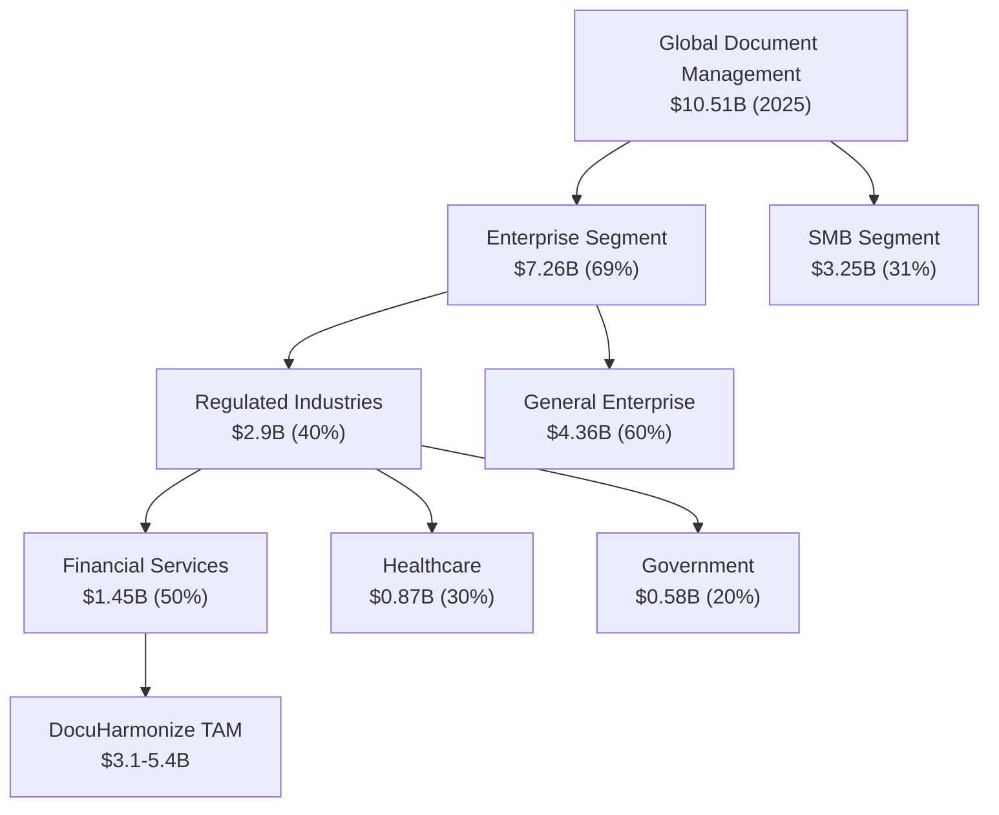

# Total Addressable Market (TAM) Analysis

:::tip **Bill Aulet Step 4: Calculate Total Addressable Market**
Understanding market size is critical for investment decisions, strategic planning, and validating the business opportunity. This TAM analysis specifically focuses on DocuHarmonize's enterprise documentation standardization opportunity.
:::

## 🌍 Global Market Overview

### Enterprise Document Management Market

### Market Growth Trajectory
- **2025 Market Size**: $10.51 billion (global document management)
- **2030 Projection**: $19.81 billion
- **CAGR**: 13.5% (2025-2030)
- **Growth Drivers**: Regulatory complexity, digital transformation, AI adoption

## 🎯 DocuHarmonize TAM Calculation

### Method 1: Top-Down Approach

#### Global Enterprise Document Management
- **Total Market**: $7.26 billion (2025)
- **Compliance-Driven Subset**: 40% = $2.9 billion
- **AI-Enabled Standardization**: 70% = $2.03 billion
- **DocuHarmonize Addressable**: $2.0-2.9 billion

#### Geographic Segmentation
| Region | Market Size | DocuHarmonize Focus | Addressable |
|--------|-------------|-------------------|-------------|
| **North America** | $1.31B (45%) | Primary | $1.31B |
| **Europe** | $0.87B (30%) | Secondary | $0.87B |
| **Asia-Pacific** | $0.58B (20%) | Long-term | $0.29B |
| **Other** | $0.14B (5%) | Future | $0.07B |
| **Total** | **$2.9B** | | **$2.54B** |

### Method 2: Bottom-Up Approach

#### Fortune 500 Financial Services Calculation
**Target Universe**: 200 major financial institutions globally

| Institution Size | Count | Employees | Annual Budget | Total TAM |
|-----------------|-------|-----------|---------------|-----------|
| **Mega Banks** (>$1T assets) | 20 | 100,000+ | $2.5M | $50M |
| **Large Banks** ($100B-1T) | 80 | 25,000+ | $1.5M | $120M |
| **Regional Banks** ($10B-100B) | 100 | 5,000+ | $800K | $80M |
| **Total Financial Services** | **200** | | | **$250M** |

#### Expansion Beyond Financial Services
**Year 1-3 Addressable Markets**:

| Vertical | Target Companies | Avg Contract | Market Size |
|----------|------------------|--------------|-------------|
| **Financial Services** | 200 | $1.25M | $250M |
| **Healthcare** | 150 | $800K | $120M |
| **Manufacturing** | 300 | $600K | $180M |
| **Energy/Utilities** | 100 | $1.0M | $100M |
| **Government** | 50 | $2.0M | $100M |
| **Total 3-Year TAM** | **800** | | **$750M** |

#### Long-Term Market Expansion (5-Year)
**Additional Markets**:
- **Mid-Market Financial** (1,000 institutions × $300K) = $300M
- **International Expansion** (EU/APAC) = $500M
- **Adjacent Verticals** (Technology, Retail) = $400M
- **Platform Extensions** (Training, Analytics) = $300M

**5-Year Total TAM**: $2.25 billion

### Method 3: Spend-Based Analysis

#### Current Enterprise Spending on Documentation/Compliance

**Per-Employee Spending Analysis**:
- **Fortune 500 Average**: 15,000 employees per company
- **Compliance Staff**: 3% of workforce = 450 employees
- **Documentation Tools Cost**: $2,500 per compliance employee annually
- **Professional Services**: $500K annually per company
- **Total Per Company**: $1.625M annually

**Market Calculation**:
- **Target Universe**: 2,000 large enterprises globally
- **Average Spend**: $1.625M per company
- **Total Current Spend**: $3.25 billion
- **DocuHarmonize Capture Rate**: 15-25% = $487M-$813M

## 📈 Market Segmentation & Sizing

### Primary Target: Fortune 500 Financial Services

#### Tier 1: Global Systemically Important Banks (G-SIBs)
**Market Characteristics**:
- **Institution Count**: 30 globally
- **Average Employees**: 150,000+
- **Compliance Budget**: $200-500M annually
- **Documentation Spend**: 5% of compliance budget = $10-25M
- **DocuHarmonize Opportunity**: $2-5M per institution
- **Total Tier 1 TAM**: $60-150M

#### Tier 2: Large Regional Banks
**Market Characteristics**:
- **Institution Count**: 170 globally
- **Average Employees**: 25,000-75,000
- **Compliance Budget**: $50-200M annually
- **Documentation Spend**: $2.5-10M annually
- **DocuHarmonize Opportunity**: $500K-2M per institution
- **Total Tier 2 TAM**: $85-340M

#### Total Financial Services TAM: $145-490M

### Secondary Target: Regulated Industries

#### Healthcare & Life Sciences
**Market Characteristics**:
- **Target Companies**: 150 (hospitals, pharma, med device)
- **Regulatory Drivers**: FDA, HIPAA, clinical trial documentation
- **Average Opportunity**: $800K per company
- **Total Healthcare TAM**: $120M

#### Energy & Utilities
**Market Characteristics**:
- **Target Companies**: 100 (oil/gas, utilities, renewable energy)
- **Regulatory Drivers**: Environmental compliance, safety documentation
- **Average Opportunity**: $1M per company
- **Total Energy TAM**: $100M

#### Manufacturing
**Market Characteristics**:
- **Target Companies**: 300 (automotive, aerospace, chemicals)
- **Regulatory Drivers**: ISO certification, safety compliance, quality documentation
- **Average Opportunity**: $600K per company
- **Total Manufacturing TAM**: $180M

### Geographic Market Distribution

#### North America (Primary Focus)
- **Market Size**: $2.0B (total addressable)
- **DocuHarmonize Focus**: 70% of efforts
- **3-Year Capture Goal**: $500M (25% market share)

#### Europe (Secondary Expansion)
- **Market Size**: $1.2B (GDPR compliance driver)
- **Entry Timeline**: Year 2-3
- **Regulatory Advantage**: GDPR compliance built-in
- **3-Year Capture Goal**: $150M (12.5% market share)

#### Asia-Pacific (Long-term)
- **Market Size**: $800M (growing regulatory complexity)
- **Entry Timeline**: Year 3-5
- **Key Markets**: Singapore, Australia, Japan
- **5-Year Capture Goal**: $100M (12.5% market share)

## 🚀 Market Growth Drivers & Trends

### Regulatory Complexity Explosion
- **Daily Regulatory Updates**: 234 per day in financial services (25x increase over decade)
- **Cross-Border Compliance**: EU GDPR expansion to Asia-Pacific markets
- **New Regulations**: DORA (EU), BASEL IV implementation
- **AI Governance**: Emerging AI regulation requiring documentation standards

### Digital Transformation Acceleration
- **Legacy System Modernization**: 70% of Fortune 500 upgrading document systems
- **Cloud Adoption**: 85% migrating document management to cloud
- **AI Integration**: 60% exploring AI for compliance automation
- **Remote Work Impact**: Distributed teams requiring standardized documentation

### Compliance Cost Pressure
- **Total Compliance Costs**: $61B annually across financial services
- **Documentation Portion**: 15-20% of total compliance spend
- **Efficiency Imperative**: Pressure to reduce costs while improving outcomes
- **Automation ROI**: 40-60% cost reduction through AI-powered automation

## 💰 Revenue Opportunity & Market Share Goals

### 3-Year Revenue Targets

#### Conservative Scenario (Market Share: 0.5%)
- **Year 1**: $5M ARR (20 customers × $250K average)
- **Year 2**: $15M ARR (50 customers × $300K average)
- **Year 3**: $35M ARR (100 customers × $350K average)
- **Total 3-Year**: $55M cumulative revenue

#### Optimistic Scenario (Market Share: 1.2%)
- **Year 1**: $8M ARR (25 customers × $320K average)
- **Year 2**: $25M ARR (70 customers × $357K average)
- **Year 3**: $60M ARR (150 customers × $400K average)
- **Total 3-Year**: $93M cumulative revenue

### 5-Year Market Leadership Goals

#### Target Market Share: 3-5%
- **Addressable TAM (5-Year)**: $3.1-5.4B
- **Market Share Goal**: 3-5%
- **Revenue Target**: $93-270M ARR
- **Customer Base**: 200-500 enterprise customers

#### Competitive Position Goals
- **Category Leadership**: #1 in AI-powered compliance documentation
- **Market Recognition**: Gartner Magic Quadrant leader
- **Industry Presence**: 25%+ of Fortune 500 financial services

## 📊 TAM Validation Metrics

### Market Research Validation
- **Customer Discovery**: 50+ interviews confirming pain points and willingness to pay
- **Competitive Analysis**: Gap analysis showing underserved market segments
- **Industry Reports**: Third-party validation of market size and growth
- **Pilot Programs**: 5-8 pilot customers validating market demand

### Financial Validation
- **Customer Acquisition Cost**: Under $100K per enterprise customer
- **Lifetime Value**: $2-5M per customer (5-year retention)
- **LTV/CAC Ratio**: 20:1 to 50:1 (highly favorable unit economics)
- **Payback Period**: 6-12 months (fast cash generation)

### Competitive Validation
- **Win Rate**: 25%+ in competitive evaluations
- **Displacement**: Ability to replace incumbent solutions
- **Expansion**: 120-150% net revenue retention
- **Reference Value**: Customer advocacy driving organic growth

## 🎯 Strategic Implications

### Investment Requirements
- **Technology Development**: $15-25M (3-year investment in AI/ML platform)
- **Sales & Marketing**: $20-30M (enterprise sales team, marketing programs)
- **Operations**: $5-10M (customer success, support, infrastructure)
- **Total Investment**: $40-65M to achieve market leadership

### Return Projections
- **5-Year Revenue**: $100-200M ARR
- **Market Valuation**: $1-3B (10-15x revenue multiple)
- **ROI**: 15-45x return on total investment
- **Exit Potential**: Strategic acquisition or IPO at scale

### Risk Mitigation
- **Market Risk**: Large, growing market with clear demand drivers
- **Technology Risk**: Proven AI/ML technologies, enterprise architecture
- **Competitive Risk**: First-mover advantage in AI-powered compliance documentation
- **Execution Risk**: Experienced team, disciplined go-to-market approach

:::info **TAM Summary**
DocuHarmonize addresses a $3.1-5.4B total addressable market driven by regulatory complexity, digital transformation, and compliance cost pressure. Conservative scenarios project $35M+ ARR by Year 3, with market leadership potential of $100-200M ARR by Year 5.
:::

---

**Next Step**: Identify [Lead Customers →](./lead-customers.md) within your addressable market.