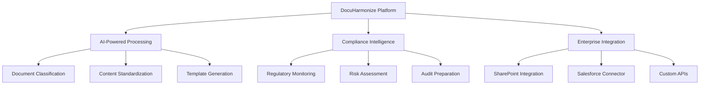

# DocuHarmonize Core Platform Overview

:::tip **Enterprise-Grade Architecture**
DocuHarmonize combines cutting-edge AI/ML technology with enterprise-grade security and scalability to deliver unprecedented documentation standardization and compliance automation for Fortune 500 financial services.
:::

## 🎯 Product Vision & Strategy

### Core Value Proposition
**"The only AI-powered platform purpose-built for enterprise compliance documentation"**

#### Problem Statement
- **Documentation Chaos**: Fortune 500 enterprises lose $12B annually due to fragmented documentation
- **Compliance Risk**: 60% inconsistency rates across departments create regulatory violations
- **Operational Inefficiency**: 8+ hours to create compliant documents with 5-7 review cycles
- **Audit Challenges**: 18-month preparation cycles for regulatory examinations

#### Solution Architecture


### Target Outcomes
- **85% Time Reduction**: 8 hours → 1.5 hours for document creation
- **60% Cost Savings**: Compliance preparation efficiency
- **95% Accuracy**: AI-powered compliance checking
- **99.9% Uptime**: Enterprise-grade reliability

---

## 🏗️ Platform Architecture

### System Overview

#### Multi-Tenant SaaS Architecture
```markdown
DOCUHARMONIZE SYSTEM ARCHITECTURE

Presentation Layer:
├── Web Application (React/TypeScript)
├── Mobile App (React Native)
├── API Gateway (Kong/AWS API Gateway)
└── Content Delivery Network (CloudFront)

Application Layer:
├── Core Platform Services (Node.js/Express)
├── AI/ML Processing Pipeline (Python/FastAPI)
├── Workflow Engine (Temporal.io)
└── Integration Services (REST/GraphQL APIs)

Data Layer:
├── Primary Database (PostgreSQL)
├── Document Storage (S3/Azure Blob)
├── Search Engine (Elasticsearch)
├── Cache Layer (Redis Cluster)
└── Analytics Database (ClickHouse)

Infrastructure Layer:
├── Container Orchestration (Kubernetes)
├── Service Mesh (Istio)
├── Monitoring (Prometheus/Grafana)
└── Security (Vault/HashiCorp)
```

#### Microservices Design
```markdown
CORE MICROSERVICES

Authentication & Authorization Service:
- JWT-based authentication
- RBAC with enterprise LDAP/AD integration
- Single Sign-On (SAML/OIDC)
- Multi-factor authentication

Document Management Service:
- Version control and lifecycle management
- Collaborative editing with real-time sync
- Template library and customization
- Digital asset management

AI/ML Processing Service:
- Document classification and entity extraction
- Content standardization and optimization
- Compliance rule engine
- Natural language processing pipeline

Workflow Management Service:
- Approval workflows and routing
- Task assignment and tracking
- SLA monitoring and escalation
- Integration with external systems

Analytics & Reporting Service:
- Usage analytics and insights
- Compliance reporting and dashboards
- Customer success metrics
- Business intelligence and forecasting
```

### Technology Stack

#### Frontend Technologies
```markdown
FRONTEND TECHNOLOGY STACK

Web Application:
- Framework: React 18 with TypeScript
- State Management: Redux Toolkit + RTK Query
- UI Library: Material-UI with custom theme
- Build Tool: Vite with Rollup optimization
- Testing: Jest + React Testing Library

Mobile Application:
- Framework: React Native with Expo
- Navigation: React Navigation 6
- Offline Support: Redux Persist + AsyncStorage
- Push Notifications: Expo Notifications
- App Store: iOS and Android deployment

Design System:
- Component Library: Custom DocuHarmonize UI
- Icons: Custom icon set + Heroicons
- Typography: Inter font family
- Color System: WCAG 2.1 AA compliant
- Responsive: Mobile-first breakpoints
```

#### Backend Technologies
```markdown
BACKEND TECHNOLOGY STACK

Core Services:
- Language: Node.js 20+ with TypeScript
- Framework: Express.js with Helmet security
- API Design: RESTful with OpenAPI 3.0 spec
- Authentication: Passport.js + JWT strategy
- Validation: Joi schema validation

AI/ML Services:
- Language: Python 3.11+ with FastAPI
- ML Framework: PyTorch for deep learning
- NLP Library: spaCy + transformers (Hugging Face)
- Vector Database: Pinecone for similarity search
- Model Serving: TorchServe + Docker containers

Data Processing:
- Message Queue: Apache Kafka for event streaming
- Workflow: Temporal.io for reliable workflows
- Caching: Redis Cluster for performance
- Search: Elasticsearch for full-text search
- Analytics: ClickHouse for time-series data
```

#### Infrastructure Technologies
```markdown
INFRASTRUCTURE STACK

Cloud Platform:
- Primary: AWS (70% of workloads)
- Secondary: Azure (25% for enterprise integration)
- Tertiary: Google Cloud (5% for AI/ML services)
- Multi-cloud: Kubernetes for portability

Container Platform:
- Orchestration: Amazon EKS (Kubernetes)
- Container Runtime: containerd with gVisor
- Service Mesh: Istio for security and observability
- Registry: Amazon ECR for container images

Databases:
- Primary: Amazon RDS (PostgreSQL 15)
- Document: Amazon DocumentDB (MongoDB compatible)
- Cache: Amazon ElastiCache (Redis)
- Analytics: Amazon Redshift for data warehouse
- Search: Amazon Elasticsearch Service
```

---

## 🤖 AI/ML Platform Architecture

### Core AI Capabilities

#### 1. Document Processing Pipeline
```markdown
DOCUMENT AI PROCESSING FLOW

Input Processing:
├── OCR Engine (Azure Computer Vision + PaddleOCR)
├── Format Normalization (PDF, Word, PowerPoint)
├── Content Extraction (Text, Images, Tables)
└── Language Detection (100+ languages)

Content Analysis:
├── Document Classification (Compliance type, department)
├── Entity Recognition (People, dates, regulations, risks)
├── Semantic Analysis (Intent, sentiment, complexity)
└── Structure Recognition (Sections, hierarchies, relationships)

Compliance Intelligence:
├── Regulatory Requirement Mapping
├── Risk Assessment and Scoring
├── Gap Analysis and Recommendations
└── Audit Trail Generation

Output Generation:
├── Standardized Templates
├── Compliance Annotations
├── Improvement Recommendations
└── Quality Scores and Metrics
```

#### 2. AI Model Architecture
```markdown
MACHINE LEARNING MODELS

Document Classification:
- Model: Fine-tuned RoBERTa-Large
- Accuracy: 95%+ for financial services documents
- Classes: 50+ compliance document types
- Training: 100K+ annotated documents

Content Standardization:
- Model: T5-Large for text generation
- Quality: 92%+ human-preferred outputs
- Customization: Customer-specific templates
- Training: Continuous learning from user feedback

Compliance Detection:
- Model: Ensemble of BERT + XGBoost
- Precision: 95%+ compliance violation detection
- Recall: 90%+ regulatory requirement coverage
- Updates: Monthly regulatory corpus refresh

Knowledge Graph:
- Technology: Neo4j + spaCy enterprise
- Entities: 10M+ compliance-related entities
- Relationships: 50M+ semantic connections
- Performance: under 200ms query response time
```

#### 3. Training Data & Continuous Learning
```markdown
AI TRAINING FRAMEWORK

Initial Training Data:
- Public regulatory documents: 500K documents
- Anonymized customer data: 100K documents
- Synthetic training data: 1M generated samples
- Expert annotations: 50K human-labeled examples

Continuous Improvement:
- Customer feedback loops: Rating and correction
- A/B testing: Model performance comparison
- Transfer learning: New regulatory domain adaptation
- Federated learning: Privacy-preserving model updates

Data Privacy:
- Differential privacy: Protect individual data points
- Federated learning: Train without data centralization
- Homomorphic encryption: Compute on encrypted data
- Anonymization: Remove personal identifiers
```

### Performance & Scalability

#### Processing Capacity
```markdown
PLATFORM PERFORMANCE TARGETS

Document Processing:
- Throughput: 50,000 documents per hour
- Latency: under 2 seconds for standard document
- Concurrent Users: 10,000+ simultaneous users
- Accuracy: 95%+ across all AI functions

System Scalability:
- Auto-scaling: 5-100 CPU nodes, 2-50 GPU nodes
- Storage: Multi-tier with lifecycle policies
- CDN: Global edge caching for 99.9% uptime
- Database: Read replicas and connection pooling

Regional Performance:
- North America: under 100ms response time
- Europe: under 150ms response time
- Asia-Pacific: under 200ms response time
- Global: 99.9% availability SLA
```

---

## 🔗 Enterprise Integration Platform

### Core Integration Strategy

#### 1. Native Integrations (Tier 1)
```markdown
PRIORITY INTEGRATIONS

Microsoft Ecosystem:
- SharePoint Online: Document sync and collaboration
- Teams: Workflow notifications and approvals
- Office 365: Word/Excel/PowerPoint editing
- Azure AD: Single sign-on and identity

Salesforce Platform:
- Knowledge Base: Document publishing
- Service Cloud: Support case integration
- Sales Cloud: Proposal and contract management
- Community Cloud: Customer document access

Enterprise Systems:
- Confluence: Knowledge management migration
- Box: Content migration and sync
- Slack: Team collaboration and notifications
- Workday: HR policy integration
```

#### 2. API-First Architecture
```markdown
API PLATFORM DESIGN

REST API:
- OpenAPI 3.0 specification
- RESTful resource design
- JSON API standard compliance
- Rate limiting and throttling

GraphQL API:
- Schema-first development
- Real-time subscriptions
- Efficient data fetching
- Developer-friendly tooling

Webhook Events:
- Document state changes
- Approval workflow completion
- Compliance alerts and notifications
- System health and performance

SDK Development:
- JavaScript/TypeScript SDK
- Python SDK for automation
- Postman collection for testing
- Comprehensive documentation
```

#### 3. Enterprise Security Integration
```markdown
SECURITY INTEGRATION FRAMEWORK

Identity & Access Management:
- SAML 2.0 and OIDC support
- Active Directory and LDAP
- Multi-factor authentication
- Just-in-time provisioning

Data Loss Prevention:
- Integration with Microsoft Purview
- Symantec DLP connector
- Custom policy enforcement
- Real-time monitoring and alerts

Compliance Platforms:
- GRC systems (MetricStream, ServiceNow)
- SIEM integration (Splunk, QRadar)
- Audit management systems
- Risk assessment platforms
```

---

## 📱 User Experience Design

### Design Philosophy

#### Enterprise UX Principles
1. **Cognitive Load Reduction**: Progressive disclosure and smart defaults
2. **Workflow Integration**: Enhance existing processes vs. replacement
3. **Accessibility First**: WCAG 2.1 AA compliance
4. **Mobile Responsive**: Equal experience across devices
5. **Change Management**: Gradual adoption and user guidance

#### User Interface Framework
```markdown
UI/UX DESIGN SYSTEM

Design Language:
- Visual Style: Clean, professional, trustworthy
- Color Palette: Blue primary, gray neutral, green success
- Typography: Inter font family for readability
- Icons: Custom compliance-focused icon set
- Spacing: 8px grid system for consistency

Component Library:
- 50+ reusable React components
- Storybook documentation and testing
- Figma design system integration
- Accessibility testing automated
- Dark mode support included

Responsive Design:
- Breakpoints: 320px, 768px, 1024px, 1440px+
- Mobile-first approach
- Touch-friendly interactions
- Offline-capable progressive web app
```

### Role-Based Interface Design

#### 1. Compliance Specialist Dashboard
```markdown
COMPLIANCE SPECIALIST INTERFACE

Primary Workflow:
- Document creation wizard with templates
- Real-time compliance checking
- Collaborative editing with stakeholders
- Approval workflow management
- Analytics and performance metrics

Key Features:
- Smart template recommendations
- Regulatory change notifications
- Bulk document operations
- Custom workflow configuration
- Integration with enterprise systems

Productivity Features:
- Keyboard shortcuts for power users
- Saved searches and filters
- Customizable dashboard layout
- Batch processing capabilities
- Automated status updates
```

#### 2. Executive Dashboard
```markdown
EXECUTIVE DASHBOARD INTERFACE

Strategic Overview:
- Compliance health scorecard
- Risk assessment summary
- Audit readiness status
- Team performance metrics
- Trend analysis and forecasting

Key Visualizations:
- Compliance score trending
- Department comparison charts
- Risk heatmaps by business unit
- Audit timeline and milestones
- ROI and efficiency metrics

Mobile Optimization:
- Native mobile app for iOS/Android
- Push notifications for critical alerts
- Offline reading capability
- Quick approval workflows
- Executive summary emails
```

#### 3. Subject Matter Expert Interface
```markdown
SME COLLABORATION INTERFACE

Review & Approval:
- Document review queue
- Comment and annotation tools
- Version comparison and tracking
- Approval delegation capabilities
- Knowledge contribution workflows

Expertise Capture:
- Guided knowledge input forms
- Template creation and customization
- Business process documentation
- Training material development
- Regulatory interpretation guidance

Time-Efficient Design:
- Quick approval actions
- Mobile-optimized review
- Email-based workflows
- Automated routing logic
- Progress tracking dashboards
```

---

## 📊 Analytics & Intelligence Platform

### Business Intelligence Framework

#### 1. Operational Analytics
```markdown
OPERATIONAL INTELLIGENCE

Document Metrics:
- Creation velocity and cycle time
- Review iterations and approval time
- Quality scores and error rates
- Template usage and effectiveness
- User adoption and engagement

Compliance Analytics:
- Risk score trending by department
- Regulatory change impact analysis
- Audit readiness assessment
- Violation prediction and prevention
- Benchmark comparison and scoring

Performance Analytics:
- System performance and uptime
- User experience and satisfaction
- Feature usage and adoption
- Integration health and reliability
- Cost optimization and efficiency
```

#### 2. Predictive Analytics
```markdown
PREDICTIVE INTELLIGENCE

Compliance Forecasting:
- Risk prediction models
- Audit outcome prediction
- Regulatory change impact assessment
- Resource requirement forecasting
- Performance trend analysis

Business Intelligence:
- Customer success prediction
- Churn risk identification
- Expansion opportunity scoring
- Market trend analysis
- Competitive intelligence
```

### Customer Success Metrics

#### Platform Adoption Tracking
```markdown
ADOPTION & SUCCESS METRICS

User Engagement:
- Daily/Monthly Active Users (DAU/MAU)
- Feature adoption rates
- Session duration and depth
- User onboarding completion
- Support ticket volume and resolution

Business Outcome Metrics:
- Time savings per document
- Compliance score improvement
- Audit preparation time reduction
- Error rate reduction
- Cost savings quantification

Customer Health Scoring:
- Usage frequency and depth
- Feature adoption breadth
- Support interaction sentiment
- Renewal probability scoring
- Expansion opportunity identification
```

:::info **Platform Architecture Summary**
DocuHarmonize combines enterprise-grade architecture with cutting-edge AI/ML capabilities to deliver a comprehensive documentation standardization platform. The multi-cloud, API-first design ensures scalability, security, and seamless integration with existing enterprise systems.
:::

---

**Next Step**: Explore [Technical Architecture Details →](./technical-architecture/ai-ml-platform.md) for deep-dive into AI/ML implementation.