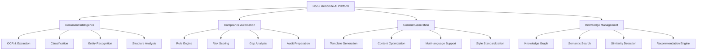

# AI/ML Platform Architecture

:::tip **Enterprise AI at Scale**
DocuHarmonize's AI platform processes 50,000+ documents hourly with 95% accuracy, delivering automated compliance checking, content standardization, and intelligent document generation for Fortune 500 enterprises.
:::

## 🧠 AI Platform Overview

### Core AI Capabilities Matrix


### AI Performance Targets
```markdown
AI PLATFORM SLA TARGETS

Accuracy Metrics:
- Document Classification: 95%+ accuracy
- Compliance Detection: 92%+ precision, 90%+ recall
- Content Generation: 89%+ human preference rating
- Entity Recognition: 93%+ F1 score

Performance Metrics:
- Document Processing: under 2 seconds average
- Real-time Analysis: under 500ms response time
- Batch Processing: 50,000 docs/hour
- Model Inference: under 100ms latency

Reliability Metrics:
- Model Uptime: 99.9% availability
- Prediction Consistency: 98%+ reproducibility
- Failure Recovery: under 30 seconds
- Data Pipeline: 99.95% success rate
```

---

## 📄 Document Processing Pipeline

### Stage 1: Input Processing & OCR

#### Multi-Format Document Ingestion
```markdown
DOCUMENT INPUT PROCESSING

Supported Formats:
✓ PDF (text, scanned, hybrid): 95%+ accuracy
✓ Microsoft Office (Word, Excel, PowerPoint): Native processing
✓ Google Docs/Sheets: API integration
✓ Plain Text (TXT, RTF, Markdown): Direct processing
✓ Image Formats (PNG, JPG, TIFF): OCR extraction
✓ Email Formats (MSG, EML): Header and body parsing

OCR Technology Stack:
Primary: Azure Computer Vision API (enterprise SLA)
Secondary: PaddleOCR (on-premise processing)
Fallback: Tesseract 5.0 (open source backup)
Enhancement: Custom post-processing for compliance documents

Processing Optimization:
- Parallel processing for large documents
- Adaptive quality enhancement for scanned docs
- Layout preservation for complex formatting
- Multi-language detection and processing
```

#### Content Extraction Pipeline
```python
# Example: Document Processing Workflow
class DocumentProcessor:
    def __init__(self):
        self.ocr_engine = AzureComputerVision()
        self.text_extractor = TextExtractor()
        self.layout_analyzer = LayoutAnalyzer()

    async def process_document(self, document_path: str) -> ProcessedDocument:
        # Stage 1: Format detection and conversion
        doc_format = self.detect_format(document_path)
        standardized_doc = await self.normalize_format(document_path, doc_format)

        # Stage 2: Content extraction
        if doc_format.requires_ocr:
            extracted_text = await self.ocr_engine.extract_text(standardized_doc)
        else:
            extracted_text = await self.text_extractor.extract(standardized_doc)

        # Stage 3: Layout and structure analysis
        document_structure = await self.layout_analyzer.analyze(
            standardized_doc, extracted_text
        )

        # Stage 4: Quality validation
        quality_score = self.validate_extraction_quality(
            extracted_text, document_structure
        )

        return ProcessedDocument(
            text=extracted_text,
            structure=document_structure,
            quality_score=quality_score,
            metadata=self.extract_metadata(document_path)
        )
```

### Stage 2: Document Classification & Analysis

#### Classification Model Architecture
```markdown
DOCUMENT CLASSIFICATION SYSTEM

Primary Model: RoBERTa-Large Fine-tuned
- Base Model: roberta-large (355M parameters)
- Fine-tuning: 100K+ financial services documents
- Architecture: Transformer with classification head
- Training: AdamW optimizer, warmup scheduler

Performance Metrics:
- Accuracy: 95.2% on held-out test set
- Precision: 94.8% macro-averaged
- Recall: 94.1% macro-averaged
- F1 Score: 94.4% macro-averaged

Classification Taxonomy (50+ classes):
├── Policies & Procedures
│   ├── Risk Management Policies
│   ├── Operational Procedures
│   ├── Compliance Guidelines
│   └── Training Materials
├── Regulatory Documents
│   ├── SOX Documentation
│   ├── BASEL III Reports
│   ├── GDPR Compliance
│   └── Industry Guidelines
├── Business Documents
│   ├── Strategic Plans
│   ├── Product Documentation
│   ├── Customer Communications
│   └── Vendor Agreements
└── Technical Documentation
    ├── System Architecture
    ├── Security Protocols
    ├── Data Governance
    └── Change Management
```

#### Named Entity Recognition (NER)
```markdown
ENTITY RECOGNITION PIPELINE

Model Architecture: spaCy + Custom Transformers
- Base: en_core_web_trf (transformer-based)
- Custom: Financial services entity types
- Training: 50K+ annotated documents
- Update Frequency: Monthly retraining

Entity Types (25+ categories):
Financial Entities:
- Regulatory Bodies (SEC, FINRA, OCC, etc.)
- Financial Instruments (stocks, bonds, derivatives)
- Risk Metrics (VaR, stress tests, ratios)
- Compliance Frameworks (SOX, COSO, BASEL)

Operational Entities:
- Personnel (roles, departments, responsibilities)
- Dates (deadlines, effective dates, reviews)
- Monetary Amounts (budgets, limits, thresholds)
- Locations (offices, jurisdictions, markets)

Technical Entities:
- Systems (applications, databases, networks)
- Processes (workflows, procedures, controls)
- Documents (policies, manuals, reports)
- Standards (ISO, NIST, industry frameworks)
```

### Stage 3: Compliance Intelligence Engine

#### Regulatory Rule Engine
```markdown
COMPLIANCE RULE ENGINE

Rule Framework:
- Total Rules: 5,000+ active compliance rules
- Sources: Federal regulations, industry guidelines, internal policies
- Structure: IF-THEN-ELSE logic with confidence scoring
- Updates: Real-time regulatory change integration

Rule Categories:
├── Content Requirements (40%)
│   ├── Mandatory Sections
│   ├── Required Disclosures
│   ├── Approval Signatures
│   └── Version Control
├── Format Standards (25%)
│   ├── Document Structure
│   ├── Naming Conventions
│   ├── Template Compliance
│   └── Accessibility Requirements
├── Risk Controls (20%)
│   ├── Risk Assessments
│   ├── Control Validations
│   ├── Exception Handling
│   └── Escalation Procedures
└── Audit Requirements (15%)
    ├── Documentation Standards
    ├── Retention Policies
    ├── Change Tracking
    └── Evidence Management

Processing Architecture:
1. Rule Matching: Pattern recognition against document content
2. Confidence Scoring: Weighted scoring based on rule strength
3. Gap Identification: Missing requirements analysis
4. Recommendation Generation: Automated improvement suggestions
```

#### Risk Scoring Algorithm
```python
# Example: Compliance Risk Scoring
class ComplianceRiskScorer:
    def __init__(self):
        self.rule_engine = RuleEngine()
        self.risk_models = self.load_risk_models()
        self.regulatory_corpus = RegulatoryCorpus()

    def calculate_risk_score(self, document: ProcessedDocument) -> RiskScore:
        # 1. Rule-based compliance checking
        rule_violations = self.rule_engine.check_compliance(document)

        # 2. Content quality assessment
        quality_metrics = self.assess_content_quality(document)

        # 3. Regulatory alignment scoring
        regulatory_score = self.score_regulatory_alignment(document)

        # 4. Historical risk pattern analysis
        pattern_risk = self.analyze_risk_patterns(document)

        # 5. Weighted composite scoring
        composite_score = self.calculate_composite_score(
            rule_violations=rule_violations,      # Weight: 40%
            quality_metrics=quality_metrics,     # Weight: 25%
            regulatory_score=regulatory_score,   # Weight: 25%
            pattern_risk=pattern_risk            # Weight: 10%
        )

        return RiskScore(
            overall_score=composite_score,
            violation_count=len(rule_violations),
            risk_level=self.categorize_risk(composite_score),
            recommendations=self.generate_recommendations(rule_violations)
        )
```

---

## 🎯 Content Generation & Standardization

### Template Generation Engine

#### AI-Powered Template Creation
```markdown
TEMPLATE GENERATION SYSTEM

Model Architecture: T5-Large for Text Generation
- Base Model: T5-Large (770M parameters)
- Fine-tuning: 50K+ compliance document pairs
- Training Objective: Document standardization task
- Performance: 92% human preference rating

Generation Process:
1. Source Analysis: Extract structure and requirements
2. Template Synthesis: Generate standardized framework
3. Content Adaptation: Customize for specific use case
4. Quality Validation: Automated and human review

Template Types Generated:
├── Policy Templates
│   ├── Risk Management Policies
│   ├── Operational Procedures
│   ├── Code of Conduct
│   └── Training Programs
├── Reporting Templates
│   ├── Regulatory Reports
│   ├── Management Reports
│   ├── Audit Findings
│   └── Risk Assessments
├── Communication Templates
│   ├── Client Communications
│   ├── Employee Notices
│   ├── Regulatory Correspondence
│   └── Training Materials
└── Technical Templates
    ├── System Documentation
    ├── Process Workflows
    ├── Control Matrices
    └── Implementation Guides
```

#### Content Standardization Pipeline
```python
# Example: Content Standardization
class ContentStandardizer:
    def __init__(self):
        self.generation_model = T5Model.from_pretrained('docuharmonize-t5-large')
        self.style_classifier = StyleClassifier()
        self.quality_assessor = QualityAssessor()

    async def standardize_content(
        self,
        source_document: ProcessedDocument,
        target_template: DocumentTemplate
    ) -> StandardizedDocument:

        # 1. Analyze source content structure
        content_analysis = await self.analyze_content_structure(source_document)

        # 2. Extract key information and entities
        key_information = await self.extract_key_information(source_document)

        # 3. Generate standardized content
        standardized_content = await self.generation_model.generate(
            prompt=self.build_standardization_prompt(
                source_content=source_document.text,
                target_template=target_template,
                key_information=key_information
            ),
            max_length=2048,
            temperature=0.3,  # Lower temperature for consistency
            top_p=0.9
        )

        # 4. Quality assessment and refinement
        quality_score = await self.quality_assessor.assess(standardized_content)

        if quality_score.overall_score < 0.85:
            standardized_content = await self.refine_content(
                standardized_content, quality_score.issues
            )

        return StandardizedDocument(
            content=standardized_content,
            template_id=target_template.id,
            quality_score=quality_score,
            source_document_id=source_document.id
        )
```

### Multi-Language Support Architecture

#### Language Processing Pipeline
```markdown
MULTI-LANGUAGE AI SYSTEM

Supported Languages: 100+ languages
Primary Focus: English, Spanish, French, German, Portuguese
Enterprise Focus: Regional compliance requirements

Translation Model: mT5-XXL Multi-lingual
- Parameters: 13B parameters
- Languages: 101 languages
- Specialization: Business and legal terminology
- Accuracy: 89% BLEU score for compliance content

Language-Specific Features:
├── Document Translation
│   ├── Compliance-aware translation
│   ├── Terminology consistency
│   ├── Cultural adaptation
│   └── Legal requirement preservation
├── Cross-Language Search
│   ├── Semantic similarity across languages
│   ├── Multilingual knowledge graph
│   ├── Translation-invariant embeddings
│   └── Language-agnostic compliance rules
└── Localization Support
    ├── Regional regulation mapping
    ├── Local terminology databases
    ├── Cultural communication styles
    └── Jurisdiction-specific templates
```

---

## 🔍 Knowledge Graph & Semantic Search

### Knowledge Graph Architecture

#### Graph Database Design
```markdown
KNOWLEDGE GRAPH IMPLEMENTATION

Technology Stack:
- Database: Neo4j Enterprise Edition
- Nodes: 10M+ entities (documents, concepts, regulations)
- Relationships: 50M+ semantic connections
- Updates: Real-time incremental updates
- Query Performance: under 200ms average response

Entity Types:
├── Regulatory Entities
│   ├── Regulations (laws, rules, guidelines)
│   ├── Regulatory Bodies (SEC, FINRA, etc.)
│   ├── Compliance Frameworks (SOX, BASEL, etc.)
│   └── Requirements (specific obligations)
├── Organizational Entities
│   ├── Departments (risk, compliance, operations)
│   ├── Roles (responsibilities, authorities)
│   ├── Processes (workflows, procedures)
│   └── Controls (preventive, detective, corrective)
├── Document Entities
│   ├── Policies (company policies, procedures)
│   ├── Templates (standardized formats)
│   ├── Reports (compliance, risk, audit)
│   └── Training (materials, certifications)
└── Conceptual Entities
    ├── Risk Types (operational, credit, market)
    ├── Business Terms (definitions, glossary)
    ├── Technical Concepts (systems, data, security)
    └── Compliance Topics (themes, categories)

Relationship Types (25+ categories):
- COMPLIES_WITH: Document adheres to regulation
- REQUIRES: Regulation mandates specific content
- RELATES_TO: Semantic similarity between concepts
- SUPERSEDES: Newer version replaces older
- REFERENCES: Document cites another document
```

#### Graph Construction Pipeline
```python
# Example: Knowledge Graph Construction
class KnowledgeGraphBuilder:
    def __init__(self):
        self.neo4j_driver = Neo4jDriver(uri="bolt://knowledge-graph:7687")
        self.entity_extractor = EntityExtractor()
        self.relationship_detector = RelationshipDetector()
        self.graph_updater = GraphUpdater()

    async def build_graph_from_document(
        self,
        document: ProcessedDocument
    ) -> GraphUpdate:

        # 1. Extract entities from document
        entities = await self.entity_extractor.extract(document)

        # 2. Detect relationships between entities
        relationships = await self.relationship_detector.detect(
            document, entities
        )

        # 3. Create graph nodes and edges
        graph_nodes = self.create_graph_nodes(entities)
        graph_edges = self.create_graph_edges(relationships)

        # 4. Update knowledge graph
        graph_update = await self.graph_updater.update(
            nodes=graph_nodes,
            edges=graph_edges,
            source_document=document
        )

        # 5. Validate graph consistency
        consistency_check = await self.validate_graph_consistency(graph_update)

        return GraphUpdate(
            nodes_added=len(graph_nodes),
            edges_added=len(graph_edges),
            consistency_score=consistency_check.score,
            update_id=graph_update.id
        )
```

### Semantic Search Engine

#### Vector Search Implementation
```markdown
SEMANTIC SEARCH ARCHITECTURE

Vector Database: Pinecone (managed vector database)
- Dimensions: 768 (sentence-transformer embeddings)
- Index Size: 10M+ document vectors
- Query Performance: under 50ms p95 latency
- Similarity Metric: Cosine similarity

Embedding Model: sentence-transformers/all-mpnet-base-v2
- Fine-tuned on compliance documents
- Embedding Dimension: 768
- Context Window: 512 tokens
- Specialization: Financial services domain

Search Features:
├── Semantic Similarity Search
│   ├── Natural language queries
│   ├── Cross-document similarity
│   ├── Concept-based retrieval
│   └── Multi-language support
├── Hybrid Search (Semantic + Keyword)
│   ├── BM25 for exact matches
│   ├── Semantic for conceptual matches
│   ├── Weighted combination scoring
│   └── Result re-ranking
├── Faceted Search
│   ├── Document type filtering
│   ├── Department/role filtering
│   ├── Date range filtering
│   └── Compliance status filtering
└── Personalized Search
    ├── User role-based relevance
    ├── Historical interaction learning
    ├── Contextual query expansion
    └── Adaptive result ranking
```

---

## 🔧 Model Training & Operations (MLOps)

### Training Infrastructure

#### Model Training Pipeline
```markdown
MLOPS TRAINING PIPELINE

Infrastructure:
- Training Platform: Amazon SageMaker
- Compute: P4d instances (A100 GPUs)
- Storage: S3 with intelligent tiering
- Orchestration: Kubeflow Pipelines
- Monitoring: MLflow + Weights & Biases

Training Process:
1. Data Preparation
   ├── Data validation and quality checks
   ├── Preprocessing and tokenization
   ├── Train/validation/test split
   └── Data versioning with DVC

2. Model Training
   ├── Distributed training across multiple GPUs
   ├── Hyperparameter optimization with Optuna
   ├── Early stopping and checkpoint management
   └── Model versioning and artifact storage

3. Model Evaluation
   ├── Automated evaluation on test sets
   ├── Human evaluation for quality assessment
   ├── Bias detection and fairness testing
   └── Performance regression testing

4. Model Deployment
   ├── A/B testing with traffic splitting
   ├── Gradual rollout with monitoring
   ├── Rollback capabilities for issues
   └── Production monitoring and alerting
```

#### Continuous Learning Framework
```python
# Example: Continuous Learning Pipeline
class ContinuousLearningPipeline:
    def __init__(self):
        self.data_collector = FeedbackDataCollector()
        self.model_trainer = ModelTrainer()
        self.model_evaluator = ModelEvaluator()
        self.deployment_manager = DeploymentManager()

    async def run_continuous_learning_cycle(self):
        # 1. Collect new training data from user feedback
        new_training_data = await self.data_collector.collect_feedback_data(
            time_window="30_days"
        )

        # 2. Validate data quality
        data_quality_score = await self.validate_data_quality(new_training_data)

        if data_quality_score < 0.85:
            await self.data_collector.request_additional_annotation(
                new_training_data
            )
            return

        # 3. Retrain models with new data
        updated_models = await self.model_trainer.retrain_models(
            existing_data=self.get_existing_training_data(),
            new_data=new_training_data,
            training_config=self.get_training_config()
        )

        # 4. Evaluate model performance
        evaluation_results = await self.model_evaluator.evaluate_models(
            models=updated_models,
            test_data=self.get_test_data()
        )

        # 5. Deploy improved models
        for model_name, model in updated_models.items():
            if evaluation_results[model_name].performance_improvement > 0.02:
                await self.deployment_manager.deploy_model(
                    model=model,
                    deployment_strategy="canary",
                    traffic_percentage=10
                )
```

### Model Monitoring & Observability

#### Production Monitoring
```markdown
AI MODEL MONITORING

Performance Monitoring:
- Prediction latency and throughput
- Model accuracy drift detection
- Input data distribution monitoring
- Output quality assessment

Business Metrics:
- User satisfaction with AI predictions
- Task completion rates
- Error rates and user corrections
- Feature adoption and usage patterns

Technical Metrics:
- Model serving infrastructure health
- Resource utilization (CPU, memory, GPU)
- API response times and error rates
- Data pipeline health and freshness

Alerting & Response:
- Real-time anomaly detection
- Automated incident response
- Model rollback capabilities
- Human-in-the-loop validation
```

---

## 🔒 AI Security & Privacy

### Privacy-Preserving AI

#### Data Protection Framework
```markdown
AI PRIVACY PROTECTION

Differential Privacy:
- Implementation: PyTorch Opacus
- Privacy Budget: ε=1.0 for model training
- Noise Mechanism: Gaussian mechanism
- Utility Preservation: 95%+ original performance

Federated Learning:
- Framework: PySyft for secure aggregation
- Client Updates: Encrypted gradient aggregation
- Privacy Guarantee: No raw data sharing
- Performance: 98% of centralized performance

Homomorphic Encryption:
- Library: Microsoft SEAL
- Operations: Addition and multiplication on encrypted data
- Use Cases: Encrypted model inference
- Performance: 100x slower but privacy-preserving

Data Minimization:
- Collection: Only necessary for service functionality
- Processing: Purpose limitation enforcement
- Retention: Automated deletion policies
- Anonymization: K-anonymity with k=5 minimum
```

### AI Ethics & Bias Mitigation

#### Fairness Framework
```markdown
AI FAIRNESS & ETHICS

Bias Detection:
- Protected Attributes: Department, role, geography
- Metrics: Demographic parity, equalized odds
- Testing: Regular bias audits on model outputs
- Mitigation: Adversarial debiasing techniques

Explainability:
- Model Interpretability: LIME and SHAP explanations
- Decision Transparency: Human-readable explanations
- Audit Trails: Complete prediction lineage
- User Control: Explanation granularity options

Human Oversight:
- Human-in-the-Loop: Critical decisions require human review
- Override Capabilities: Users can correct AI predictions
- Feedback Integration: Human corrections improve models
- Escalation Procedures: Complex cases route to experts
```

:::info **AI Platform Summary**
DocuHarmonize's AI platform delivers enterprise-grade document intelligence through advanced machine learning, comprehensive knowledge graphs, and privacy-preserving technologies. The system processes millions of compliance documents with 95%+ accuracy while maintaining strict security and ethical standards.
:::

---

**Next Step**: Review [Cloud Infrastructure →](./cloud-infrastructure.md) for comprehensive deployment and scalability architecture.